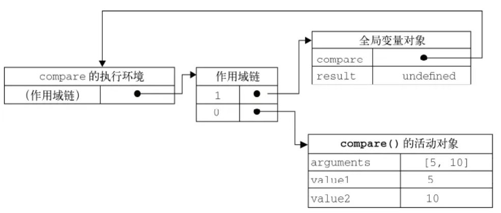

# 闭包


### 定义

- MDN 对闭包的定义为：


闭包是指那些能够访问自由变量的函数。

- 那什么是自由变量呢？


自由变量是指在函数中使用的，但既不是函数参数也不是函数的局部变量的变量。

由此，我们可以看出闭包共有两部分组成：

**闭包 = 函数 + 函数能够访问的自由变量**


举个例子：

```js
var a = 1;

function foo() {
    console.log(a);
}

foo();
```

foo 函数可以访问变量 a，但是 a 既不是 foo 函数的局部变量，也不是 foo 函数的参数，所以 a 就是自由变量。

所以在《JavaScript权威指南》中就讲到：从技术的角度讲，所有的JavaScript函数都是闭包。

***这是理论上的闭包*。**


ECMAScript中，闭包指的是：

1. 从理论角度：所有的函数。因为它们都在创建的时候就将上层上下文的数据保存起来了。哪怕是简单的全局变量也是如此，因为函数中访问全局变量就相当于是在访问自由变量，这个时候使用最外层的作用域。

2. **从实践角度：以下函数才算是闭包：**

   1. **即使创建它的上下文已经销毁，它仍然存在（比如，内部函数从父函数中返回）**
   2. **在代码中引用了自由变量**

   嵌套的函数作用域，inner function访问到outer function的声明变量。并将inner function当做一个值类型进行传递。


例子

```js
var scope = "global scope";
function checkscope(){
    var scope = "local scope";
    function f(){
        return scope;
    }
    return f;
}

var foo = checkscope();
foo();
```


***当 f 函数执行的时候，checkscope 函数上下文已经被销毁了啊（即从执行上下文栈中被弹出），怎么还会读取到 checkscope 作用域下的 scope 值呢？***

当我们了解了具体的执行过程后，我们知道 f 执行上下文维护了一个作用域链：

VO：变量对象。VO理解为代码编译时产生。VO绑定以下属性：函数形参，函数申明，变量申明。

AO：活动对象。函数被调用后，执行环境就切换成了对应的函数，此时活动对象就会产生。也就是说AO可以理解为函数执行时产生的。 进入函数执行环境后，实际上AO就相当于函数的VO，只是说在函数执行环境里 VO属性不能被直接访问，所以生成AO来替代访问。

在全局执行环境中，VO属性是可以被访问的，而进入函数执行环境后VO属性不能被直接访问，此时会生成活动对象AO替代VO，可以访问AO属性。

```js
fContext = {
    Scope: [AO, checkscopeContext.AO, globalContext.VO],
}
```

对的，就是因为这个作用域链，f 函数依然可以读取到 checkscopeContext.AO 的值，说明当 f 函数引用了 checkscopeContext.AO 中的值的时候，即使 checkscopeContext 被销毁了，但是 JavaScript 依然会让 checkscopeContext.AO 活在内存中，f 函数依然可以通过 f 函数的作用域链找到它，正是因为 JavaScript 做到了这一点，从而实现了闭包这个概念。


### 更多解释

Closures are functions that have access to variables from another function’s scope. 

An Example:
The outer function return the inner function 
 which has access to the variable from the outer function .Even after the inner function has been returned and is being used elsewhere, it has access to that variable. This occurs because the inner function’s scope chain includes the scope of the outer function.

The details of how scope chains are created and used are important for a good understanding of closures. 

当某个函数被调用时，会创建一个执行环境（execution context）及相应的作用域链。
然后，使用 arguments 和其他命名参数的值来初始化函数的活动对象（activation object）。但在作用域链中，外部函数的活动对象始终处于第二位，外部函数的外部函数的活动对象处于第三位，……直至作为作用域链终点的全局执行环境。




#### 参数按值传递

在《JavaScript高级程序设计》第三版 4.1.3，讲到传递参数：

> ECMAScript中所有函数的参数都是按值传递的。

什么是按值传递呢？

> 也就是说，把函数外部的值复制给函数内部的参数，就和把值从一个变量复制到另一个变量一样。


引用类型传递的是内存地址。


## 为什么需要闭包


为什么整个作用域得以保存？而不是只保留闭包函数使用到的变量？机制

上一个执行环境的AO还在[Scope]栈内

执行上下文？上下文销毁？