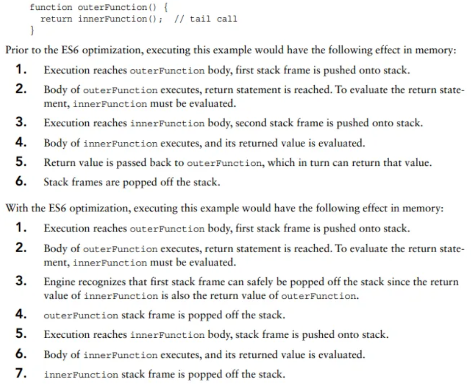

### 箭头函数

- this

  继承外部this

- 没有arguments

### 尾递归优化

Tail Call Optimization Requirements

The engine is only capable of performing such an optimization when it is sure that the outer stack frame is truly not needed any longer. This demands the following conditions:
➤ The code is executing in strict mode
➤ The return value of the outer function is the invoked tail call function
➤ There is no further execution required after the tail call function returns
➤ The tail call function is not a closure that refers to variables in the outer function’s scope

