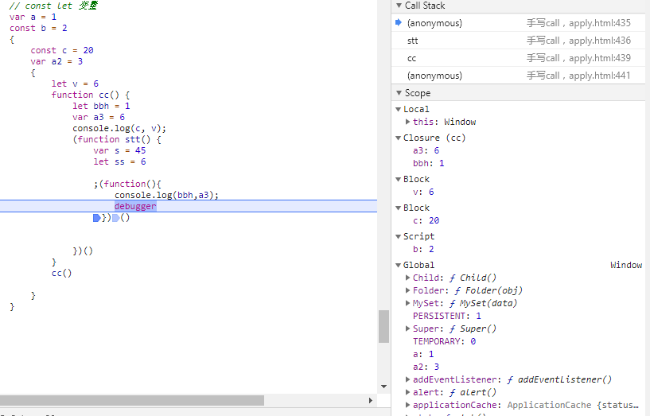
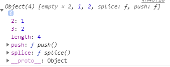

## `['1', '2', '3'].map(parseInt)` what & why ?

parseInt(string, radix)，两个参数，分别是要解析的字符串和表示要解析的数字的基数（进制）。该值介于 2 ~ 36 之间。


## var、let 和 const 区别的实现原理是什么

> 全局作用域中，用 const 和 let 声明的变量不在 window 上，那到底在哪里？如何去获取？

作用域（Scope）分为Local（function内部）、Closure、Block、Script（理解为顶级的Block）、Global几部分。

var 没有块作用域，全局变量定义在Global（window）；

let const全局变量定义在Script中，不在window中；




## 严格模式中Math ，this.Math

严格模式，function中this指向undefined时，为什么能访问Math？

Math在Global中


## 下面的代码打印什么内容，为什么？简单改造下面的代码，使之分别打印 10 和 20

> ```js
> var b = 10;
> (function b(){
>     b = 20;
>     console.log(b); 
> })();
> ```

1. 函数表达式与函数声明不同，函数名只在该函数内部有效，并且此绑定是**常量**绑定。
2. 对于一个常量进行赋值，在 strict 模式下会报错，非 strict 模式下静默失败。
3. IIFE中的函数是函数表达式，而不是函数声明。


## 下面代码中 a 在什么情况下会打印 1？

```js
var a = ?;
if(a == 1 && a == 2 && a == 3){
 	console.log(1);
}
```

修改toString ，toValue，或者[Symbol.toPrimitive]方法

```js
a = {}
a.toString = (function(){
	let arr = [1,2,3]
	return function(){
			return arr.shift()
		}
	})()
```


## 输出以下代码执行的结果并解释为什么

> ```js
> var obj = {
>     '2': 3,
>     '3': 4,
>     'length': 2,
>     'splice': Array.prototype.splice,
>     'push': Array.prototype.push
> }
> obj.push(1)
> obj.push(2)
> console.log(obj)
> ```



> 个人理解

length为2，push则在index为2的地方添加新元素


## 输出以下代码的执行结果并解释为什么

> ```js
> var a = {n: 1};
> var b = a;
> a.x = a = {n: 2};
> 
> console.log(a.x) 	
> console.log(b.x)
> ```

undefined

{n:2}


## `a.b.c.d` 和 `a['b']['c']['d']`，哪个性能更高？

应该是 `a.b.c.d` 比 `a['b']['c']['d']` 性能高点，后者还要考虑 `[ ]` 中是变量的情况，再者，从两种形式的结构来看，显然编译器解析前者要比后者容易些，自然也就快一点。AST 对比


## 为什么普通 `for` 循环的性能远远高于 `forEach` 的性能，请解释其中的原因。


## 输出以下代码运行结果

> ```js
> 1 + "1"	// "11"
> 
> 2 * "2" // 4
> 
> [1, 2] + [2, 1] // "1,22,1"
> 
> "a" + + "b"  // "aNaN"
> ```


## 改造下面的代码，使之输出0 - 9，写出你能想到的所有解法。

```js
for (var i = 0; i< 10; i++){
	setTimeout(() => {
		console.log(i);
    }, 1000)
}
```

1. let

2. 立即执行

   ```js
   for (var i = 0; i< 10; i++){
   	setTimeout((() => {
   		console.log(i);
       })(), 1000)
   }
   ```

3. 闭包

   

4. setimeout传参

   ```js
   for (var i = 0; i< 10; i++){
   	setTimeout((i) => {
   		console.log(i);
       }, 1000,i)
   }
   ```


#### 使用 JavaScript Proxy 实现简单的数据绑定


#### 修改以下 print 函数，使之输出 0 到 99，或者 99 到 0

> 要求：
>
> 1、只能修改 `setTimeout` 到 `Math.floor(Math.random() * 1000` 的代码
>
> 2、不能修改 `Math.floor(Math.random() * 1000`
>
> 3、不能使用全局变量
>
> ```js
> function print(n){
> setTimeout(() => {
> console.log(n);
> }, Math.floor(Math.random() * 1000));
> }
> for(var i = 0; i < 100; i++){
> print(i);
> }
> ```

解法1：settimeout回调函数改成表达式或者立即执行函数

```js
function print(n){
  setTimeout(console.log(n), Math.floor(Math.random() * 1000));
}

for(var i = 0; i < 100; i++) {
  print(i);
}
```

解法2：中间插入一个参数，相当于废掉原来的时间，^_^

```js
function print(n){
  setTimeout(() => {
    console.log(n);
  }, 1, Math.floor(Math.random() * 1000));
}
for(var i = 0; i < 100; i++){
  print(i);
}
```

解法3：再加个时间递增的更长的timeout，让原来的时间影响力降为0

```js
function print(n){

    setTimeout(() => {
        
        setTimeout( () =>{
            console.log(n);
        }, 1000 * n);

    }, Math.floor(Math.random() * 1000));
}
for(var i = 0; i < 100; i++){
    print(i);
}
```


# 实现一个 sleep 函数，比如 sleep(1000) 意味着等待1000毫秒，可从 Promise、Generator、Async/Await 等角度实现

```js
//Promise
const sleep = time => {
  return new Promise(resolve => setTimeout(resolve,time))
}
sleep(1000).then(()=>{
  console.log(1)
})

//Generator
function* sleepGenerator(time) {
  yield new Promise(function(resolve,reject){
    setTimeout(resolve,time);
  })
}
sleepGenerator(1000).next().value.then(()=>{console.log(1)})

//async
function sleep(time) {
  return new Promise(resolve => setTimeout(resolve,time))
}
async function output() {
  let out = await sleep(1000);
  console.log(1);
  return out;
}
output();

//ES5
function sleep(callback,time) {
  if(typeof callback === 'function')
    setTimeout(callback,time)
}

function output(){
  console.log(1);
}
sleep(output,1000);
```