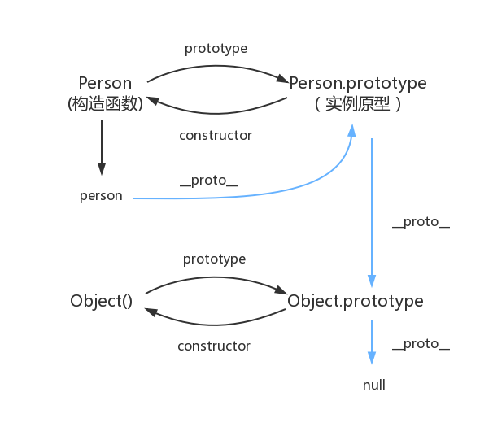

#### 介绍下 Set、Map、WeakSet 和 WeakMap 的区别？

#### ES5/ES6 的继承除了写法以外还有什么区别？

#### 有以下 3 个判断数组的方法，请分别介绍它们之间的区别和优劣

> Object.prototype.toString.call() 、 instanceof 以及 Array.isArray()


#### 箭头函数与普通函数（function）的区别是什么？构造函数（function）可以使用 new 生成实例，那么箭头函数可以吗？为什么？

#### var、let 和 const 区别的实现原理是什么

严格模式中Math ，this.Math

#### 暂时性死区

#### 什么是原型？prototype和__proto__区别

每一个JavaScript对象(null除外)在创建的时候就会与之关联另一个对象，这个对象就是我们所说的原型，每一个对象都会从原型"继承"属性。

继承意味着复制，而这里只是两个对象的关联，委托的说法准确些。

**构造函数和实例原型**（Person和 Person.prototype）：构造函数的prototype属性指向实例原型。

**实例和实例原型**（person 和 Person.prototype ）：实例的__proto__指向实例原型。

**原型与构造函数**：每个原型都有一个 constructor 属性指向关联的构造函数。当获取 person.constructor 时，其实 person 中并没有 constructor 属性,当不能读取到constructor 属性时，会从 person 的原型也就是 Person.prototype 中读取

**原型的原型**：原型也是一个对象，也有自己的原型，原型对象就是通过 Object 构造函数生成的，Object.prototype.`__proto__`指向null

**原型链**：当读取实例的属性时，如果找不到，就会查找与对象关联的原型中的属性，如果还查不到，就去找原型的原型，一直找到最顶层为止。




#### 什么是调用栈？

假设你调用greet("maggie")，计算机将首先为该函数调用分配一块内存。我们来使用这些内存。变量name被设置为maggie，这需要存储到内存中。每当你调用函数时，计算机都像这样将函数调用涉及的所有变量的值存储到内存中。接下来，你打印hello, maggie!，再调用greet2("maggie")。同样，计算机也为这个函数调用分配一块内存。计算机使用一个栈来表示这些内存块，其中第二个内存块位于第一个内存块上面。你打印how are you, maggie?，然后从函数调用返回。此时，栈顶的内存块被弹出。重要概念：调用另一个函数时，当前函数暂停并处于未完成状态。该函数的所有变量的值都还在内存中。


#### 箭头函数除了不绑定this 还有什么作用

- 函数体内的this值，绑定的定义时所在的作用域的this
- 构造函数不能是箭头函数
- 没有arguments
- 没有prototype，但有__proto__


#### 作用域

作用域是指程序源代码中定义变量的区域。

作用域规定了如何查找变量，也就是确定当前执行代码对变量的访问权限。

JavaScript 采用词法作用域(lexical scoping)，也就是静态作用域。


#### 静态作用域与动态作用域

因为 JavaScript 采用的是词法作用域，函数的作用域在函数定义的时候就决定了。

而与词法作用域相对的是动态作用域，函数的作用域是在函数调用的时候才决定的。


#### 执行上下文栈

JavaScript 引擎并非一行一行地分析和执行程序，而是一段一段地分析执行。当执行一段代码的时候，会进行一个“准备工作”，比如变量提升，和函数提升。

##### 可执行代码

全局代码、函数代码、eval代码

##### 执行上下文栈

对于每个执行上下文，都有三个重要属性：

- 变量对象(Variable object，VO)
- 作用域链(Scope chain)
- this

当执行一个函数的时候，就会创建一个执行上下文，并且压入执行上下文栈，当函数执行完毕的时候，就会将函数的执行上下文从栈中弹出。只有当整个应用程序结束的时候，ECStack 才会被清空，所以程序结束之前， ECStack 最底部永远有个 globalContext（全局执行上下文）。


#### 变量对象

变量对象是与执行上下文相关的数据作用域，存储了在上下文中定义的变量和函数声明。

- 全局上下文

  全局上下文中的变量对象就是全局对象呐！

- 函数上下文

  在函数上下文中，我们用活动对象(activation object, AO)来表示变量对象。

  活动对象和变量对象(VO)其实是一个东西，只是变量对象是规范上的或者说是引擎实现上的，不可在JavaScript 环境中访问，只有到当进入一个执行上下文中，这个执行上下文的变量对象才会被激活，所以才叫 activation object 呐，而只有被激活的变量对象，也就是活动对象上的各种属性才能被访问。

  活动对象是在进入函数上下文时刻被创建的，它通过函数的 arguments 属性初始化。arguments 属性值是 Arguments 对象。

  其他观点：**AO = VO + function parameters + arguments**,AO 实际上是包含了 VO 的

  

  ##### 执行过程

  1.进入执行上下文

  ​	变量对象会包括：

  1. 函数的所有形参 (如果是函数上下文)
     - 由名称和对应值组成的一个变量对象的属性被创建
     - 没有实参，属性值设为 undefined
  2. 函数声明
     - 由名称和对应值（函数对象(function-object)）组成一个变量对象的属性被创建
     - 如果变量对象已经存在相同名称的属性，则完全替换这个属性
  3. 变量声明
     - 由名称和对应值（undefined）组成一个变量对象的属性被创建；
     - 如果变量名称跟已经声明的形式参数或函数相同，则变量声明不会干扰已经存在的这类属性

  2.代码执行

  ​	在代码执行阶段，会顺序执行代码，根据代码，修改变量对象的值

  

到这里变量对象的创建过程就介绍完了，让我们简洁的总结我们上述所说：

1. 全局上下文的变量对象初始化是全局对象
2. 函数上下文的变量对象初始化只包括 Arguments 对象
3. 在进入执行上下文时会给变量对象添加形参、函数声明、变量声明等初始的属性值
4. 在代码执行阶段，会再次修改变量对象的属性值


#### 作用域链

当查找变量的时候，会先从当前上下文的变量对象中查找，如果没有找到，就会从父级(词法层面上的父级)执行上下文的变量对象中查找，一直找到全局上下文的变量对象，也就是全局对象。这样由**多个执行上下文的变量对象**构成的链表就叫做作用域链。

函数的作用域在函数定义的时候就决定了。

这是因为函数有一个内部属性 [[scope]]，当函数创建的时候，就会保存所有父变量对象到其中，你可以理解 [[scope]] 就是所有父变量对象的层级链，但是注意：[[scope]] 并不代表完整的作用域链！


#### 类数组

拥有一个数值length属性和对应非负整数属性的对象。

可以通过call，apply等调用数组原型方法。

**类数组转数组方法**：

- Array.from()
- [...arrayLike]
- slice, splice, concat等，如Array.prototype.slice.apply(arrayLike)


#### arguments 修改属性会不会影响原来的对象？严格模式和非严格模式有什么不同？

在非严格模式下，函数的arguments和当前函数定义的形参存在映射关系，一个变另外一个也变；

在严格模式下，函数的arguments和当前函数定义的形参是没有映射关系（个人理解：arguments为新创建的变量，里边的元素分别指向相应参数，因此重新复制不影响参数的值），并且禁止使用arguments.callee和arguments.callee.caller


#### 函数签名

#### typeof

#### Symbol

##### 应用场景1：使用Symbol来作为对象属性名(key)

可以设置私有属性，Object.keys, for...in不能获取，排除在自身的属性名集合中。

JSON.stringify()也排除。

获取方式：

```js
// 使用Object的API
Object.getOwnPropertySymbols(obj) // [Symbol(name)]

// 使用新增的反射API
Reflect.ownKeys(obj) // [Symbol(name), 'age', 'title']
```

##### 应用场景2：使用Symbol来替代常量


##### 注册和获取全局Symbol

```csharp
let gs1 = Symbol.for('global_symbol_1')  //注册一个全局Symbol
let gs2 = Symbol.for('global_symbol_1')  //获取全局Symbol

gs1 === gs2  // true
```


symbol也是有包装类吧，可以调方法属性的


## for of

一种数据结构只要部署了 Iterator 接口，我们就称这种数据结构是“可遍历的”（iterable）。

ES6 规定，默认的 Iterator 接口部署在数据结构的 Symbol.iterator 属性，或者说，一个数据结构只要具有Symbol.iterator 属性，就可以认为是"可遍历的"（iterable）。

一些数据结构默认部署了 Symbol.iterator 属性：

1. 数组
2. Set
3. Map
4. 类数组对象，如 arguments 对象、DOM NodeList 对象
5. Generator 对象
6. 字符串


#### 实现对象可用

```js
// 用 ES5 的语法创建一个迭代器
function createIterator(items) {
    var i = 0;
    return {
        next: function() {
            var done = i >= items.length;
            var value = !done ? items[i++] : undefined;

            return {
                done: done,
                value: value
            };
        }
    };
}

const obj = {
    value: 1
};

obj[Symbol.iterator] = function() {
    return createIterator([1,2,3]);
};

for (value of obj) {
    console.log(value);
}

// 1
// 2
// 3
```


#### 模拟实现for of

```js
function forOf(obj, cb) {
    let iterable, result;
	// 判断是否可遍历
    if (typeof obj[Symbol.iterator] !== "function")
        throw new TypeError(result + " is not iterable");
    // 判断是否是function
    if (typeof cb !== "function") throw new TypeError("cb must be callable");
	// 创建迭代器
    iterable = obj[Symbol.iterator]();
	// 获取迭代结果
    result = iterable.next();
    while (!result.done) {
        cb(result.value);
        result = iterable.next();
    }
}
```


#### 与for...in区别

for...in是可枚举


## 模板字符串的标签模板

