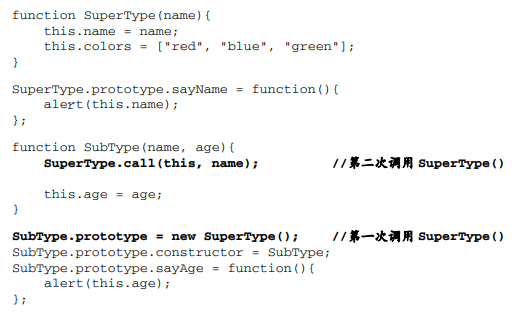

## 1.原型链继承

```js
function Parent () {
    this.name = 'kevin';
}

Parent.prototype.getName = function () {
    console.log(this.name);
}

function Child () {

}

Child.prototype = new Parent();

var child1 = new Child();

console.log(child1.getName()) // kevin
```

缺点：

1.原型属性会被所有实例共享

2.在创建子类型的实例时，不能向超类型的构造函数中传递参数


## 2.借用构造函数（经典继承）

```js
function Parent () {
    this.names = ['kevin', 'daisy'];
}

function Child () {
    // 调用父构造函数
    Parent.call(this);
}

var child1 = new Child();

child1.names.push('yayu');

console.log(child1.names); // ["kevin", "daisy", "yayu"]

var child2 = new Child();

console.log(child2.names); // ["kevin", "daisy"]
```

优点：

1.避免了引用类型的属性被所有实例共享

2.可以在 Child 中向 Parent 传参

缺点：

1.方法都在构造函数中定义，每次创建实例都会创建一遍方法。

2.没有操作原型，在超类型的原型中定义的方法，对子类型而言也是不可见的


## 3.组合继承（常用）

```js
function Parent (name) {
    this.name = name;
    this.colors = ['red', 'blue', 'green'];
}

Parent.prototype.getName = function () {
    console.log(this.name)
}

function Child (name, age) {
    // 执行父构造函数
    Parent.call(this, name);
    this.age = age;
}
// 原型
Child.prototype = new Parent();
// 构造函数指向问题修复
Child.prototype.constructor = Child;

var child1 = new Child('kevin', '18');

```

组合继承避免了原型链和借用构造函数的缺陷，融合了它们的优点，成为 JavaScript 中最常用的继承模式


## 4.原型式继承

这种方法并没有使用严格意义上的构造函数。他的想法是借助原型可以基于已有的对象创建新对象，同时还不必因此创建自定义类型。

**就是 ES5 Object.create 的模拟实现，将传入的对象作为创建的对象的原型。**

```js
function createObj(o) {
    function F(){}
    F.prototype = o;
    return new F();
}
```


## 5.寄生式继承

原型式继承的增强。在内部以某种方式来增强对象，

```js
function createObj (o) {
    // 调用原型式继承方法
    //var clone = Object.create(o);
    var clone = createObj(o);
    
    // 增强
    clone.sayName = function () {
        console.log('hi');
    }
    return clone;
}
```


## 6.寄生组合式继承

组合式继承的问题在于，调用两次超类型构造函数。

子类型最终会包含超类型对象的全部实例属性，但我们不得不在调用子类型构造函数时重写这些属性。



寄生组合式

```js
function object(o) {
    function F() {}
    F.prototype = o;
    return new F();
}

function Parent (name) {
    this.name = name;
    this.colors = ['red', 'blue', 'green'];
}
Parent.prototype.getName = function () {
    console.log(this.name)
}

function Child (name, age) {
    Parent.call(this, name);
    this.age = age;
}

function prototype(child, parent) {
    var prototype = object(parent.prototype);
    prototype.constructor = child;
    child.prototype = prototype;
}

// 当我们使用的时候：
prototype(Child, Parent);
```

这种方式的高效率体现它只调用了一次 Parent 构造函数，并且因此避免了在 Parent.prototype 上面创建不必要的、多余的属性。与此同时，原型链还能保持不变；因此，还能够正常使用 instanceof 和 isPrototypeOf。开发人员普遍认为寄生组合式继承是引用类型最理想的继承范式。


