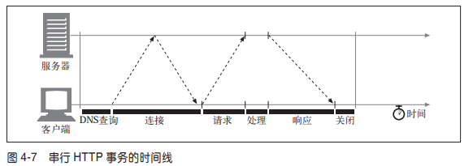
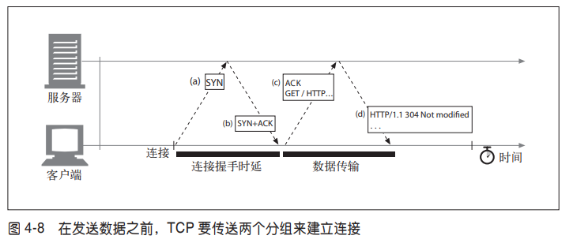
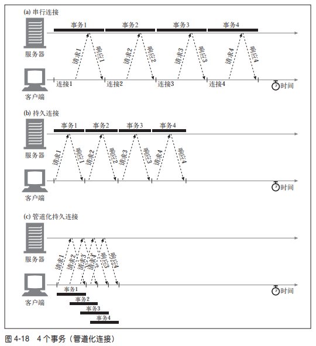

http版本的发展史

url

http报文是什么

报文结构

```html
<method> <request-URL> <version>
<headers>
<entity-body>
```

```html
<version> <status> <reason-phrase>
<headers>
<entity-body>
```

实体的主体部分包含一个由任意数据组成的数据块。并不是所有的报文都包含实 体的主体部分，有时，报文只是以一个 CRLF 结束。

一组 HTTP 首部总是应该以一个空行（仅有 CRLF）结束，甚至即使没有首 部和实体的主体部分也应如此。但由于历史原因，很多客户端和服务器都在没有实 体的主体部分时，（错误地）省略了最后的 CRLF。


请求方法作用？有哪些？区别？

get，head, post,put,trace,options,delete

 POST 用于向服务器发送数据。PUT 用于向服务器上的资源（例如文件）中存储数据。


状态码

方法是用来告诉服务器做什么事情的，状态码则用来告诉客户端，发生了什么事情。

状态码分类 

| 整体范围   | 已定义范围 | 分类       |
| ---------- | ---------- | ---------- |
| 100 ～ 199 | 100 ～ 101 | 信息提示   |
| 200 ～ 299 | 200 ～ 206 | 成功       |
| 300 ～ 399 | 300 ～ 305 | 重定向     |
| 400 ～ 499 | 400 ～ 415 | 客户端错误 |
| 500 ～ 599 | 500 ～ 505 | 服务器错误 |


注意，版本号不会被当作小数来处理。版本中的每个数字（比如 HTTP/1.0 中的 1 和 0）都会被当作一个单独的数字来处理。因此，在比较 HTTP 版本时，每个数字 都必须单独进行比较，以便确定哪个版本更高。比如，HTTP/2.22 就比 HTTP/2.3 的 版本要高，因为 22 比 3 大。

100，101


首部分类

• 通用首部 ，既可以出现在请求报文中，也可以出现在响应报文中。 

• 请求首部 ，提供更多有关请求的信息。 

• 响应首部 ，提供更多有关响应的信息。 

• 实体首部 ，描述主体的长度和内容，或者资源自身。 

• 扩展首部 ，规范中没有定义的新首部。

最后是一个 CRLF


If-Modified-Since有时差问题吧？

304 Not Modified


HTTP 是如何使用 TCP 连接的

TCP 连接的时延、瓶颈以及存在的障碍；

HTTP 的优化，包括并行连接、keep-alive（持久连接）和管道化连接；

管理连接时应该以及不应该做的事情


tcp

TCP 会按序、无差错地承载 HTTP 数据


TCP流是分段的、由IP分组传送

TCP 的数据是通过名为 IP 分组（或 IP 数据报）的小数据块来发送的。这样的话， 如图 4-3a 所示，HTTP 就是“HTTP over TCP over IP”这个“协议栈”中的最顶层 了。其安全版本 HTTPS 就是在 HTTP 和 TCP 之间插入了一个（称为 TLS 或 SSL 的）密码加密层（图 4-3b）。

HTTP 要传送一条报文时，会以流的形式将报文数据的内容通过一条打开的 TCP 连 接按序传输。TCP 收到数据流之后，会将数据流砍成被称作段的小数据块，并将段 封装在 IP 分组中，通过因特网进行传输（参见图 4-4）。所有这些工作都是由 TCP/ IP 软件来处理的，HTTP 程序员什么都看不到。


在任意时刻计算机都可以有几条 TCP 连接处于打开状态。TCP 是通过端口号来保持 所有这些连接持续不断地运行。

IP 地址可以将你连接到正确的计算机， 而端口号则可以将你连接到正确的应用程序上去。TCP 连接是通过 4 个值来识别的： < 源 IP 地址、源端口号、目的 IP 地址、目的端口号 >


每一层头都有什么信息


HTTP事务的时延




本节其余部分列出了一些会对 HTTP 程序员产生影响的、最常见的 TCP 相关时延， 其中包括： 

- TCP 连接建立握手； 

  建立一条新的 TCP 连接时，甚至是在发送任意数据之前，TCP 软件之间会交换一系 列的 IP 分组，对连接的有关参数进行沟通。如果连接只用来传送少量 数据，这些交换过程就会严重降低 HTTP 的性能。



- TCP 慢启动拥塞控制； 

  TCP 数据传输的性能还取决于 TCP 连接的使用期（age）。TCP 连接会随着时间进行 自我“调谐”，起初会限制连接的最大速度，如果数据成功传输，会随着时间的推移 提高传输的速度。这种调谐被称为 TCP 慢启动（slow start），用于防止因特网的突 然过载和拥塞。

- 数据聚集的 Nagle 算法；

-  用于捎带确认的 TCP 延迟确认算法；

-  TIME_WAIT 时延和端口耗尽。


串行事务处理时延


并行连接

HTTP 允许客户端打开多条连接，并行地执行多个 HTTP 事务。在 这个例子中，并行加载了四幅嵌入式图片，每个事务都有自己的 TCP 连接。

并行连接的速度可能会更快，但并不一定总是更快。客户端的网络带宽不足 （比如，浏览器是通过一个 28.8kbps 的 Modem 连接到因特网上去的）时，大部分 的时间可能都是用来传送数据的。在这种情况下，一个连接到速度较快服务器上的 HTTP 事务就会很容易地耗尽所有可用的 Modem 带宽。如果并行加载多个对象，每 个对象都会去竞争这有限的带宽，每个对象都会以较慢的速度按比例加载，这样带 来的性能提升就很小，甚至没什么提升。

打开大量连接会消耗很多内存资源，从而引发自身的性能问题。


持久连接


优先复用tcp还是优先创建tcp？


持久以及并行连接

我们看到，并行连接可以提高复合页面的传输速度。但并行连接也有一些缺点。 

• 每个事务都会打开 / 关闭一条新的连接，会耗费时间和带宽。 

• 由于 TCP 慢启动特性的存在，每条新连接的性能都会有所降低。 

• 可打开的并行连接数量实际上是有限的。


持久连接有一些比并行连接更好的地方。持久连接降低了时延和连接建立的开销， 将连接保持在已调谐状态，而且减少了打开连接的潜在数量。但是，管理持久连接 时要特别小心，不然就会累积出大量的空闲连接，耗费本地以及远程客户端和服务 器上的资源。

持久连接与并行连接配合使用可能是最高效的方式。现在，很多 Web 应用程序都会 打开少量的并行连接，其中的每一个都是持久连接。持久连接有两种类型：比较老的 HTTP/1.0+“keep-alive”连接，以及现代的HTTP/1.1“persistent”连接。在接 下来的几节中我们将对这两种类型进行介绍。


HTTP/1.1持久连接 

HTTP/1.1 逐渐停止了对 keep-alive 连接的支持，用一种名为持久连接（persistent connection）的改进型设计取代了它。持久连接的目的与 keep-alive 连接的目的相 同，但工作机制更优一些。

与 HTTP/1.0+ 的 keep-alive 连接不同，HTTP/1.1 持久连接在默认情况下是激活 的。除非特别指明，否则 HTTP/1.1 假定所有连接都是持久的。要在事务处理结束 之后将连接关闭，HTTP/1.1 应用程序必须向报文中显式地添加一个 Connection: close 首部。


keep-alive  persistent connection区别？

与keep-alive连接不同，HTTP/1.1中persistent连接默认就是激活的，除非特别指明，否则HTTP/1.1认为所有连接都是持久的。
 HTTP/1.1的客户端假定在收到的响应后，除非报文包含了Connection: Close首部，否则客户端就认为连接仍为维持在打开状态。


管道化连接

HTTP/1.1 允许在持久连接上可选地使用请求管道。




Content-Length及截尾操作

每条 HTTP 响应都应该有精确的 Content-Length 首部，用以描述响应主体的尺 寸。


客户端不应该以管道化方式传送非幂等请求（比如 POST）。


重定向

- 永久搬离的资源

- 临时搬离的资源

- URL 增强

- URL 增强

  如果一个超载的服务器收到一条请求，服务器可以将客户端重定向到一个负载不太 重的服务器上去。状态码 303 See Other 和 307 Temporary Redirect 可用于此类重定向。

- 服务器关联

- 规范目录名称

  客户端请求的 URI 是一个不带尾部斜线的目录名时，大多数 Web 服务器都会将 客户端重定向到一个加了斜线的 URI 上，这样相对链接就可以正常工作了。


对持久连接来说，连接可能仍保持打开状态，在这种情况下，服务器要特别小心， 要正确地计算 Content-Length 首部，不然客户端就无法知道响应什么时候结束了。


代理vs网关

代理连接的是两个或多个使用相同协议的应用程序，而网关连接的则是 两个或多个使用不同协议的端点。网关扮演的是“协议转换器”的角色，即使客户 端和服务器使用的是不同的协议，客户端也可以通过它完成与服务器之间的事务 处理。

实际上，代理和网关之间的区别很模糊。由于浏览器和服务器实现的是不同版本的 HTTP，代理也经常要做一些协议转换工作。而商业化的代理服务器也会实现网关 的功能来支持 SSL 安全协议、SOCKS 防火墙、FTP 访问，以及基于 Web 的应用程 序。


为什么使用代理


