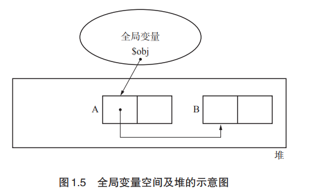

#### GC

让已经无法利用的内存实现自动再利用（可 能称为“内存资源回收”更恰当）的技术。GC把程序不用的内存空间视为垃圾。

作者：

既然话说到这里了，我就再介绍一下我的个人看法吧。实际上，GC 相当于虚拟内存。 一般的虚拟内存技术是在较小的物理内存的基础上，利用辅助存储创造一片看上去很大的“虚 拟”地址空间。也就是说，GC 是扩大内存空间的技术，因此我称其为空间性虚拟存储。

#### GC要做什么

1. 找到内存空间里的垃圾
2. 回收垃圾，让程序员能再次利用这部分空间

#### 内存泄露

内存空间在使用完毕后未释放。

#### 对象/头/域

对象由头（header）和域（field）构成。

> ##### 头

对象中保存对象本身信息的部分称为“头”。头主要含有以下信息：

-  对象的大小
- 对象的种类

如果不清楚对象的大小和种类，就会发生问题，例如无法判别内存中存储的对象的边界。 因此头对 GC 来说非常重要。

> 域

我们把对象使用者在对象中可访问的部分称为“域”。

对象使用者会引用或替换对象的域值。另一方面，对象使用者基本上无 法直接更改头的信息。 域中的数据类型大致分为以下 2 种：

- 指针

  通过 GC，对象会被销毁或保留。这时候起到关键作用的就是指针。因为 GC 是根据对 象的指针指向去搜寻其他对象的。

- 非指针

  GC 对非指针不进行任何操作

指针是指向内存空间中某块区域的值。

非指针指的是在编程中直接使用值本身。数值、字符以及真假值都是非指针。

#### mutator

它的实体就是“应用程序”。

mutator 实际进行的操作有以下 2 种：

- 生成对象
- 更新指针

#### 堆

堆指的是用于动态（也就是执行程序时）存放对象的内存空间。当 mutator 申请存放对象时， 所需的内存空间就会从这个堆中被分配给 mutator。

#### 活动对象/非活动对象

我们将分配到内存空间中的对象中那些能通过 mutator 引用的对象称为“活动对象”。反 过来，把分配到堆中那些不能通过程序引用的对象称为“非活动对象”。也就是说，不能通 过程序引用的对象已经没有人搭理了，所以死掉了。死掉的对象（即非活动对象）我们就称为“垃圾”。

#### 分配

分配（allocation）指的是在内存空间中分配对象。当 mutator 需要新对象时，就会向分配 器（allocator）申请一个大小合适的空间。分配器则在堆的可用空间中找寻满足要求的空间， 返回给 mutator。

> 在块里边分配？

#### 分块

分块（chunk）在 GC 的世界里指的是为利用对象而事先准备出来的空间。 初始状态下，堆被一个大的分块所占据。 然后，程序会根据 mutator 的要求把这个分块分割成合适的大小，作为（活动）对象使用。 活动对象不久后会转化为垃圾被回收。此时，这部分被回收的内存空间再次成为分块，为下次 被利用做准备。也就是说，内存里的各个区块都重复着分块→活动对象→垃圾（非活动对象）→ 分块→ …… 这样的过程。

#### 根

在 GC 的世界里，根是指向对象的指针的“起点” 部分。 这些都是能通过 mutator 直接引用的空间。

GC 把上述这样可以直接或间接从全局变量空间中引用的对象视为活动对象。 与全局变量空间相同，我们也可以通过 mutator 直接引用调用栈（call stack）和寄存器。 也就是说，调用栈、寄存器以及全局变量空间都是根。

