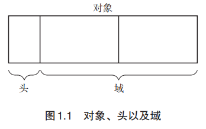

#### GC

让已经无法利用的内存实现自动再利用（可 能称为“内存资源回收”更恰当）的技术。GC把程序不用的内存空间视为垃圾。

作者：

既然话说到这里了，我就再介绍一下我的个人看法吧。实际上，GC 相当于虚拟内存。 一般的虚拟内存技术是在较小的物理内存的基础上，利用辅助存储创造一片看上去很大的“虚 拟”地址空间。也就是说，GC 是扩大内存空间的技术，因此我称其为空间性虚拟存储。

#### GC要做什么

1. 找到内存空间里的垃圾
2. 回收垃圾，让程序员能再次利用这部分空间

#### 内存泄露

内存空间在使用完毕后未释放。

#### 对象/头/域

对象由头（header）和域（field）构成。

> ##### 头

对象中保存对象本身信息的部分称为“头”。头主要含有以下信息：

-  对象的大小
- 对象的种类

如果不清楚对象的大小和种类，就会发生问题，例如无法判别内存中存储的对象的边界。 因此头对 GC 来说非常重要。

> 域

我们把对象使用者在对象中可访问的部分称为“域”。

对象使用者会引用或替换对象的域值。另一方面，对象使用者基本上无 法直接更改头的信息。 域中的数据类型大致分为以下 2 种：

- 指针

  通过 GC，对象会被销毁或保留。这时候起到关键作用的就是指针。因为 GC 是根据对 象的指针指向去搜寻其他对象的。

- 非指针

  GC 对非指针不进行任何操作

指针是指向内存空间中某块区域的值。

非指针指的是在编程中直接使用值本身。数值、字符以及真假值都是非指针。

#### mutator

它的实体就是“应用程序”。

mutator 实际进行的操作有以下 2 种：

- 生成对象
- 更新指针

#### 堆

堆指的是用于动态（也就是执行程序时）存放对象的内存空间。当 mutator 申请存放对象时， 所需的内存空间就会从这个堆中被分配给 mutator。

