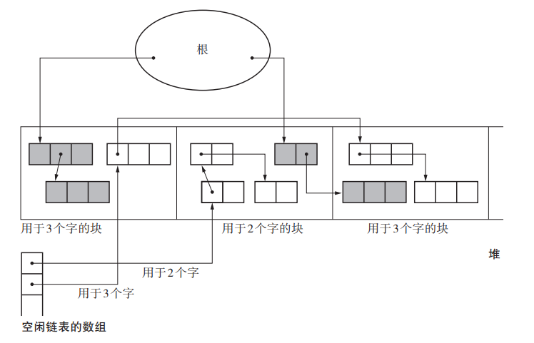
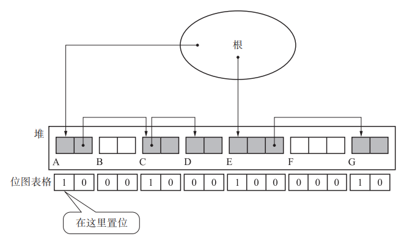

## 是什么

GC 标记 - 清除算法由标记阶段和清除阶段构成。标记阶段是把所有活动对象都做上标记的阶段。清除阶段是把那些没有标记的对象，也就是非活动对象回收的阶段。


## 两个阶段

#### 标记阶段

在标记阶段中，collector 会为堆里的所有活动对象打上标记。为此， 我们首先要标记通过根直接引用的对象。首先我们标记这样的对象，然后递归地标记通过指针数组能访问到的对象。 这样就能把所有活动对象（头）都标记上了。


用一句话概括，标记阶段就是“遍历对象并标记”的处理 过程。

标记所花费的时间是与“活动对 象的总数”成正比的。


#### 清除阶段

在清除阶段中，collector 会遍历整个堆，回收没有打上标记的对象（即垃圾），使其能再次得到利用。

所花费时间与堆大小成正比。堆越大，清除阶段所花费的时间就会越长。

```js
// 伪代码
sweep_phase(){
 sweeping = $heap_start
 while(sweeping < $heap_end)
 if(sweeping.mark == TRUE)
 sweeping.mark = FALSE
 else
 sweeping.next = $free_list
 $free_list = sweeping
 sweeping += sweeping.size
}
```

回收对象就是把对象作为分块，连接到被称为“空 闲链表”的单向链表。在之后进行分配时只要遍历这个空闲链表，就可以找到分块了。


#### 分配

这里的分配是指将回收的垃圾进行再利用。当 mutator 申请分块时，怎样才能把大小合适的分块分配 给 mutator 呢？

如前文所述，我们在清除阶段已经把垃圾对象连接到空闲链表了。搜索空闲链表并寻找 大小合适的分块，这项操作就叫作分配。

如果它找到和 size 大小 相同的分块，则会直接返回该分块；如果它找到比 size 大的分块，则会将其分割成 size 大 小的分块和去掉 size 后剩余大小的分块，并把剩余的分块返回空闲链表。


#### 合并

前文中已经提过，根据分配策略的不同可能会产生大量的小分块。但如果它们是连续的， 我们就能把所有的小分块连在一起形成一个大分块。这种“连接连续分块”的操作就叫作合 并（coalescing），合并是在清除阶段进行的。


## 优缺点

> 优点

简单

> 缺点

- 碎片化。

  在 GC 标记 - 清除算法的使用过程中会逐渐产生被细化的分块，不久后就会导致无数的 小分块散布在堆的各处。

- 分配速度

  GC 标记 - 清除算法中分块不是连续的，因此每次分配都必须遍历空闲链表，找到足够 大的分块。最糟的情况就是每次进行分配都得把空闲链表遍历到最后。

  引申：在 GC 复制算法和 GC 标记 - 压缩算法

- 与写时复制技术不兼容

  引申：位图标记


## 多个空闲链表

目的：优化分配效率


## BiBOP法

目的：优化碎片化

将大小相近的对象整理成固定大小的块进行管理的做法

GC 标记 - 清除算法中会发生碎片化。碎 片化的原因之一就是堆上杂乱散布着大小各异的对象。

对此，我们可以用这个方法：把堆分割成固定大小的块，让每个块只能配置同样大小的 对象。这就是 BiBOP 法。



如图所示，3 个字的对象被整合分配到左数第 1 个和第 3 个块，2 个字的对象被整 合分配到左数第 2 个块。像这样配置对象，就会提高内存的使用效率。因为每个块中只能配 置同样大小的对象，所以不可能出现大小不均的分块。 但是，使用 BiBOP 法并不能完全消除碎片化。比方说在全部用于 2 个字的块中，只有 1 到 2 个活动对象，这种情况下就不能算是有效利用了堆。 BiBOP 法原本是为了消除碎片化，提高堆使用效率而采用的方法。但像上面这样，在多 个块中分散残留着同样大小的对象，反而会降低堆使用效率。


## 位图标记

在单纯的 GC 标记 - 清除算法中，用于标记的位是被分配到各个对象的头中的。也就是说， 算法是把对象和头一并处理的。然而之前也提过，这跟写时复制技术不兼容。 对此我们有个方法，那就是只收集各个对象的标志位并表格化，不跟对象一起管理。在 标记的时候，不在对象的头里置位，而是在这个表格中的特定场所置位。像这样集合了用于标记的位的表格称为“位图表格”（bitmap table），利用这个表格进行标记的行为称为“位图标 记”。位图表格的实现方法有多种，例如散列表和树形结构等。



#### 优点

- 与写时复制技术兼容

- 清除操作更高效

  以往的清除操作都必须遍历整个堆，把 非活动对象连接到空闲链表，同时取消活动对象的标志位。 利用了位图表格的清除操作则把所有对象的标志位集合到一处，所以可以快速消去标志位。


## 延迟清除法