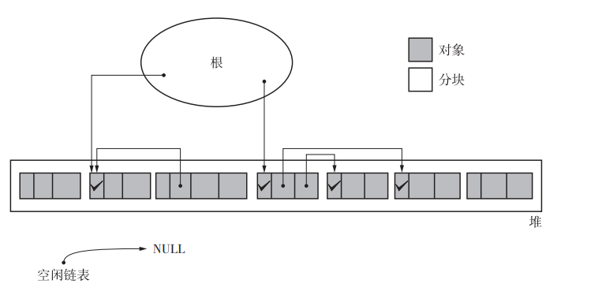

> 是什么

GC 标记 - 清除算法由标记阶段和清除阶段构成。标记阶段是把所有活动对象都做上标记的阶段。清除阶段是把那些没有标记的对象，也就是非活动对象 回收的阶段。

> 什么是活动对象

#### 标记阶段

在标记阶段中，collector 会为堆里的所有活动对象打上标记。为此， 我们首先要标记通过根直接引用的对象。首先我们标记这样的对象，然后递归地标记通过指针数组能访问到的对象。 这样就能把所有活动对象都标记上了。

用一句话概括，标记阶段就是“遍历对象并标记”的处理 过程。

标记所花费的时间是与“活动对 象的总数”成正比的。

> 什么是根

#### 清除阶段

在清除阶段中，collector 会遍历整个堆，回收没有打上标记的对象（即垃圾），使其能再次得到利用。

所花费时间与堆大小成正 比。堆越大，清除阶段所花费的时间就会越长。

