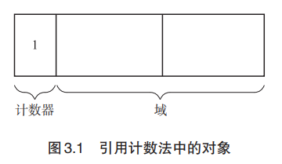

## 引用计数法是什么

GC 原本是一种“释放怎么都无法被引用的对象的机制”。那么人们自然而然地就会 想到，可以让所有对象事先记录下“有多少程序引用自己”。让各对象知道自己的“人气指 数”，从而让没有人气的对象自己消失，这就是引用计数法（Reference Counting），它是 George E. Collins [6] 于 1960 年钻研出来的。

## 算法

#### 计数器

计数器表示的是对象的人气指数， 也就是有多少程序引用了这个对象（被引用数）。

#### 缺点

- 循环引用无法回收
- 计数器值的增减处理繁重
- 计数器需要占用很多位
- 实现烦琐复杂

## 延迟引用计数法

## Sticky引用计数法

## 1位引用计数法

## 部分标记-清除算法

目的：解决不能回收循环的垃圾

