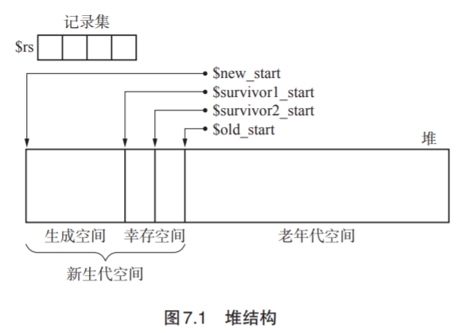

## 是什么

经验总结：大部分的对象在生成后马上就变成了垃圾， 很少有对象能活得很久。

引入“年龄”概念：经历 过一次 GC 后活下来的对象年龄为 1 岁。

#### 新生代对象和老年代对象

分代垃圾回收中把对象分类成几代，针对不同的代使用不同的 GC 算法，我们把刚生成 的对象称为新生代对象，到达一定年龄的对象则称为老年代对象。

新生代对象大部分会变成垃圾。如果我们只对这些新生代对象执行 GC 会怎 么样呢？除了引用计数法以外的基本算法，都会进行只寻找活动对象的操作（如 GC 标记 - 清除算法的标记阶段和 GC 复制算法等）。因此，如果很多对象都会死去，花费在 GC 上的时 间应该就能减少。我们将对新对象执行的 GC 称为新生代 GC（minor GC）。

新生代 GC 将存活了一定次数的新生代对象当作老年代对象来处理。我们把 类似于这样的新生代对象上升为老年代对象的情况称为晋升（promotion）。

因为老年代对象很难成为垃圾，所以我们对老年代对象减少执行 GC 的频率。相对于新 生代 GC，我们将面向老年代对象的 GC 称为老年代 GC（major GC）。

## Ungar的分代垃圾回收

分代垃圾回收的优点是只将垃圾回收的重点放在新生代对象身上，以此来缩减 GC 所需 要的时间。不过考虑到从老年代对象的引用，结果还是要搜索堆中的所有对象，这样一来就 大大削减了分代垃圾回收的优势。 因此我们才利用如图 7.1 所示的数组 —记录集。记录集用来记录从老年代对象到新生 代对象的引用。这样在新生代 GC 时就可以不搜索老年代空间的所有对象，只通过搜索记录 集来发现从老年代对象到新生代对象的引用。

#### 记录集

记录集被用于高效地寻找从老年代对象到新生代对象的引用。

> 幸存空间满了怎么办？

通常的 GC 复制算法把空间二等分为 From 空间和 To 空间，即使 From 空间里的对象都还 活着，也确保能把它们收纳到 To 空间里去。不过在 Ungar 的分代垃圾回收里，To 幸存空间必 须收纳 From 幸存空间以及生成空间中的活动对象。From 幸存空间和生存空间的点大小比 To 幸 存空间大，所以如果活动对象很多，To 幸存空间就无法容纳下它们。 当发生这种情况时，稳妥起见只能把老年代空间作为复制的目标空间。当然，如果频繁发生 这种情况，分代垃圾回收的优点就会淡化。 然而实际上经历晋升的对象很少，所以这不会有什么重大问题，因此在伪代码中我们就把这 步操作省略掉了。

## 优缺点

#### 优点

吞吐量得到改善

“很多对象年纪轻轻就会死”这一法则虽然是经验之谈，不过还是适用于大多数情况的。

#### 缺点

在部分程序中会起到反作用

