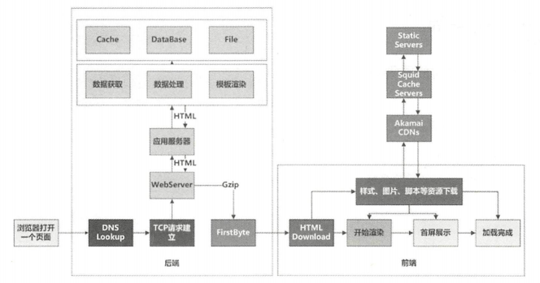
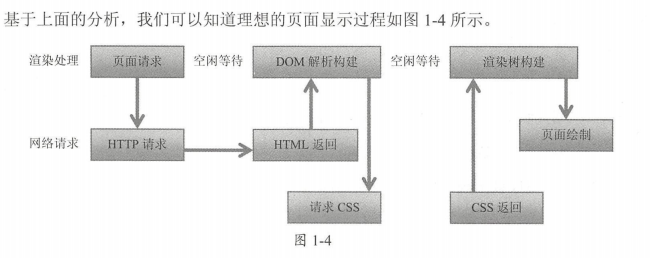
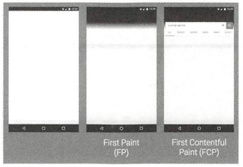

- 白屏
- 首屏
- 页面整体加载
- 页面可交互
- 功能交互响应

白屏时间

输入url后，从屏幕空白到第一个画面出来的时间。

chrome的firstPaint指标。代表浏览器开始渲染时间。

白屏过程

dns lookup

域名解析的过程，可短至几十毫秒，也可能消耗几秒

DNS 解析速度的优化策略有很多，通常我们会从以下几个方面思考细节的优化 

- DNS 缓存优化
- DNS 预加载策略
- 页面中资源的域名的合理分配
- 稳定可靠的 DNS 服务器等。

建立 CP 请求连接

- 基于不 同的网络环境，优化数据包的大小，以减少数据 传输丢失或者被破坏产生的重 传，从而提高传输效率 
- 网络传输链路的优化， 对于大部分企业来说，是需要很大投入的。例如，尝试在部署在不同国家的后台服务系统之间，有针对性地建立高速的专属网络通道，或者通过购买第 三方 内容网络服务来加速浏览器和 Web 服务器之间的网络通道优化 ，可以想象投入是 巨大的。

服务端请求处理晌应

对于中小 网站来说， 可能主要放在数据获取过程的优化。其中对缓存、数据库等处 理的优化，可为网站页面带来较大的 应速度提升。

客户端下载 解析、渲染显示页面

具体步骤如下

1. 如果是 Gz ip 包，则先解压为 HTML
2. 解析 HTML 的头部代码，下载头部代码中引用的样式资源文件或者脚本资源文件
3. 解析 HTML 代码和样式文件代码，这个过程会构造出两个树结构， HTML 相关 DOM 树，以及与 css相关的CSSOM树
4. 通过遍历 DOM 树和 CSSOM树， 浏览器依次计算每个节点的大小、坐标、颜色等样 式，构造出 染树。
5. 根据渲染树完成绘制的过程

上面的渲染过程，我们可以使用 chrome 的控制台开发工具中的 timeline 进行观察

浏览器下载 HTML 后，首先解析头部代码，进行样式表下载，然后继续向 解析 HTML 代码，构造 DOM 树，同时进行样式下载。 DOM 树构建完成后，立即开始构造 CSSOM 树。如 果样式表的下载速度足够快， DOM 树和 CSSOM 树就进入 个并行的过程，当两棵树准备完毕， 即可开始构造渲染树，最后进行绘制。

而在真实页面解析过程中，浏览器通常会因为各种因素被阻断：

( 1) HTML 代码中的 JavaScript 代码（简称 JS 代码）会阻断 DOM 树的构造，因为浏览器认 为这段 JS 代码可能会修改 DOM 结构，所以必须等待 JS 代码执行完毕，再恢复 DOM 树的构造过 程。这是由浏览器的安全解析策略决定的，目前并没有指定某个 JS 代码不涉及 DOM 的属性。

(2 ）浏览器必须等待样式表加载完成，才能开始构建 CSSOM树。

(3 ）还有 种特殊情况，浏览器在解析 HTML 才遇到 JS 代码，而此时 CSSOM 树还未构 建完成，则浏览器会暂停脚本的执行（浏览器同时也会暂停继续向下解析 HTML 代码，从而导致DOM 树的构建过程被暂停阻塞），自到 css 样式文件 载完成，并完成 CSSOM 树的构建， 才会重新恢复原来的解析 这也足由浏览器的安全解析策略决定的

通过对上面各因素的分析， 我们可以发现， HTML 中的内联 js代码执行的危害之处，不在 于它阻断了 DOM 树的构建过过程，除非是一段特别恶劣的js代码运行非常慢。通常内联的 JS 代码运行大概消耗几十毫秒，也就是暂停构建几 秒到几十毫秒， 它最大的危害在于上面第 三种情况提到的，即 DOM 树构建被阻塞的时间不是只有js代码运行的时间，而是会加上样式资 源文件下载和 CSSOM 树的构建时间。 这时浏览器所进行的串行解析过程，与我们在前面期望 DOM 树和 CSSOM树 的井行解析过程相差甚远 。

几个方面着手：

- 优化 HTML 代码和结构，缩短 HTML 下载时间， 加快 HTML 解析速度。
- 优化css 文件和结构，缩短 css 下载时间和解析时间
- 合理 JS 代码，避免前面第三种情况的出现， 这也是最重要的

首屏时间

首屏时间代表页面在“第一个屏幕”中的内容完全展示出来的时间。

> 这怎么测量

与白屏不同，我们并不能从浏览器的系统 API 中获取首屏时间。在真实网络环境中，我们通过模拟的方式来获取首屏指标；而在实验室环境中，我们则可以通过一些性能测试工具来获取。这个我们在后面的指标量化里会做详细说明。

首屏时间在页面整体力日载的过程中，在开始渲染（ StartRender ）和加载完成 OnLoad 的中间

first paint

first contentful paint

WebPagetest

Speedlndex由WebPagetest提供，通过视频录制、画面到帧的分析来模拟监测首屏的渲染，可以反映在实验室中配置的各种不同终端及网络下 ，页面首屏内容展示完成的速度快慢。

> 首屏时间优化策略

页面整体加载完成（Page Load）

