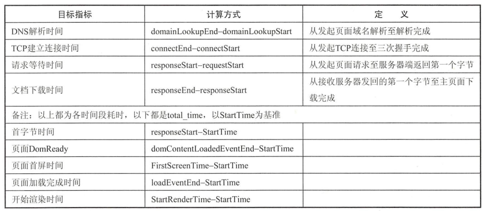
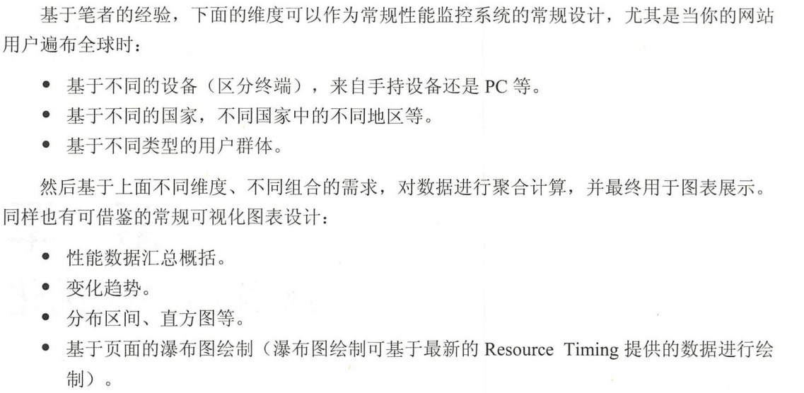

《高性能网站建设指南》 书中总结了 12 条某本规则：

-  减少 HTTP 请求。 
- 使用 CDN 
- 静态资源使用 Cache 
- 启用 Gzip 压缩。 
- JavaScript 脚本尽量放在页面底部 •
- css 样式放在顶部 
- 避免 css 表达式 
- 减少内联 JavaScript 和css的 使用，尽可能使用外部的 JavaScript和 css文件 
- 减少 DNS 
- 精简 JavaScript 
- 避免重定向。 
- 删除重复的脚本

（删除不用的脚本）

以上主要几种在加载阶段，而浏览器解析和渲染阶段空白

使用 PageSpeed 进行性能分析

使用 WebPagetest 进行性能分析

真实用户前端性能监控

- 采集数据存储。 
- 监控系统指标定义及加工计算。
- 数据分析、性能报表产出
- 性能基线定义

终端环境数据

- 设备信息，用于区分 PC、Mobil、平板 等不同设备。
- 操作系统 
- 浏览器。
- 地区／国家等。

通过浏览器UA获取设备、系统、浏览器信息，通过ip以及IP库获取地区国家信息

基础性能指标数据

网络相关时间：

- 页面域名解析时间（ DNS Lookup Time
- TCP 连接时间（ TCP Connection Time 
- 页面首宇节时间， 可理解为页面请求等待时间（ Time To First Byte ）
- HTML 文档下载时间 HTML Download Time

浏览器端渲染相关时间：

- 页面开始渲染时间， 即白屏等待时 间（ StartRender Time）
-  文档对象模型准备时间 Dom Ready Time 
- 页面加载完成时间 Page Load Time

页面资源加载详细数据

页面加载包含的 IMG、 JS、 css 资源的时间消耗数据

Performance Timing API 主要包含3部分。

- Navigation Timing：主要提供页面加载过程的性能数据
- Resource Timing： 主要提供页面所包含的脚本、样式表、图片等资源加载的性能数据 
-  User Timing ：方便为在复杂脚本内部记录不同代码片段的执行时间提供 API实现

一般我们都以 NavigationStart或者 Fetch Start 的值作为页面加载的开始时间，以 Response End 作为分隔点， 它之前的时间一般归属到网络相关的消耗，而在它之后的时间一般归属到终端渲染的消耗，最后以 LoadEvent End 作为结束时间

Resource API

通过访问 Window. performance.getEntriesByType（"resource"）返回的数组对象，可以遍历当前页面所包含资源加载相关的性能信息

页面白屏时间的监控

目前在 IE9＋、 Chrome 浏览器中分别提供各自版本的 FirstPaint （即StartRender) 时间，可通过 JavaScript 访问来获取

页面性能数据加工计算

 StartTime 

StartTime的定义非常重要，因为后面所有的指标都需要以此时间为基准进行计算。基于经验，如果 NavigationStart 不为0，则使用 NavigationStart 作为页面 StartTime 基数，如果为0 ，则 降级使用 Fetch Start ，如 Fetch Start 还是0，则将考虑此数据作废

> 为啥要不为零？？

其他指标加工计算准则

系统报表简介

在完成原始指标的加工计算后，后期的数据分析、可视化图表的展示就变得非常重要。 

聚合计算时，推荐中位数而不是平均数。

