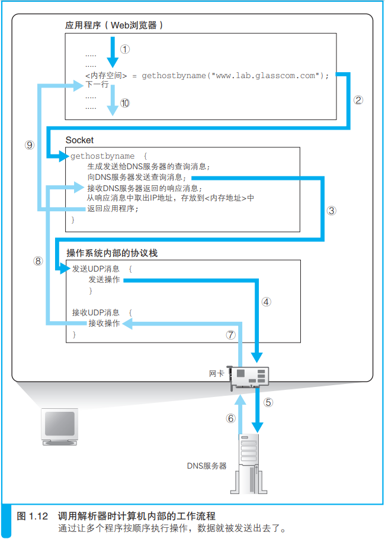
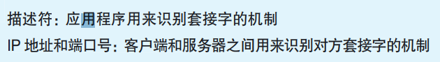

>  http://www.nikkeibp.co.jp/ 中的 www 代表 World Wide Web 协议（对通信操作规则所作的定义）？

×。http://www.nikkeibp.co.jp/ 中的 www 只是 Web 服务器上的一种命名。而且，World Wide Web 也不是一个协议的名字，而是 Web 的提出者最早开发的浏览器兼 HTML 编辑器的名字。

>  浏览器等网络应用程序实际上并不具备网络控制功能？

√。应用程序并不是自己去控制网络，而是委托操作系统来控制网络。

## 旅从用户在浏览器中输入网址（URL）开始

#### 为什么有各种各样的 URL？

浏览器可以用来访问Web 服务器，也可以用来在FTP 服务器上下载和上传文件，同时也具备电子邮件客户端的功能。因此它需要一些东西来判断应该使用其中哪种功能来访问相应的数据，而各种不同的URL 就是用来干这个的，比如访问 Web 服务器时用“http:”，而访问 FTP服务器时用“ftp:”。这部分文字都表示浏览器应当使用的访问方法（协议类型）。

### 1.1 浏览器先要解析 URL

以访问web服务器为例，当对 URL进行解析时，首先需要按照http协议的url格式，将其中的各个元素拆分出来，获取url含义。

- ##### 省略文件名的情况

1. http://www.lab.glasscom.com/dir/

   以“/”结尾代表 /dir/ 后面本来应该有的文件名被省略了。我们会在服务器上事先设置好文件名省略时要访问的默认文件名。这个设置根据服务器不同而不同，大多数情况下是 index.html 或者 default.htm 之类的文件名。

2. http://www.lab.glasscom.com/

   访问一个名叫“/”的目录。同上。

3. http://www.lab.glasscom.com

   当没有路径名时，就代表访问根目录下事先设置的默认文件

4. http://www.lab.glasscom.com/whatisthis

   由于末尾没有“/”，如果Web 服务器上存在名为 whatisthis 的文件，则将 whatisthis 作为文件名来处理；如果存在名为 whatisthis 的目录，则将 whatisthis 作为目录名来处理

#### HTTP 的基本思路

HTTP 协议定义了客户端和服务器之间交互的消息内容和步骤。

请求消息中包含的内容是“对什么”和“进行怎样的操作”两个部分。

1. **“对什么”的部分称为 URI**

   可以是url或其他的访问目标

2. **“进行怎样的操作”的部分称为方法**

   > *为什么要有不同的请求方法*？

除此以外，HTTP 消息中还有一些用来表示附加信息的**头字段**。客户端向 Web 服务器发送数据时，会先发送头字段，然后再发送数据。不过，头字段属于可有可无的附加信息。

##### 服务器工作

收到请求消息之后，Web 服务器会对其中的内容进行解析，通过 URI和方法来判断“对什么”“进行怎样的操作”，并根据这些要求来完成自己的工作，然后将结果存放在响应消息中。在响应消息的开头有一个状态码，它用来表示操作的执行结果是成功还是发生了错误。

> *状态码相关补充*

##### 回到客户端

响应消息会被发送回客户端，客户端收到之后，浏览器会从消息中读出所需的数据并显示在屏幕上。到这里，HTTP 的整个工作就完成了。

##### 举例，

get请求获取网页数据（输入url地址，获取index.html网页），当 Web 服务器收到消息后，会打开 /index.html文件并读取出里面的数据，然后将读出的数据存放到响应消息中，并返回给客户端。最后，客户端浏览器会收到这些数据并显示在屏幕上。

使用 POST 方法时，URI 会指向 Web 服务器中运行的一个应用程序 B 的文件名，然后，在请求消息中，除了方法和 URI 之外，还要加上传递给应用程序和脚本的数据。

> *get请求数据有大小限制吗？post为什么没有？是分包关系？怎么分包的，分数据包分的是什么数据？*

### 1.2 生成 HTTP 请求消息

对 URL 进行解析之后，浏览器确定了 Web 服务器和文件名，接下来就是根据这些信息来生成 HTTP 请求消息了。

#### 按照一定的格式

### 1.3 发送请求后会收到响应

状态码是一个数字，它主要用来向程序告知执行的结果。

响应短语则是一段文字，用来向人们告知执行的结果。

返回响应消息之后，浏览器会将数据提取出来并显示在屏幕上，我们就能够看到网页的样子了。如果网页的内容只有文字，那么到这里就全部处理完毕了，但如果网页中还包括图片等资源，则还有下文。

> 1 条请求消息中只能写 1 个 URI。如果需要获取多个文件，必须对每个文件单独发送 1 条请求。

### 2. 向 DNS 服务器查询 Web 服务器的 IP 地址

生成 HTTP 消息之后，接下来我们需要委托操作系统将消息发送给Web 服务器。需要提供IP地址，因此，在生成 HTTP 消息之后，下一个步骤就是根据域名查询 IP 地址。

#### 2.1 TCP/IP 的基本思路

互联网和公司内部的局域网都是基于 TCP/IP 的思路来设计的。

由一些小的子网，通过路由器 A连接起来组成一个大的网络。这里的子网可以理解为用集线器连接起来的几台计算机，我们将它看作一个单位，称为子网。将子网通过路由器连接起来，就形成了一个网络。

#### 2.2 IP地址

在网络中，所有的设备都会被分配一个地址。包括***网络号和主机号***。

> 网络号，主机号是什么？

通过 IP 地址我们可以判断出访问对象服务器的位置，从而将消息发送到服务器。

发送者发出的消息首先经过子网中的集线器，转发到距离发送者最近的路由器上。接下来，路由器会根据消息的目的地判断下一个路由器的位置，然后将消息发送到下一个路由器，即消息再次经过子网内的集线器被转发到下一个路由器。前面的过程不断重复，最终消息就被传送到了目的地。

实际的 IP 地址是一串32 比特的数字，按照 8 比特（1 字节）为一组分成 4 组，分别用十进制表示然后再用圆点隔开。这就是我们平常经常见到的 IP 地址格式，但仅凭这一串数字我们无法区分哪部分是网络号，哪部分是主机号。在 IP 地址的规则中，网络号和主机号连起来总共是 32 比特，但这两部分的具体结构是不固定的。在组建网络时，用户可以自行决定它们之间的分配关系，因此，我们还需要另外的附加信息来表示 IP 地址的内部结构。

转成二进制，子网掩码为 1 的部分表示网络号，子网掩码为 0 的部分表示主机号。

#### 域名和 IP 地址并用的理由

**直接IP访问？**

语义化，另外，如果 Web 服务器使用了虚拟主机功能，有可能无法通过 IP 地址来访问

**直接域名访问？**

从运行效率，需要处理更多的子节，而且格式不固定，处理复杂

### 2.3 Socket 库提供查询 IP 地址的功能

向 DNS 服务器发出查询，也就是向 DNS 服务器发送查询消息，并接收服务器返回的响应消息。换句话说，对于 DNS 服务器，我们的计算机上一定有相应的 DNS 客户端，而相当于 DNS 客户端的部分称为 DNS 解析器，或者简称解析器。通过 DNS 查询 IP 地址的操作称为域名解析

解析器实际上是一段程序，它包含在操作系统的 Socket 库中。Socket 库，其中包含的程序组件可以让其他的应用程序调用操作系统的网络功能，而解析器就是这个库中的其中一种程序组件。

***Socket 库是用于调用网络功能的程序组件集合。***

调用解析器后，解析器会向 DNS 服务器发送查询消息，然后 DNS 服务器会返回响应消息。响应消息中包含查询到的 IP 地址，解析器会取出 IP地址，并将其写入浏览器指定的内存地址中。接下来，浏览器在向 Web 服务器发送消息时，只要从该内存地址取出 IP 地址，并将它与 HTTP 请求消息一起交给操作系统就可以了。

> ***存在内存中是缓存作用吗？***

#### 解析器的内部原理

**“控制流程转移”**

发送消息这个操作并不是由解析器自身来执行，而是要委托给操作系统内部的协议栈来执行。这是因为和浏览器一样，解析器本身也不具备使用网络收发数据的功能。解析器调用协议栈后，控制流程会再次转移，协议栈会执行发送消息的操作，然后通过网卡将消息发送给 DNS 服务器。

如果要查询 www.lab.glasscom.com 这个域名对应的 IP 地址，客户端会向 DNS 服务器发送包含以下信息的查询消息。
（a）域名 = www.lab.glasscom.com
（b） Class = IN
（c）记录类型 = A（A对应IP地址，MX对应邮件服务器）

#### 域名的层次结构

DNS 中的域名都是用句点来分隔的，比如 www.lab.glasscom.com，com 域的下一层是glasscom 域，再下一层是 lab 域，再下面才是 www 这个名字。

假设公司的域为 example.co.jp， 我们可以在这个域的下面创建两个子域， 即 sub1.example.co.jp 和sub2.example.co.jp，然后就可以将这两个下级域分配给不同的事业集团来使用。

有时候并不需要从最上级的根域开始查找，因为 DNS 服务器有一个缓存功能，可以记住之前查询过的域名。有时候并不需要从最上级的根域开始查找，因为 DNS 服务器有一个缓存功能，可以记住之前查询过的域名。

### 3. 委托协议栈发送消息

Socket只要是桥梁作用，实质是协议栈去处理。

使用 Socket 库来收发数据的操作过程，分为若干个阶段，可以大致总结为以下 4 个。
（1）创建套接字（创建套接字阶段）
（2）将管道连接到服务器端的套接字上（连接阶段）
（3）收发数据（通信阶段）
（4）断开管道并删除套接字（断开阶段）

只要将数据送入套接字就可以收发数据了，只要将数据送入套接字就可以收发数据了。

#### 创建套接字阶段

调用 Socket 库中的 socket 程序组件就可以了。

套接字创建完成后，协议栈会返回一个描述符，应用程序会将收到的描述符存放在内存中。用来识别不同的套接字。

#### 连接阶段：把管道接上去

应用程序通过调用 Socket 库中的名为 connect 的程序组件来完成这一操作。需要指定描述符、服务器 IP 地址和端口号这 3 个参数。

##### 端口号

知道了 IP 地址，我们就可以识别出网络上的某台计算机。但是，连接操作的对象是某个具体的套接字，因此必须要识别到具体的套接字才行。当同时指定 IP 地址和端口号时，就可以明确识别出某台具体的计算机上的某个具体的套接字。

如果说描述符是用来在一台计算机内部识别套接字的机制，那么端口号就是用来让通信的另一方能够识别出套接字的机制。

客户端在创建套接字时，协议栈会为这个套接字随便分配一个端口号。接下来，当协议栈执行连接操作时，会将这个随便分配的端口号通知给服务器。

说了这么多，总而言之，就是当调用 connect 时，协议栈就会执行连接操作。当连接成功后，协议栈会将**对方**的 IP 地址和端口号等信息保存在套接字中，这样我们就可以开始收发数据了。

#### 通信阶段：传递消息

当套接字连接起来之后，只要将数据送入套接字，数据就会被发送到对方的套接字中。

Socket 库委托协议栈来完成这个操作，这个操作需要使用 write 这个程序组件。

生成的 HTTP 请求消息就是我们要发送的数据。

接收消息的操作是通过 Socket 库中的 read 程序组件委托协议栈来完成的。调用read 时需要指定用于存放接收到的响应消息的内存地址，这一内存地址称为接收缓冲区。收缓冲区是一块位于应用程序内部的内存空间，相当于已经转交给了应用程序。

#### 断开阶段：收发数据结束

调用 Socket 库的 close 程序组件进入断开阶段。最终，连接在套接字之间的管道会被断开，套接字本身也会被删除。

##### 断开流程：

Web 使用的 HTTP 协议规定，当 Web 服务器发送完响应消息之后，应该主动执行断开操作，因此 Web 服务器会首先调用close 来断开连接。断开操作传达到客户端之后，客户端的套接字也会进入断开阶段。接下来，当浏览器调用 read 执行接收数据操作时，read 会告知浏览器收发数据操作已结束，连接已经断开。浏览器得知后，也会调用close 进入断开阶段。

