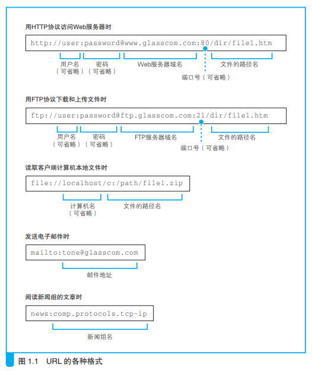
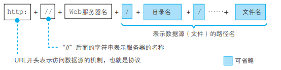

>  http://www.nikkeibp.co.jp/ 中的 www 代表 World Wide Web 协议（对通信操作规则所作的定义）？

×。http://www.nikkeibp.co.jp/ 中的 www 只是 Web 服务器上的一种命名。而且，World Wide Web 也不是一个协议的名字，而是 Web 的提出者最早开发的浏览器兼 HTML 编辑器的名字。

>  浏览器等网络应用程序实际上并不具备网络控制功能？

√。应用程序并不是自己去控制网络，而是委托操作系统来控制网络。

## 旅从用户在浏览器中输入网址（URL）开始

#### 为什么有各种各样的 URL？

浏览器可以用来访问Web 服务器，也可以用来在FTP 服务器上下载和上传文件，同时也具备电子邮件客户端的功能。因此它需要一些东西来判断应该使用其中哪种功能来访问相应的数据，而各种不同的URL 就是用来干这个的，比如访问 Web 服务器时用“http:”，而访问 FTP服务器时用“ftp:”。这部分文字都表示浏览器应当使用的访问方法（协议类型）。

#### 1.浏览器先要解析 URL

以访问web服务器为例，当对 URL进行解析时，首先需要按照http协议的url格式，将其中的各个元素拆分出来，获取url含义。

- ##### 省略文件名的情况

1. http://www.lab.glasscom.com/dir/

   以“/”结尾代表 /dir/ 后面本来应该有的文件名被省略了。我们会在服务器上事先设置好文件名省略时要访问的默认文件名。这个设置根据服务器不同而不同，大多数情况下是 index.html 或者 default.htm 之类的文件名。

2. http://www.lab.glasscom.com/

   访问一个名叫“/”的目录。同上。

3. http://www.lab.glasscom.com

   当没有路径名时，就代表访问根目录下事先设置的默认文件

4. http://www.lab.glasscom.com/whatisthis

   由于末尾没有“/”，如果Web 服务器上存在名为 whatisthis 的文件，则将 whatisthis 作为文件名来处理；如果存在名为 whatisthis 的目录，则将 whatisthis 作为目录名来处理

