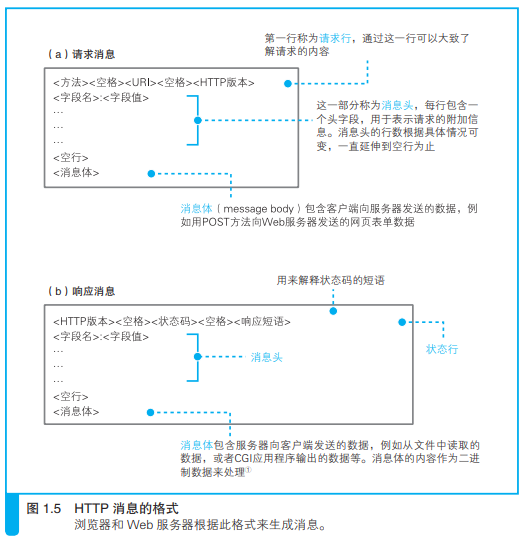

>  http://www.nikkeibp.co.jp/ 中的 www 代表 World Wide Web 协议（对通信操作规则所作的定义）？

×。http://www.nikkeibp.co.jp/ 中的 www 只是 Web 服务器上的一种命名。而且，World Wide Web 也不是一个协议的名字，而是 Web 的提出者最早开发的浏览器兼 HTML 编辑器的名字。

>  浏览器等网络应用程序实际上并不具备网络控制功能？

√。应用程序并不是自己去控制网络，而是委托操作系统来控制网络。

## 旅从用户在浏览器中输入网址（URL）开始

#### 为什么有各种各样的 URL？

浏览器可以用来访问Web 服务器，也可以用来在FTP 服务器上下载和上传文件，同时也具备电子邮件客户端的功能。因此它需要一些东西来判断应该使用其中哪种功能来访问相应的数据，而各种不同的URL 就是用来干这个的，比如访问 Web 服务器时用“http:”，而访问 FTP服务器时用“ftp:”。这部分文字都表示浏览器应当使用的访问方法（协议类型）。

### 1.1浏览器先要解析 URL

以访问web服务器为例，当对 URL进行解析时，首先需要按照http协议的url格式，将其中的各个元素拆分出来，获取url含义。

- ##### 省略文件名的情况

1. http://www.lab.glasscom.com/dir/

   以“/”结尾代表 /dir/ 后面本来应该有的文件名被省略了。我们会在服务器上事先设置好文件名省略时要访问的默认文件名。这个设置根据服务器不同而不同，大多数情况下是 index.html 或者 default.htm 之类的文件名。

2. http://www.lab.glasscom.com/

   访问一个名叫“/”的目录。同上。

3. http://www.lab.glasscom.com

   当没有路径名时，就代表访问根目录下事先设置的默认文件

4. http://www.lab.glasscom.com/whatisthis

   由于末尾没有“/”，如果Web 服务器上存在名为 whatisthis 的文件，则将 whatisthis 作为文件名来处理；如果存在名为 whatisthis 的目录，则将 whatisthis 作为目录名来处理

#### HTTP 的基本思路

HTTP 协议定义了客户端和服务器之间交互的消息内容和步骤。

请求消息中包含的内容是“对什么”和“进行怎样的操作”两个部分。

1. **“对什么”的部分称为 URI**

   可以是url或其他的访问目标

2. **“进行怎样的操作”的部分称为方法**

   > *为什么要有不同的请求方法*？

除此以外，HTTP 消息中还有一些用来表示附加信息的**头字段**。客户端向 Web 服务器发送数据时，会先发送头字段，然后再发送数据。不过，头字段属于可有可无的附加信息。

##### 服务器工作

收到请求消息之后，Web 服务器会对其中的内容进行解析，通过 URI和方法来判断“对什么”“进行怎样的操作”，并根据这些要求来完成自己的工作，然后将结果存放在响应消息中。在响应消息的开头有一个状态码，它用来表示操作的执行结果是成功还是发生了错误。

> *状态码相关补充*

##### 回到客户端

响应消息会被发送回客户端，客户端收到之后，浏览器会从消息中读出所需的数据并显示在屏幕上。到这里，HTTP 的整个工作就完成了。

##### 举例，

get请求获取网页数据（输入url地址，获取index.html网页），当 Web 服务器收到消息后，会打开 /index.html文件并读取出里面的数据，然后将读出的数据存放到响应消息中，并返回给客户端。最后，客户端浏览器会收到这些数据并显示在屏幕上。

使用 POST 方法时，URI 会指向 Web 服务器中运行的一个应用程序 B 的文件名，然后，在请求消息中，除了方法和 URI 之外，还要加上传递给应用程序和脚本的数据。

> *get请求数据有大小限制吗？post为什么没有？是分包关系？怎么分包的，分数据包分的是什么数据？*

### 1.2生成 HTTP 请求消息

对 URL 进行解析之后，浏览器确定了 Web 服务器和文件名，接下来就是根据这些信息来生成 HTTP 请求消息了。

#### 按照一定的格式

### 1.3发送请求后会收到响应

状态码是一个数字，它主要用来向程序告知执行的结果。

响应短语则是一段文字，用来向人们告知执行的结果。

返回响应消息之后，浏览器会将数据提取出来并显示在屏幕上，我们就能够看到网页的样子了。如果网页的内容只有文字，那么到这里就全部处理完毕了，但如果网页中还包括图片等资源，则还有下文。

> 1 条请求消息中只能写 1 个 URI。如果需要获取多个文件，必须对每个文件单独发送 1 条请求。

### 2.向 DNS 服务器查询 Web 服务器的 IP 地址

生成 HTTP 消息之后，接下来我们需要委托操作系统将消息发送给Web 服务器。需要提供IP地址，因此，在生成 HTTP 消息之后，下一个步骤就是根据域名查询 IP 地址。

