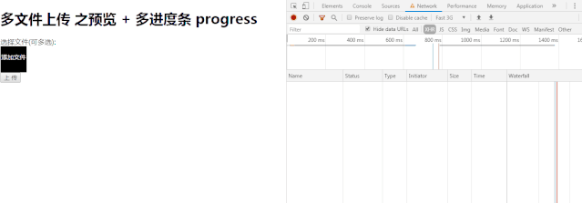
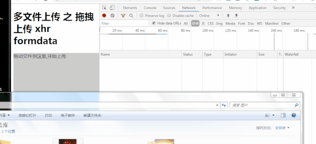
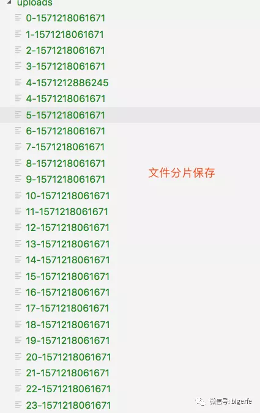

## 写给新手前端的各种文件上传攻略，从小图片到大文件断点续传

[程序员成长指北](javascript:void(0);) *今天*

以下文章来源于前端张大胖 ，作者zz_jesse

前端张大胖

本订阅号讲述了一个前端新屌丝如何登上了前端的贼船，又如何逆袭成为正式屌丝的心路历程，共勉。


# 写在前面

今年国庆假期终于可以憋在家里了不用出门了，不用出去看后脑了，真的是一种享受。这么好的光阴怎么浪费，睡觉、吃饭、打豆豆这怎么可能（耍多了也烦），完全不符合我们程序员的作风，赶紧起来把文章写完。

这篇文章比较基础，在国庆期间的业余时间写的，这几天又完善了下，力求把更多的前端所涉及到的关于文件上传的各种场景和应用都涵盖了,若有疏漏和问题还请留言斧正和补充。

# 自测读不读

以下是本文所涉及到的知识点，break or continue ?

- 文件上传原理
- 最原始的文件上传
- 使用 koa2 作为服务端写一个文件上传接口
- 单文件上传和上传进度
- 多文件上传和上传进度
- 拖拽上传
- 剪贴板上传
- 大文件上传之分片上传
- 大文件上传之断点续传
- node 端文件上传

# 原理概述

原理很简单，就是根据 http 协议的规范和定义，完成请求消息体的封装和消息体的解析，然后将二进制内容保存到文件。

我们都知道如果要上传一个文件，需要把 form 标签的`enctype`设置为`multipart/form-data`,同时`method`必须为`post`方法。

那么`multipart/form-data`表示什么呢？

> ★
>
> multipart互联网上的混合资源，就是资源由多种元素组成，form-data表示可以使用HTML Forms 和 POST 方法上传文件，具体的定义可以参考RFC 7578。
>
> ”

`multipart/form-data` 结构

看下 http 请求的消息体


- 请求头：

`Content-Type: multipart/form-data; boundary=----WebKitFormBoundaryDCntfiXcSkPhS4PN` 表示本次请求要上传文件，其中boundary表示分隔符，如果要上传多个表单项，就要使用boundary分割，每个表单项由———XXX开始，以———XXX结尾。

- 消息体- Form Data 部分

每一个表单项又由`Content-Type`和`Content-Disposition`组成。

`Content-Disposition: form-data` 为固定值，表示一个表单元素，`name` 表示表单元素的 名称，回车换行后面就是`name`的值，如果是上传文件就是文件的二进制内容。

`Content-Type`：表示当前的内容的 MIME 类型，是图片还是文本还是二进制数据。

**解析**

客户端发送请求到服务器后，服务器会收到请求的消息体，然后对消息体进行解析，解析出哪是普通表单哪些是附件。

可能大家马上能想到通过正则或者字符串处理分割出内容，不过这样是行不通的，二进制`buffer`转化为`string`,对字符串进行截取后，其索引和字符串是不一致的，所以结果就不会正确，除非上传的就是字符串。

不过一般情况下不需要自行解析，目前已经有很成熟的三方库可以使用。

至于如何解析，这个也会占用很大篇幅，后面的文章在详细说。

# 最原始的文件上传

**使用 form 表单上传文件**

在 `ie`时代，如果实现一个无刷新的文件上传那可是费老劲了，大部分都是用 iframe 来实现局部刷新或者使用 flash 插件来搞定，在那个时代 ie 就是最好用的浏览器（别无选择）。

DEMO


这种方式上传文件，不需要 js ，而且没有兼容问题，所有浏览器都支持，就是体验很差，导致页面刷新，页面其他数据丢失。

HTML

```html
<form method="post" action="http://localhost:8100" enctype="multipart/form-data">

        选择文件:
            <input type="file" name="f1"/> input 必须设置 name 属性，否则数据无法发送<br/>
<br/>
            标题：<input type="text" name="title"/><br/><br/><br/>

        <button type="submit" id="btn-0">上 传</button>

</form>
```

# 文件上传接口

服务端文件的保存基于现有的库`koa-body`结合 `koa2`实现服务端文件的保存和数据的返回。

在项目开发中，文件上传本身和业务无关，代码基本上都可通用。

在这里我们使用`koa-body`库来实现解析和文件的保存。

`koa-body` 会自动保存文件到系统临时目录下，也可以指定保存的文件路径。


然后在后续中间件内得到已保存的文件的信息，再做二次处理。

- `ctx.request.files.f1`   得到文件信息，`f1`为`input file` 标签的 `name`
- 获得文件的扩展名，重命名文件

```
NODE
```

```js
/**
 * 服务入口
 */
var http = require('http');
var koaStatic = require('koa-static');
var path = require('path');
var koaBody = require('koa-body');//文件保存库
var fs = require('fs');
var Koa = require('koa2');

var app = new Koa();
var port = process.env.PORT || '8100';

var uploadHost= `http://localhost:${port}/uploads/`;

app.use(koaBody({
    formidable: {
        //设置文件的默认保存目录，不设置则保存在系统临时目录下  os
        uploadDir: path.resolve(__dirname, '../static/uploads')
    },
    multipart: true // 开启文件上传，默认是关闭
}));

//开启静态文件访问
app.use(koaStatic(
    path.resolve(__dirname, '../static') 
));

//文件二次处理，修改名称
app.use((ctx) => {
    var file = ctx.request.files.f1;//得道文件对象
    var path = file.path;
    var fname = file.name;//原文件名称
    var nextPath = path+fname;
    if(file.size>0 && path){
        //得到扩展名
        var extArr = fname.split('.');
        var ext = extArr[extArr.length-1];
        var nextPath = path+'.'+ext;
        //重命名文件
        fs.renameSync(path, nextPath);
    }
    //以 json 形式输出上传文件地址
    ctx.body = `{
        "fileUrl":"${uploadHost}${nextPath.slice(nextPath.lastIndexOf('/')+1)}"
    }`;
});

/**
 * http server
 */
var server = http.createServer(app.callback());
server.listen(port);
console.log('demo1 server start ......   ');
```

https://github.com/Bigerfe/fe-learn-code/tree/master/src/upfiles-demo/demo1

# 多文件上传

在 `ie` 时代的多文件上传是需要创建多个 `input file` 标签，现在 `html5`只需要一个标签加个属性就搞定了,`file` 标签开启`multiple`。

DEMO


HTML

```html
//设置 multiple属性
<input type="file" name="f1" multiple/>
```

NODE

服务端也需要进行简单的调整，由单文件对象变为多文件数组，然后进行遍历处理。

```js
//二次处理文件，修改名称
app.use((ctx) => {
    
    var files = ctx.request.files.f1;// 多文件， 得到上传文件的数组
    var result=[];

    //遍历处理
    files && files.forEach(item=>{
        var path = item.path;
        var fname = item.name;//原文件名称
        var nextPath = path + fname;
        if (item.size > 0 && path) {
            //得到扩展名
            var extArr = fname.split('.');
            var ext = extArr[extArr.length - 1];
            var nextPath = path + '.' + ext;
            //重命名文件
            fs.renameSync(path, nextPath);
            
            //文件可访问路径放入数组
            result.push(uploadHost+ nextPath.slice(nextPath.lastIndexOf('/') + 1));
        }
    });
    
    //输出 json 结果
    ctx.body = `{
        "fileUrl":${JSON.stringify(result)}
    }`;
})
```

https://github.com/Bigerfe/fe-learn-code/tree/master/src/upfiles-demo/demo2

# 局部刷新 - iframe

这里说的是在 `ie` 时代的上传文件局部刷新，借助 iframe 实现。

DEMO


- 局部刷新

页面内放一个隐藏的 `iframe`，或者使用 `js` 动态创建，指定 `form` 表单的 `target` 属性值为`iframe`标签 的 `name` 属性值，这样 `form` 表单的 `shubmit` 行为的跳转就会在 `iframe` 内完成，整体页面不会刷新。

- 拿到接口数据

然后为 `iframe` 添加`load`事件，得到 `iframe` 的页面内容，将结果转换为 `JSON` 对象，这样就拿到了接口的数据

HTML

```html

   <iframe id="temp-iframe" name="temp-iframe" src="" style="display:none;"></iframe>
        <form method="post" target="temp-iframe" action="http://localhost:8100" enctype="multipart/form-data">
        选择文件(可多选):
            <input type="file" name="f1" id="f1" multiple/><br/> input 必须设置 name 属性，否则数据无法发送<br/>
<br/>
            标题：<input type="text" name="title"/><br/><br/><br/>

        <button type="submit" id="btn-0">上 传</button>

        </form>
        
        
<script>

var iframe = document.getElementById('temp-iframe');
iframe.addEventListener('load',function () {
      var result = iframe.contentWindow.document.body.innerText;
      //接口数据转换为 JSON 对象
      var obj = JSON.parse(result);
      if(obj && obj.fileUrl.length){
          alert('上传成功');
          
      }
      console.log(obj);
});


</script>
```

服务端代码不需要改动，略.

CODE

https://github.com/Bigerfe/fe-learn-code/tree/master/src/upfiles-demo/demo3

# 无刷新上传

无刷新上传文件肯定要用到`XMLHttpRequest`,在 `ie` 时代也有这个对象，单只 支持文本数据的传输，无法用来读取和上传二进制数据。

现在已然升级到了`XMLHttpRequest2`，较1版本有非常大的升级，首先就是可以读取和上传二进制数据，可以使用·FormData·对象管理表单数据。

当然也可使用 `fetch` 进行上传。

DEMO


HTML

```html
<div>
        选择文件(可多选):
        <input type="file" id="f1" multiple/><br/><br/>
        <button type="button" id="btn-submit">上 传</button>
</div>
```

JS xhr

```html
<script>
    function submitUpload() {
        //获得文件列表，注意这里不是数组，而是对象
        var fileList = document.getElementById('f1').files;
        if(!fileList.length){
            alert('请选择文件');
            return;
        }
        var fd = new FormData();   //构造FormData对象
        fd.append('title', document.getElementById('title').value);

        //多文件上传需要遍历添加到 fromdata 对象
        for(var i =0;i<fileList.length;i++){
            fd.append('f1', fileList[i]);//支持多文件上传
        }

        var xhr = new XMLHttpRequest();   //创建对象
        xhr.open('POST', 'http://localhost:8100/', true);

        xhr.send(fd);//发送时  Content-Type默认就是: multipart/form-data; 
        xhr.onreadystatechange = function () {
            console.log('state change', xhr.readyState);
            if (this.readyState == 4 && this.status == 200) {
                var obj = JSON.parse(xhr.responseText);   //返回值
                console.log(obj);
                if(obj.fileUrl.length){
                    alert('上传成功');
                }
            }
        }

    }

    //绑定提交事件
    document.getElementById('btn-submit').addEventListener('click',submitUpload);
</script>
```

JS Fetch

```js

  fetch('http://localhost:8100/', {
            method: 'POST',
            body: fd
        })
            .then(response => response.json())
            .then(response =>{
                console.log(response);
                if (response.fileUrl.length) {
                    alert('上传成功');
                }
            } )
            .catch(error => console.error('Error:', error));
```

https://github.com/Bigerfe/fe-learn-code/tree/master/src/upfiles-demo/demo4

# 多文件，单进度

借助`XMLHttpRequest2`的能力，实现多个文件或者一个文件的上传进度条的显示。

DEMO


说明

- 页面内增加一个用于显示进度的标签 `div.progress`
- `js` 内处理增加进度处理的监听函数`xhr.upload.onprogress`
- `event.lengthComputable`这是一个状态，表示发送的长度有了变化，可计算
- `event.loaded`表示发送了多少字节
- `event.total`表示文件总大小
- 根据`event.loaded`和`event.total`计算进度，渲染`div.progress`

## **PS 特别提醒**

`xhr.upload.onprogress`要写在`xhr.send`方法前面，否则`event.lengthComputable`状态不会改变，只有在最后一次才能获得，也就是`100%`的时候.

HTML

```html
<div>
        选择文件(可多选):
            <input type="file" id="f1" multiple/><br/><br/>

            <div id="progress">
                <span class="red"></span>
            </div>

        <button type="button" id="btn-submit">上 传</button>

</div>
```

JS

```html
<script>
    function submitUpload() {
        var progressSpan = document.getElementById('progress').firstElementChild;
        var fileList = document.getElementById('f1').files;
        progressSpan.style.width='0';
        progressSpan.classList.remove('green');

        if(!fileList.length){
            alert('请选择文件');
            return;
        }

        var fd = new FormData();   //构造FormData对象
        fd.append('title', document.getElementById('title').value);

        for(var i =0;i<fileList.length;i++){
            fd.append('f1', fileList[i]);//支持多文件上传
        }

        var xhr = new XMLHttpRequest();   //创建对象
        xhr.open('POST', 'http://10.70.65.235:8100/', true);

        xhr.onreadystatechange = function () {
            console.log('state change', xhr.readyState);
            if (xhr.readyState == 4) {
                var obj = JSON.parse(xhr.responseText);   //返回值
                console.log(obj);
                if(obj.fileUrl.length){
                    //alert('上传成功');
                }
            }
        }

        xhr.onprogress=updateProgress;
        xhr.upload.onprogress = updateProgress;
        function updateProgress(event) {
            console.log(event);
            if (event.lengthComputable) {
                var completedPercent = (event.loaded / event.total * 100).toFixed(2);
                progressSpan.style.width= completedPercent+'%';
                progressSpan.innerHTML=completedPercent+'%';
                if(completedPercent>90){//进度条变色
                    progressSpan.classList.add('green');
                }
                console.log('已上传',completedPercent);
            }
        }
        //注意 send 一定要写在最下面，否则 onprogress 只会执行最后一次 也就是100%的时候
        xhr.send(fd);//发送时  Content-Type默认就是: multipart/form-data; 
    }
    //绑定提交事件
    document.getElementById('btn-submit').addEventListener('click',submitUpload);
</script>
```

https://github.com/Bigerfe/fe-learn-code/tree/master/src/upfiles-demo/demo5

# 多文件上传+预览+取消

上一个栗子的多文件上传只有一个进度条，有些需求可能会不大一样，需要观察到每个文件的上传进度，并且可以终止上传。

DEMO



说明

- 为了预览的需要，我们这里选择上传图片文件，其他类型的也一样，只是预览不方便
- 页面内增加一个多图预览的容器`div.img-box`
- 根据选择的文件信息动态创建所属的预览区域和进度条以及取消按钮
- 为取消按钮绑定事件，调用`xhr.abort();`终止上传
- 使用`window.URL.createObjectURL`预览图片，在图片加载成功后需要清除使用的内存`window.URL.revokeObjectURL(this.src);`

HTML

```html
<div>
    选择文件(可多选):
    <div class="addfile">添加文件
    <input type="file" id="f1" multiple />
    </div>
    <div class="img-box"></div>
    <button type="button" id="btn-submit">上 传</button>
</div>
```

JS

```html
<script>
    //更改网络 为慢3g，就可以比较明显的看到进度条了
    var fileMaxCount=6;
    var imgBox =document.getElementsByClassName('img-box')[0];
    var willUploadFile=[];//保存待上传的文件以及相关附属信息
    document.getElementById('f1').addEventListener('change',function (e) {
        var fileList = document.getElementById('f1').files;

        if (willUploadFile.length > fileMaxCount || fileList.length>fileMaxCount || (willUploadFile.length+ fileList.length>fileMaxCount)) {
            alert('最多只能上传' + fileMaxCount + '张图');
            return;
        }
        for (var i = 0; i < fileList.length; i++) {
            var f = fileList[i];//先预览图片
            var img = document.createElement('img');
            var item = document.createElement('div');
            var progress = document.createElement('div');
            progress.className='progress';
            progress.innerHTML = '<span class="red"></span><button type="button">Abort</button>';
            item.className='item';
            img.src = window.URL.createObjectURL(f);
            img.onload = function () {
                //显示要是否这块儿内存
                window.URL.revokeObjectURL(this.src);
            }
            
            item.appendChild(img);
            item.appendChild(progress);
            imgBox.appendChild(item);

            willUploadFile.push({
                file:f,
                item,
                progress
            });
        }
    });


    function xhrSend({file, progress}) {

        var progressSpan = progress.firstElementChild;
        var btnCancel = progress.getElementsByTagName('button')[0];
        
        btnCancel.removeEventListener('click',function(e) {
            
        });
        btnCancel.addEventListener('click',function(e) {
           if(xhr && xhr.readyState!==4){
               //取消上传
               xhr.abort();
           } 
        });
        
        progressSpan.style.width='0';
        progressSpan.classList.remove('green');

        var fd = new FormData();   //构造FormData对象
        fd.append('f1',file);

        var xhr = new XMLHttpRequest();   //创建对象
        xhr.open('POST', 'http://localhost:8100/', true);

        xhr.onreadystatechange = function () {
            console.log('state change', xhr.readyState);
            //调用 abort 后，state 立即变成了4,并不会变成0
            //增加自定义属性  xhr.uploaded
            if (xhr.readyState == 4 &&  xhr.uploaded) {
                var obj = JSON.parse(xhr.responseText);   //返回值
                console.log(obj);
                if(obj.fileUrl.length){
                    //alert('上传成功');
                }
            }
        }

        xhr.onprogress=updateProgress;
        xhr.upload.onprogress = updateProgress;
        function updateProgress(event) {
            if (event.lengthComputable) {
                var completedPercent = (event.loaded / event.total * 100).toFixed(2);
                progressSpan.style.width= completedPercent+'%';
                progressSpan.innerHTML=completedPercent+'%';
                if(completedPercent>90){//进度条变色
                    progressSpan.classList.add('green');
                }
                if(completedPercent>=100){
                    xhr.uploaded=true;
                }
                console.log('已上传',completedPercent);
            }
        }
        //注意 send 一定要写在最下面，否则 onprogress 只会执行最后一次 也就是100%的时候
        xhr.send(fd);//发送时  Content-Type默认就是: multipart/form-data; 
        return xhr;
    }

    //文件上传
    function submitUpload(willFiles) {
        if(!willFiles.length){
            return;
        }
        //遍历文件信息进行上传
        willFiles.forEach(function (item) {
             xhrSend({
                 file:item.file,
                 progress:item.progress
             });
        });
    }
    //绑定提交事件
    document.getElementById('btn-submit').addEventListener('click',function () {
        submitUpload(willUploadFile);
    });
</script>
```


## **问题1**

这里没有做上传的并发控制，可以通过控制同时可上传文件的个数（这里控制为最多6个）或者上传的时候做好并发处理，也就是同时只能上传 X 个文件。

## **问题2**

在测试过程中，取消请求的方法`xhr.abort()`调用后，`xhr.readyState`会立即变为`4`,而不是`0`，所以这里需要做容错处理。

MDN 上说是0.


如果大家有不同的结果，欢迎留言。

CODE

https://github.com/Bigerfe/fe-learn-code/tree/master/src/upfiles-demo/demo11

# 拖拽上传

`html5`的出现，让拖拽上传交互成为可能，现在这样的体验也屡见不鲜。

DEMO



说明

- 定义一个允许拖放文件的区域`div.drop-box`
- 取消`drop` 事件的默认行为`e.preventDefault();`，不然浏览器会直接打开文件
- 为拖拽区域绑定事件,鼠标在拖拽区域上 `dragover`, 鼠标离开拖拽区域`dragleave`, 在拖拽区域上释放文件`drop`
- `drop`事件内获得文件信息`e.dataTransfer.files`

HTML

```html
 <div class="drop-box" id="drop-box">       
     拖动文件到这里,开始上传    
</div>        
<button type="button" id="btn-submit">上 传</button>
```

JS

```html

<script>

    var box = document.getElementById('drop-box');
    
    //禁用浏览器的拖放默认行为
    document.addEventListener('drop',function (e) {
        console.log('document drog');
        e.preventDefault();
    });
   
    //设置拖拽事件
    function openDropEvent() {
        box.addEventListener("dragover",function (e) {
            console.log('elemenet dragover');
             box.classList.add('over');
               e.preventDefault();
        });
         box.addEventListener("dragleave", function (e) {
              console.log('elemenet dragleave');
            box.classList.remove('over');
              e.preventDefault();
        });

        box.addEventListener("drop", function (e) {
            e.preventDefault(); //取消浏览器默认拖拽效果

            var fileList = e.dataTransfer.files; //获取拖拽中的文件对象
            var len=fileList.length;//用来获取文件的长度（其实是获得文件数量）
            
            //检测是否是拖拽文件到页面的操作
            if (!len) {
                box.classList.remove('over');
                return;
            }

            box.classList.add('over');

            window.willUploadFileList=fileList;

        }, false);
    }

    openDropEvent();

    function submitUpload() {

        var fileList = window.willUploadFileList||[];
        if(!fileList.length){
            alert('请选择文件');
            return;
        }

        var fd = new FormData();   //构造FormData对象

        for(var i =0;i<fileList.length;i++){
            fd.append('f1', fileList[i]);//支持多文件上传
        }

        var xhr = new XMLHttpRequest();   //创建对象
        xhr.open('POST', 'http://localhost:8100/', true);
        xhr.onreadystatechange = function () {
            if (xhr.readyState == 4) {
                var obj = JSON.parse(xhr.responseText);   //返回值
                if(obj.fileUrl.length){
                    alert('上传成功');
                }
            }
        }
        xhr.send(fd);//发送
    }
    //绑定提交事件
    document.getElementById('btn-submit').addEventListener('click',submitUpload);

</script>
```

https://github.com/Bigerfe/fe-learn-code/tree/master/src/upfiles-demo/demo7

# 剪贴板上传

掘金的写文编辑器是支持粘贴上传图片的，比如我从磁盘粘贴或者从网页上右键复制图片。

DEMO


说明

- 页面内增加一个可编辑的编辑区域`div.editor-box`,开启`contenteditable`
- 为`div.editor-box`绑定`paste`事件
- 处理`paste` 事件，从`event.clipboardData || window.clipboardData`获得数据
- 将数据转换为文件`items[i].getAsFile()`
- 实现在编辑区域的光标处插入内容 `insertNodeToEditor` 方法

## **问题1**

测试中发现复制多个文件无效，只有最后一个文件上传，在掘金的编辑器里也同样存在，在坐有知道原因的可以留言说下。

## **问题2**

`mac`系统可以支持从磁盘复制文件后上传，`windows` 系统测试未通过，剪贴板的数据未拿到。

HTML

```html
 <div class="editor-box" id="editor-box" contenteditable="true" >       
     可以直接粘贴图片到这里直接上传 
</div>
```

JS

```js

 //光标处插入 dom 节点
    function  insertNodeToEditor(editor,ele) {
        //插入dom 节点
        var range;//记录光标位置对象
        var node = window.getSelection().anchorNode;
        // 这里判断是做是否有光标判断，因为弹出框默认是没有的
        if (node != null) {
            range = window.getSelection().getRangeAt(0);// 获取光标起始位置
            range.insertNode(ele);// 在光标位置插入该对象
        } else {
            editor.append(ele);
        }
    }
    
    var box = document.getElementById('editor-box');
    //绑定paste事件
    box.addEventListener('paste',function (event) {
        var data = (event.clipboardData || window.clipboardData);

        var items = data.items;
        var fileList = [];//存储文件数据
        if (items && items.length) {
            // 检索剪切板items
            for (var i = 0; i < items.length; i++) {
                console.log(items[i].getAsFile());
                fileList.push(items[i].getAsFile());
            }
        }

        window.willUploadFileList = fileList;
        event.preventDefault();//阻止默认行为

        submitUpload();
    }); 

    function submitUpload() {
        var fileList = window.willUploadFileList||[];
        var fd = new FormData();   //构造FormData对象
        for(var i =0;i<fileList.length;i++){
            fd.append('f1', fileList[i]);//支持多文件上传
        }
        var xhr = new XMLHttpRequest();   //创建对象
        xhr.open('POST', 'http://localhost:8100/', true);
        xhr.onreadystatechange = function () {
            if (xhr.readyState === 4) {
                var obj = JSON.parse(xhr.responseText);   //返回值
                console.log(obj);
                if(obj.fileUrl.length){
                    var img = document.createElement('img');
                    img.src= obj.fileUrl[0];
                    img.style.width='100px';
                    insertNodeToEditor(box,img);
                   // alert('上传成功');
                }
            }
        }
        xhr.send(fd);//发送
    }
```

https://github.com/Bigerfe/fe-learn-code/blob/master/src/upfiles-demo/demo8/

# 大文件上传-分片

在 `ie` 时代由于无法使用`xhr`上传二进制数据，上传大文件需要借助浏览器插件来完成。现在来看实现大文件上传简直soeasy。

如果太大的文件，比如一个视频1g 2g那么大，直接采用上面的栗子中的方法上传可能会出链接现超时的情况，而且也会超过服务端允许上传文件的大小限制，所以解决这个问题我们可以将文件进行分片上传，每次只上传很小的一部分 比如2M。

DEMO




说明

相信大家都对`Blob` 对象有所了解，它表示原始数据,也就是二进制数据，同时提供了对数据截取的方法`slice`,而 `File` 继承了`Blob`的功能，所以可以直接使用此方法对数据进行分段截图。

- 把大文件进行分段 比如2M，发送到服务器携带一个标志，暂时用当前的时间戳，用于标识一个完整的文件
- 服务端保存各段文件
- 浏览器端所有分片上传完成，发送给服务端一个合并文件的请求
- 服务端根据文件标识、类型、各分片顺序进行文件合并
- 删除分片文件

HTML

代码略，只需要一个 `input file` 标签。

JS

```html
  //分片逻辑  像操作字符串一样
      
    var start=0,end=0;
    while (true) {
        end+=chunkSize;
        var blob = file.slice(start,end);
        start+=chunkSize;
        
        if(!blob.size){//截取的数据为空 则结束
            //拆分结束
            break;
        }
        
        chunks.push(blob);//保存分段数据
    }

<script>
    function submitUpload() {
        var chunkSize=2*1024*1024;//分片大小 2M
        var file = document.getElementById('f1').files[0];
        var chunks=[], //保存分片数据
         token = (+ new Date()),//时间戳
         name =file.name,chunkCount=0,sendChunkCount=0;

        //拆分文件 像操作字符串一样
        if(file.size>chunkSize){
            //拆分文件
            var start=0,end=0;
            while (true) {
                end+=chunkSize;
                var blob = file.slice(start,end);
                start+=chunkSize;
                
                if(!blob.size){//截取的数据为空 则结束
                    //拆分结束
                    break;
                }
                
                chunks.push(blob);//保存分段数据
            }
        }else{
            chunks.push(file.slice(0));
        }

        chunkCount=chunks.length;//分片的个数 
        
        //没有做并发限制，较大文件导致并发过多，tcp 链接被占光 ，需要做下并发控制，比如只有4个在请求在发送
        
        for(var i=0;i< chunkCount;i++){
            var fd = new FormData();   //构造FormData对象
            fd.append('token', token);
            fd.append('f1', chunks[i]);
            fd.append('index', i);
            xhrSend(fd,function () {
                sendChunkCount+=1;
                if(sendChunkCount===chunkCount){//上传完成，发送合并请求
                    console.log('上传完成，发送合并请求');
                    var formD = new FormData();
                    formD.append('type','merge');
                    formD.append('token',token);
                    formD.append('chunkCount',chunkCount);
                    formD.append('filename',name);
                    xhrSend(formD);
                }
            });
        }
    }

    function xhrSend(fd,cb) {
        var xhr = new XMLHttpRequest();   //创建对象
        xhr.open('POST', 'http://localhost:8100/', true);
        xhr.onreadystatechange = function () {
            console.log('state change', xhr.readyState);
            if (xhr.readyState == 4) {
                console.log(xhr.responseText);
                cb && cb();
            }
        }
        xhr.send(fd);//发送
    }

    //绑定提交事件
    document.getElementById('btn-submit').addEventListener('click',submitUpload);
</script>

```

服务端需要做一些改动，保存分片文件、合并分段文件、删除分段文件。

**PS**

合并文件这里使用 `stream pipe` 实现，这样更节省内存，边读边写入，占用内存更小，效率更高，代码见`fnMergeFile`方法。

```js

//二次处理文件，修改名称
app.use((ctx) => {
    var body = ctx.request.body;
    var files = ctx.request.files ? ctx.request.files.f1:[];//得到上传文件的数组
    var result=[];
    var fileToken = ctx.request.body.token;// 文件标识
    var fileIndex=ctx.request.body.index;//文件顺序

    if(files &&  !Array.isArray(files)){//单文件上传容错
        files=[files];
    }

    files && files.forEach(item=>{
        var path = item.path;
        var fname = item.name;//原文件名称
        var nextPath = path.slice(0, path.lastIndexOf('/') + 1) + fileIndex + '-' + fileToken;
        if (item.size > 0 && path) {
            //得到扩展名
            var extArr = fname.split('.');
            var ext = extArr[extArr.length - 1];
            //var nextPath = path + '.' + ext;
            //重命名文件
            fs.renameSync(path, nextPath);
            result.push(uploadHost+nextPath.slice(nextPath.lastIndexOf('/') + 1));
        }
    });

    if(body.type==='merge'){//合并分片文件
        var filename = body.filename,
        chunkCount = body.chunkCount,
            folder = path.resolve(__dirname, '../static/uploads')+'/';
        
        var writeStream = fs.createWriteStream(`${folder}${filename}`);

        var cindex=0;
        //合并文件
        function fnMergeFile(){
            var fname = `${folder}${cindex}-${fileToken}`;
            var readStream = fs.createReadStream(fname);
            readStream.pipe(writeStream, { end: false });
            readStream.on("end", function () {
                fs.unlink(fname, function (err) {
                    if (err) {
                        throw err;
                    }
                });
                if (cindex+1 < chunkCount){
                    cindex += 1;
                    fnMergeFile();
                }
            });
        }
        fnMergeFile();
        ctx.body='merge ok 200';
    }
  
});
```

https://github.com/Bigerfe/fe-learn-code/tree/master/src/upfiles-demo/demo12

# 大文件上传-断点续传

在上面我们实现了大文件的分片上传，解决了大文件上传超时和服务器的限制。

但是仍然不够完美，大文件上传并不是短时间内就上传完成，如果期间断网，页面刷新了仍然需要重头上传。

## **方法1**

基于上面一个栗子进行改进，服务端已保存了部分片段，重新上传的时候，服务端对当前的分段进行对比，只接收本地没有的分段，前提是分段大小一致。

在上面为了方便，使用了时间戳作为这个文件的标志，其实可以使用`spark-md5`来生成文件的 hash 值，这样服务器就可以进行文件的对比了。

但是不好的地方是每个分段都要重新发送请求。

## **方法2 - 断点续传**

方法1中，重新上传时请求和数据还会发到服务器，其实已上传的分段就不应该再发送到服务器了，所以我们可以使用断点续传来进行改进。

- 为每个分段生成 hash 值，使用  `spark-md5`  库
- 将上传成功的分段信息保存到本地
- 重新上传时，进行和本地分段 hash 值的对比，如果相同的话则跳过，继续下一个分段的上传

**PS**

生成 hash 过程肯定也会耗费资源，但是和重新上传相比可以忽略不计了。

DEMO


HTML

```
代码略
JS
```

模拟分段保存，本地保存到`localStorage`

```js
    //获得本地缓存的数据
    function getUploadedFromStorage(){
        return JSON.parse( localStorage.getItem(saveChunkKey) || "{}");
    }
    //写入缓存
    function setUploadedToStorage(index) {
        var obj =  getUploadedFromStorage();
        obj[index]=true;      
        localStorage.setItem(saveChunkKey, JSON.stringify(obj) );
    }
    
    //分段对比
    
    var uploadedInfo = getUploadedFromStorage();//获得已上传的分段信息

    for(var i=0;i< chunkCount;i++){
            console.log('index',i, uploadedInfo[i]?'已上传过':'未上传');
            
            if(uploadedInfo[i]){//对比分段
                sendChunkCount=i+1;//记录已上传的索引
                continue;//如果已上传则跳过
            }
            var fd = new FormData();   //构造FormData对象
            fd.append('token', token);
            fd.append('f1', chunks[i]);
            fd.append('index', i);
           
           (function (index) {
                    xhrSend(fd, function () {
                    sendChunkCount += 1;
                    //将成功信息保存到本地
                    setUploadedToStorage(index);
                    if (sendChunkCount === chunkCount) {
                        console.log('上传完成，发送合并请求');
                        var formD = new FormData();
                        formD.append('type', 'merge');
                        formD.append('token', token);
                        formD.append('chunkCount', chunkCount);
                        formD.append('filename', name);
                        xhrSend(formD);
                    }
                });
            })(i);
    }
```

# node 端上传图片

不只会从客户端上传文件到服务器，服务器也会上传文件到其他服务器。

- 读取文件buffer `fs`
- 构建 form-data `form-data`
- 上传文件 `node-fetch`

NODE

```js

 /**
     * filepath = 相对根目录的路径即可
     */
   async function getFileBufer(filePath) => {

        return new Promise((resolve) => {
            fs.readFile(filePath, function (err, data) {
                var bufer = null;
                if (!err) {
                    resolve({
                        err: err,
                        data: data
                    });
                }

            });

        });
    }
    
    
    /**
     * 上传文件
     */
    let fetch = require('node-fetch');
    let formData = require('form-data');
    
    module.exports = async (options) => {
        let {
            imgPath
        } = options;
        let data = await getFileBufer(imgPath);
        if (data.err) {
            return null;
        }
        let form = new formData();
        form.append('xxx', xxx);
        form.append('pic', data.data);
        return fetch('http://xx.com/upload', {
            body: form,
            method: 'POST',
            headers: form.getHeaders()//要活的 form-data的头，否则无法上传
        }).then(res => {
            return res.json();
        }).then(data => {
            return data;
        })
    }
```

# 其他

## **在浏览器端对文件的类型、大小、尺寸进行判断**

- `file.type`判断类型
- `file.size`判断大小
- 通过动态创建 img 标签，图片加载后获得尺寸,`naturalWidth naturalHeight`or `width height`

JS

```js
    var file = document.getElementById('f1').files[0];
    
    //判断类型
    if(f.type!=='image/jpeg' &&  f.type !== 'image/jpg'  ){
        alert('只能上传 jpg 图片');
        flag=false;
        break;
    }
    
    //判断大小
    if(file.size>100*1024){
        alert('不能大于100kb');
    }
    
    //判断图片尺寸
    var img =new Image();
    img.onload=function(){
         console.log('图片原始大小 width*height', this.width, this.height);
        if(this.naturalWidth){
        console.log('图片原始大小 naturalWidth*naturalHeight', this.naturalWidth, this.naturalHeight);
        }else{
          console.log('oImg.width*height', this.width, this.height);
        }
    }
```

## **input file 外观更改**

由于input file 的外观比较传统，很多地方都需要进行美化。

1. 定义好一个外观，然后将 file input 定位到该元素上，让他的透明度为0。
2. 使用 label 标签

```html
<label for="file">Choose file to upload</label>    
<input type="file" id="file" name="file" multiple>
```

1. 隐藏 input file 标签，然后调用 input 元素的 click 方法

**PS**

file 标签隐藏后在 ie 下无法获得文件内容，建议还是`方法1` 兼容性强。

# 所有代码

以上代码均已上传 github

https://github.com/Bigerfe/fe-learn-code/

# 最后

本文参考资料

https://developer.mozilla.org/zh-CN/docs/Web/API/Blob

https://developer.mozilla.org/zh-CN/docs/Web/API/XMLHttpRequest

https://cloud.tencent.com/developer/news/323657


[深入理解Node.js 进程与线程(8000长文彻底搞懂)](http://mp.weixin.qq.com/s?__biz=MzUxNzk1MjQ0Ng==&mid=2247484158&idx=1&sn=73b1aee6b8a2eb5369bd13c5f2e926ba&chksm=f991042fcee68d395283c77acadc37d0f31b41c4f189e65679757799c45dc17d6d191448decb&scene=21#wechat_redirect)

[[源码解读\]一文彻底搞懂Events模块](http://mp.weixin.qq.com/s?__biz=MzUxNzk1MjQ0Ng==&mid=2247484226&idx=1&sn=19ff9dc40a79d5f6afebc2ba20c1d4f3&chksm=f9910593cee68c850419abfb95f7cc74a00986200fd35345115ee7edd2f203a408d845fe2701&scene=21#wechat_redirect)

[Node.js 高级进阶之 fs 文件模块学习](http://mp.weixin.qq.com/s?__biz=MzUxNzk1MjQ0Ng==&mid=2247484143&idx=1&sn=6b819dbdcdf643ced1c75bad46748295&chksm=f991043ecee68d28586467ea526204f87ffe0842fe1a04302d12118c64ba3901c20db49845f3&scene=21#wechat_redirect)

[Node进阶-探究不在V8堆内存中存储的Buffer对象](http://mp.weixin.qq.com/s?__biz=MzUxNzk1MjQ0Ng==&mid=2247484111&idx=1&sn=1cb26d729d78fe8da2bbd93b61414535&chksm=f991041ecee68d086c8132c3e46934595e5219a4e8436111b1e624435d88dffdda1ddfe97f52&scene=21#wechat_redirect)

[说Node.js做后端开发，stream有必要了解下](http://mp.weixin.qq.com/s?__biz=MzUxNzk1MjQ0Ng==&mid=2247484099&idx=1&sn=49778ebe663d936398b728c08376a7db&chksm=f9910412cee68d04bd409eb21b3a37c34904083a79b380d247371f6de2132aaf0cf37d0c84b2&scene=21#wechat_redirect)

[require时，exports和module.exports的区别你真的懂吗？](http://mp.weixin.qq.com/s?__biz=MzUxNzk1MjQ0Ng==&mid=2247484178&idx=1&sn=3629936845bd3a0364dcfc23f0bdb1c9&chksm=f99105c3cee68cd52dc3518138d0c29d925cc66ac564640c18b7d92ec8da81903ba07f6cd55c&scene=21#wechat_redirect)

[来，告诉你Node.js究竟是什么？](http://mp.weixin.qq.com/s?__biz=MzUxNzk1MjQ0Ng==&mid=2247484117&idx=1&sn=317aedef966dc24ba9c6d941e93f9bd1&chksm=f9910404cee68d120367655dcd1f25360993d4fd4ac3259f0cb181144ee8cfc25c08fce41ca9&scene=21#wechat_redirect)

### 交流学习

大家好，我是koala，公众号「程序员成长指北」作者。公众号为您打造优质Node与前端学习路线，并且会推送超级优质文章。加入我们一起学习吧！博客地址：https://github.com/koala-coding/goodBlog


​    **在看你最美**