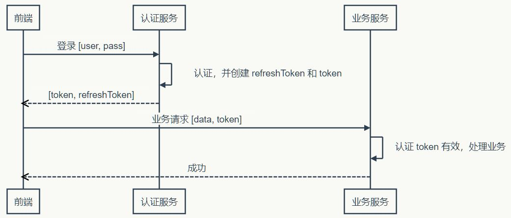

##### 介绍下前端加密的常见场景和方法

##### 介绍下如何实现 token 加密

#### 记住密码，重新登录的时机？实践中，记住密码到期之后需要重新登录，是怎么控制这个时机的？不可能我在操作业务系统的时候，重新登录吧？好像也可以，弹框页面不跳就可以了，否则录入的数据都丢了？

## cookie 和 token 都存放在 header 中，为什么不会劫持 token？

题目有问题？cookie、token都会被劫持

1、首先token不是防止XSS的，而是为了防止CSRF的；
2、CSRF攻击的原因是浏览器会自动带上cookie，而浏览器不会自动带上token

# 介绍下如何实现 token 加密

多个子系统怎么单点登录？token如果存在cookie里边就会被劫持

token不应该存在cookie？会被劫持吧？cookie如果存了账号密码，自己就可以获取token啊！

###### cookie、token、session

JWT+ip的方案，如果是多端（多设备）登录呢？好像没问题，签名信息的IP跟请求ip一致就行。

考虑一种情况，token未到期但被用户主动注销，服务器要对这种未到期已注销的token，判无效。

1.服务端要记录这种token（或者是redis记录所有有效的token，认证成功且在redis中才是有效的）

2.token时间尽可能短

#### 认证和业务分离

在使用无状态 Token 的时候，有两点需要注意：

1. Refresh Token 有效时间较长，所以它应该在服务器端有状态，以增强安全性，确保用户注销时可控（注销后，服务器判断不了Refresh Token无效吧？注销操作也要服务器记录已注销的Refresh Token？）
2. 应该考虑使用二次认证来增强敏感操作的安全性

那还是那个问题，账号密码被窃取怎么办？账号密码就可以获取token

