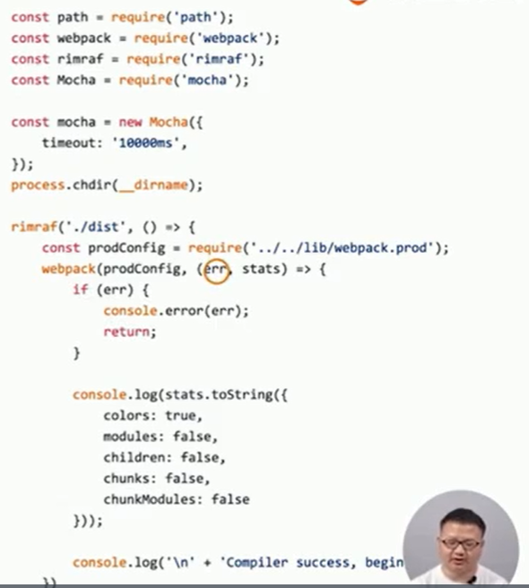

### 冒烟测试

指对提交测试的软件在进行详细深入的测试之前进行的与测试。这种预测试的主要目的是暴露导致软件需要重新发布的基本功能失效等严重问题。

（保证基本功能可用）

### 冒烟则是执行

- 构建是否成功

- 每次构建完成build目录是否有内容输出
  - 有否js、css等静态资源文件
  - 有否html文件

#### 判断构建是否成功

#### 判断基本功能是否正常

编写mocha测试用例，测试文件是否输出

