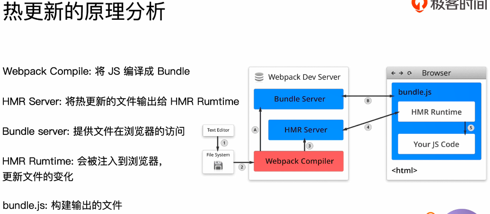

## webpack-dev-server


WDS不刷新浏览器

WDS不输出文件，而是放在内存中（速度优势）

使用HotModuleReplacementPlugin插件


```js
"scripts": {
	"dev": "webpack-dev-server --open"
}
```

添加插件配置

```js
plugins: [
    new webpack.HotModuleReplacementPlugin()
],
devServer: {
    contentBase: './dist',
    hot: true
}
```


## webpack-dev-middleware


WDM将webpack输出的文件传输给服务器

使用于灵活的定制场景




Bundle：最终打包的js

Bundle server：浏览器可以通过localhost:8080的访问

HMR Runtime注入到bundle.js中，这样可以跟服务器建立链接，通常是websocket


启动阶段：1->2->a->b

更新：1->2->3->4

