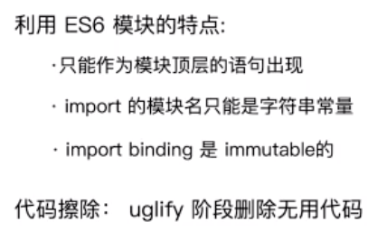

## 为什么需要构建工具

- 转换es6、jsx、ts等语法
- css前缀补全、预处理器
- 压缩混淆，代码分割等
- 图片压缩
- 插件

## loaders

webpack开箱即用只支持js、json两种文件类型。

通过loaders去支持其他文件类型，病转化撤更有效模块，添加到依赖图中。

## mode

NamedChunksPlugin和NamedModulesPlugin，代码热更新阶段，在控制台打印那个模块热更新。

## babel

两个配置

plugins，一个plugin对应一个功能；

presets，一系列plugins的集合；

## 文件监听

1. #### watch配置项

缺点：手动刷新浏览器

原理：轮询判断文件的最后修改时间是否变化。当某个文件发生变化，并不会立即告诉监听者，

是先缓存起来，等待aggregateTimeout（缓存等待时间）

2. #### 热更新

   1. ##### webpack-dev-server

   wds不刷新浏览器

   wds不输出文件，放在内存中（速度优势）

   结合HotModuleReplacementPlugin

   2. ##### webpack-dev-middleware

      将webpack输出的文件传输给服务器

      适用于灵活的定制场景

   

   

   Bundle：最终打包的js

   Bundle server：浏览器可以通过localhost:8080的访问

   HMR Runtime注入到bundle.js中，这样可以跟服务器建立链接，通常是websocket

   

   启动阶段：1->2->a->b

   更新：1->2->3->4

   

   

   ## 文件指纹

   方便浏览器利用缓存

   hash：整个项目构建相关，只要有项目文件修改，就变

   chunkhash：entry相关

   contenthash：文件内容相关

   

   

   ## 代码内联

   #### html、js

   raw-loader

   #### css

   - style-loader
- html-inline-css-webpack-plugin（内联打包出来的css代码）
   

   

   
## 多页面打包通用方案
   
glob.sync动态获取entry和设置html-webpack-plugin
   

   
## sourcemap
   
devtool配置项
   

   
## 基础库分离
   
#### 基础库分离
   
html-webpack-externals-plugin，cdn引入
   
splitChunksPlugin（webpack4内置），提取基础库或公共代码（代码分割）
   

   
## treeshaking
   
dead code擦除，production默认开启
   
   要求es6方法（静态编译分析），且**不能有副作用**
   
   
   
   
   
   
   
   ## ScopeHoisting
   
   不开启，打包后代码有大量闭包代码（体积增大；作用于增多，内存开销大）
   
   要求es6方法
   
   原理：
   
   将所有模块的代码按照引用顺序放在一个函数作用域里，然后适当的重命名一些变量一防止变量冲突。消除包裹。
   
   
   
   ## 代码分割和动态import
   
   #### 代码分割意义
   
   - 脚本懒加载，初始下载代码更小
   - 抽离相同代码带一个共享块
   
   #### 懒加载js
   
   - commonjs： require.ensure
   - es6: 动态import
   
   
   
   
   
   
   
   
   
   
   
   
   
   
   
   
   
   
   
   
   
   
   
   
   
   
   
   

