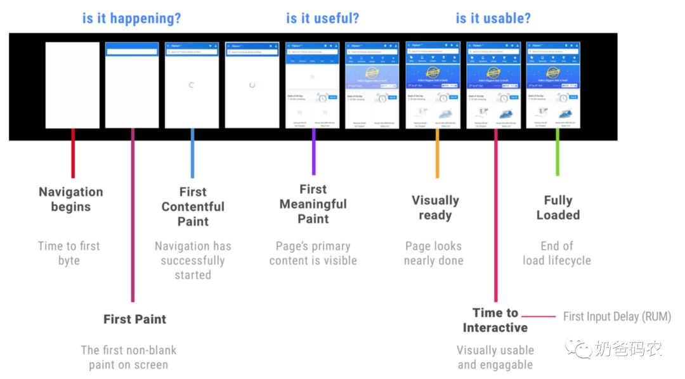

网站性能指标有哪些？怎么选取？

> 关于加载时长，随着4G、5G的普及，是不是加载时长就不是问题了呢？

1. 网络状况存在地域差异（服务器远近、当地基础建设等）、个体差异（用户硬件设备）等因素，你的应用程序的加载时间是来自每个用户的所有加载时间的集合，并且完全表示该加载时间的唯一方法是使用如以下直方图中的分布：

   怎么统计？埋点？

   

2. 随着网络升级，网页应用也在升级，有更多的功能，更大的复杂度，网页体积大幅增加。

用户怎么感受性能问题

- 页面加载时长
- 页内操作响应及时性
- 动画流畅度

基于用户体验的性能指标

- 是否在加载

  FP/FCP。可以提示给到用户说明页面正在加载中，这时候应该页面从白屏阶段变成一些页面框架。为了提升首屏加载时间可以通过骨架屏的方式，在获取服务端数据前提前进行页面渲染。

- 是否内容有用

  FMP。一般页面会有一些核心元素，又称为Hero元素，例如播放网站，播放器往往就是核心元素，在这个核心元素渲染出现时候才能告诉用户这个页面是否对他有价值。为了提升FMP，可以在核心渲染路径上优先保证核心元素的渲染，后置其他信息的渲染。

- 是否可以使用

  TTI。这时候通常是指页面可以接受用户操作响应，页面加载完成的时间。

- 是否使用流畅

  Long Tasks。在用户使用过程中，例如点击、滑动等等操作时候，是否能够保证页面的及时响应。通常情况下我们需要保证FPS（Frame Per Second，每秒传输帧数或叫刷新率）在60以上，这样用户不会感受到明显的迟钝感，所以单次JS Long Task执行时间需要在 1s/60 = 16ms以内。

**百分位线**

概念：TP=Top Percentile，Top百分数，是一个统计学里的术语，与平均数、中位数都是一类。

应用：TP50、TP90和TP99等指标常用于系统性能监控场景，指高于50%、90%、99%等百分线的情况。

在统计性能数据的时候，通常会采用百分位线的方式来统计，而不是采用平均数。因为实际用户的设备和网络环境千差万别，实际的页面加载性能指标会有很大的差异性，为了避免个别极端数据导致整体数据失真，采用百分位线数据是比较合理的。

**秒开率**

在移动互联网时代，尤其对于App中的页面，秒开是一种对于用户而言最佳的体验，如果能够在1秒内加载完成页面，对于用户而言他几乎是可以获得类似原生的体验，并且不会有产生太多的焦虑感。

通常而言，可以根据业务情况设定不同的页面打开的标准，例如：FCP、FMP或者TTI，然后统计在真实用户数据中，低于1s内的数据占比即是秒开率。在业界优秀的公司，例如手淘的页面秒开率基本都达到80%以上。

**RAIL模型**

RAIL模型也是一个基于用户体验的性能衡量标准

**Response**: 在50ms内处理事件

目标：在100ms内完成用户输入启动的转换。用户花费大部分时间等待站点响应他们的输入，而不是等待站点加载。

**Animation**：在10ms中生成动画的下一帧

目标：在10ms或更短的时间内在动画中生成每个帧。从技术上讲，每帧的最大预算为16毫秒（1000毫秒/每秒60帧≈16毫秒），但浏览器需要大约6毫秒来渲染每帧，因此每帧10毫秒的准则。

**Idle**：最大化空闲时间

目标：最大化空闲时间以提高用户输入响应时间

**Load**：在5秒内实现网站完全加载

目标：在首次加载页面时候，在3G连接速度较慢的中等配置的移动设备上在5秒或更短时间内实现页面完全加载并且可以进行交互。

**数据收集**

数据收集分为两类：实验室数据和真实用户数据。实验室数据往往是在一个可控的内部测试环境中，模拟用户的操作，通过本地的测试工具获得相应数据。真实用户数据就是通过真实数据的采集汇总，用于判断真实用户体验，数据指标较少且不易调试。

**实验室数据**

对于实验室数据的收集，通常会使用Lighthouse和Chrome Devtools。

- **Lighthouse**：提供关于性能、无障碍化、PWA、SEO等最佳实践的建议

- **Chrom Devtools**：提供了一系列开发者工具，针对性能可以很容易的分析网络传输、页面加载、JS执行时间等等数据。

一些核心时间可以通过以下时间点进行计算：

- DNS查询：domainLookupEnd - domainLookupStart
- TCP连接：connectEnd - connectStart
- FP首次渲染：domloading - navigationStart
- TTI（页面可交互时间）：domInteractive - navigationStart
- DOMReady：domContentLoadedEventEnd - navigationStart
- onload：loadEventEnd - navigationStart

当然还有一些核心指标，例如首屏加载时间、FMP时间等，不太容易直接通过windows.performance获取得到，这时候可能需要手动打点上传或者通过特定Dom元素检测来获得数据。

优化点在哪里呢？

打包优化（体积）

网络传输

内存占用

渲染性能

