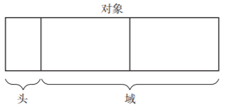
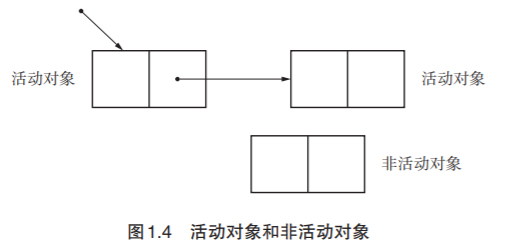
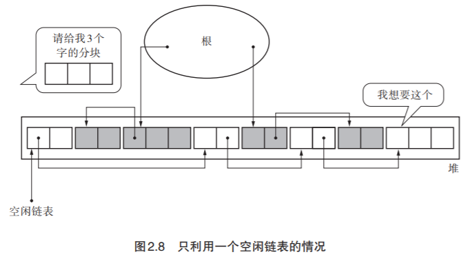
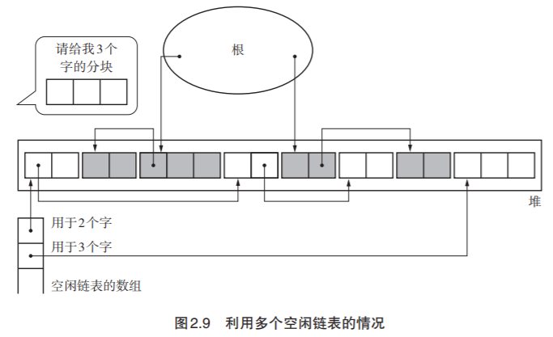
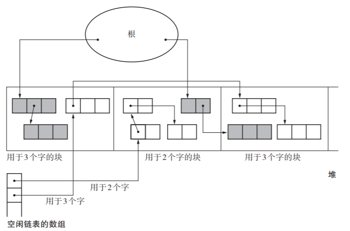
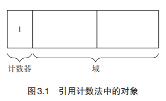
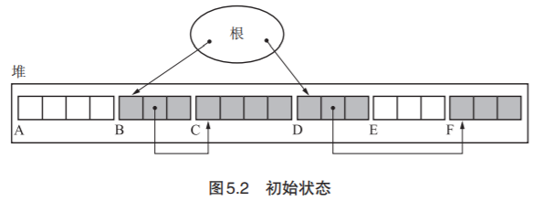
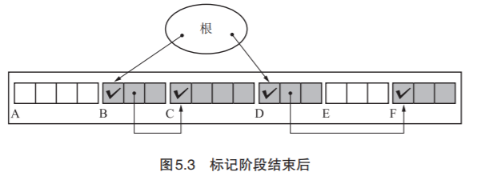
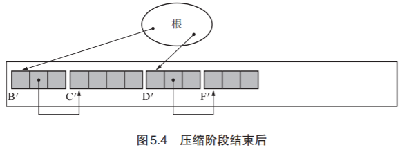

# 垃圾回收算法

GC 是 Garbage Collection 的简称，中文称为“垃圾回收”。GC 把程序不用的内存空间视为垃圾。

#### GC要做两件事

1. 找到内存空间里的垃圾 
2. 2. 回收垃圾，让程序员能再次利用这部分空间

#### 未知的第四种算法

现在为世人所知的 GC 算法，不过是从**标记-清除算法**、**引用计数法**、**GC复制算法**三种基本算法中衍生出来的产物。

## 学习GC之前

### 头

我们将对象中保存对象本身信息的部分称为“头”。头主要含有以下信息。 

- 对象的大小
- 对象的种类

此外，头中事先存有运行 GC 所需的信息。然而根据 GC 算法的不同，信息也不同。

### 域

我们把对象使用者在对象中可访问的部分称为“域”。可以将其想成 C 语言中结构体的成员， 这样就很简单了吧。对象使用者会引用或替换对象的域值。另一方面，对象使用者基本上无 法直接更改头的信息。 域中的数据类型大致分为以下 2 种。 

- 指针 
- 非指针

指针是指向内存空间中某块区域的值。非指针指的是在编程中直接使用值本身。数值、字符以及真假值都是非指针。

### 指针

通过 GC，对象会被销毁或保留。这时候起到关键作用的就是指针。因为 GC 是根据对 象的指针指向去搜寻其他对象的。另一方面，GC 对非指针不进行任何操作。

在大多数语言处理程序中，指针都默认指向对象的首地址。

### mutator

mutator 实际进行的操作有以下 2 种。 

- 生成对象 
- 更新指针

### 堆

堆指的是用于动态（也就是执行程序时）存放对象的内存空间。当 mutator 申请存放对象时， 所需的内存空间就会从这个堆中被分配给 mutator。 

GC 是管理堆中已分配对象的机制。在开始执行 mutator 前，GC 要分配用于堆的内存空间。 一旦开始执行 mutator，程序就会按照 mutator 的要求在堆中存放对象。等到堆被对象占满后， GC 就会启动，从而分配可用空间。如果不能分配足够的可用空间，一般情况下我们就要扩大堆。

### 活动对象/非活动对象

我们将分配到内存空间中的对象中那些能通过 mutator 引用的对象称为“活动对象”。反 过来，把分配到堆中那些不能通过程序引用的对象称为“非活动对象”。也就是说，不能通 过程序引用的对象已经没有人搭理了，所以死掉了。死掉的对象（即非活动对象）我们就称为“垃圾”。

这里需要大家注意的是：死了的对象不可能活过来。因为就算 mutator 想要重新引用（复 活）已经死掉的对象，我们也没法通过 mutator 找到它了。 

因此，GC 会保留活动对象，销毁非活动对象。当销毁非活动对象时，其原本占据的内 存空间会得到解放，供下一个要分配的新对象使用。

### 分配

分配（allocation）指的是在内存空间中分配对象。当 mutator 需要新对象时，就会向分配器（allocator）申请一个大小合适的空间。分配器则在堆的可用空间中找寻满足要求的空间， 返回给 mutator。

然而，当堆被所有活动对象占满时，就算运行 GC 也无法分配可用空间。这时候我们有 以下两种选择。 

- 销毁至今为止的所有计算结果，输出错误信息 
- 扩大堆，分配可用空间

### 分块

分块（chunk）在 GC 的世界里指的是为利用对象而事先准备出来的空间。 初始状态下，堆被一个大的分块所占据。 然后，程序会根据 mutator 的要求把这个分块分割成合适的大小，作为（活动）对象使用。 活动对象不久后会转化为垃圾被回收。此时，这部分被回收的内存空间再次成为分块，为下次 被利用做准备。

也就是说，内存里的各个区块都重复着分块→活动对象→垃圾（非活动对象）→ 分块→ …… 这样的过程。

### 根

根（root）这个词的意思是“根基”“根底”。在 GC 的世界里，根是指向对象的指针的“起点” 部分。 

这些都是能通过 mutator 直接引用的空间。

## 标记-清除算法

GC 标记 - 清除算法由标记阶段和清除阶段构成。

标记阶段是把所有活动对象都做上标记的阶段。清除阶段是把那些没有标记的对象，也就是非活动对象 回收的阶段。通过这两个阶段，就可以令不能利用的内存空间重新得到利用。

### 标记阶段

在标记阶段中，collector 会为堆里的所有活动对象打上标记。为此， 我们首先要标记通过根直接引用的对象。这里的“对象”就是我们在 1.8 节中讲到的“确实 活动着的对象”。首先我们标记这样的对象，然后递归地标记通过指针数组能访问到的对象。 这样就能把所有活动对象都标记上了。

在标记阶段中，程序会标记所有活动对象。毫无疑问，标记所花费的时间是与“活动对 象的总数”成正比的。

> 深度优先搜索与广度优先搜索

### 清除阶段

在清除阶段中，collector 会遍历整个堆，回收没有打上标记的对象（即垃圾），使其能再次得到利用。

### 合并

根据分配策略的不同可能会产生大量的小分块。但如果它们是连续的， 我们就能把所有的小分块连在一起形成一个大分块。这种“连接连续分块”的操作就叫作合 并（coalescing），合并是在清除阶段进行的。

### 缺点

- 碎片化

  在 GC 标记 - 清除算法的使用过程中会逐渐产生被细化的分块，不久后就会导致无数的 小分块散布在堆的各处。我们称这种状况为碎片化（fragmentation）。众所周知，Windows 的 文件系统也会产生这种现象。

- 分配速度

  GC 标记 - 清除算法中分块不是连续的，因此每次分配都必须遍历空闲链表，找到足够大的分块。最糟的情况就是每次进行分配都得把空闲链表遍历到最后。

### 多个空闲链表

之前我们讲的标记 - 清除算法中只用到了一个空闲链表，在这个空闲链表中，对大的分 块和小的分块进行同样的处理。但是这样一来，每次分配的时候都要遍历一次空闲链表来寻 找合适大小的分块，这样非常浪费时间。

### BiBOP法

BiBOP 是 Big Bag Of Pages 的缩写。这么说可能比 较难懂，用一句话概括就是“将大小相近的对象整理成固定大小的块进行管理的做法”。

前面已经跟大家讲过，GC 标记 - 清除算法中会发生碎片化。碎 片化的原因之一就是堆上杂乱散布着大小各异的对象。

对此，我们可以用这个方法：把堆分割成固定大小的块，让每个块只能配置同样大小的 对象。这就是 BiBOP 法。

## 引用计数法

GC 原本是一种“释放怎么都无法被引用的对象的机制”。那么人们自然而然地就会 想到，可以让所有对象事先记录下“有多少程序引用自己”。让各对象知道自己的“人气指 数”，从而让没有人气的对象自己消失，这就是引用计数法（Reference Counting），它是 George E. Collins [6] 于 1960 年钻研出来的。

引用计数法中引入了一个概念，那就是“计数器”。计数器表示的是对象的人气指数， 也就是有多少程序引用了这个对象（被引用数）。计数器是无符号的整数，用于计数器的位数 根据算法和实现而有所不同。引用计数法中的对象如图 3.1 所示。

计数器的值为 0 的对象变成了“垃圾”。

### 优点

- 可即刻回收垃圾
- 最大暂停时间短
- 没有必要沿指针查找

### 缺点

循环引用无法回收

## GC复制算法

GC 复制算法（Copying GC）是 Marvin L. Minsky 在 1963 年研究出来的算法。说 得简单点，就是只把某个空间里的活动对象复制到其他空间，把原空间里的所有对象都回收 掉。这是一个相当大胆的算法。在此，我们将复制活动对象的原空间称为 From 空间，将 粘贴活动对象的新空间称为 To 空间。

当 From 空间被完全占满时，GC 会将活动 对象全部复制到 To 空间。当复制完成后，该算法会把 From 空间和 To 空间互换，GC 也就结 束了。From 空间和 To 空间大小必须一致。这是为了保证能把 From 空间中的所有活动对象 都收纳到 To 空间里。

### 优点

- 不会发生碎片化

- 优秀的吞吐量

  GC 标记 - 清除算法消耗的吞吐量是搜索活动对象（标记阶段）所花费的时间和搜索整体 堆（清除阶段）所花费的时间之和。 另一方面，因为 GC 复制算法只搜索并复制活动对象，所以跟一般的 GC 标记 - 清除算 法相比，它能在较短时间内完成 GC。也就是说，其吞吐量优秀。

- 可实现高速分配

  GC 复制算法不使用空闲链表。这是因为分块是一个连续的内存空间。因此，调查这个 分块的大小，只要这个分块大小不小于所申请的大小，那么移动 $free 指针就可以进行分配了。 比起 GC 标记 - 清除算法和引用计数法等使用空闲链表的分配，GC 复制算法明显快得多。

### 缺点

- 堆使用效率低下

  GC 复制算法把堆二等分，通常只能利用其中的一半来安排对象。

## GC标记 -压缩算法

GC 标记 - 压缩算法（Mark Compact GC）是将 GC 标记 - 清除算法与 GC 复制算 法相结合的产物。

GC 标记 - 压缩算法由标记阶段和压缩阶段构成。

首先，这里的标记阶段和我们在讲解 GC 标记 - 清除算法时提到的标记阶段完全一样。 接下来，我们要搜索数次堆来进行压缩。压缩阶段通过数次搜索堆来重新装填活动对象。 因压缩而产生的优点我们已经在第 4 章中介绍 GC 复制算法时提过了，不过它跟 GC 复制算 法不同，不用牺牲半个堆。

在 Lisp2 算法中，压缩阶段并不会改变对象的排列顺序，只是缩小了它们之间的空隙， 把它们聚集到了堆的一端。

### 优点

- 可有效利用堆

### 缺点

- 压缩花费计算成本

## 分代垃圾回收

分代垃圾回收（Generational GC）在对象中导入了“年龄”的概念，通过优先回收容 易成为垃圾的对象，提高垃圾回收的效率。 

### 对象的年龄

人们从众多程序案例中总结出了一个经验：“大部分的对象在生成后马上就变成了垃圾， 很少有对象能活得很久。”分代垃圾回收利用该经验，在对象中导入了“年龄”的概念，经历 过一次 GC 后活下来的对象年龄为 1 岁。

### 新生代对象和老年代对象

分代垃圾回收中把对象分类成几代，针对不同的代使用不同的 GC 算法，我们把刚生成 的对象称为新生代对象，到达一定年龄的对象则称为老年代对象。 

众所周知，新生代对象大部分会变成垃圾。如果我们只对这些新生代对象执行 GC 会怎么样呢？除了引用计数法以外的基本算法，都会进行只寻找活动对象的操作（如 GC 标记 - 清除算法的标记阶段和 GC 复制算法等）。因此，如果很多对象都会死去，花费在 GC 上的时 间应该就能减少。 我们将对新对象执行的 GC 称为新生代 GC（minor GC）。minor 在这里的意思是“小规模的”。 新生代 GC 的前提是大部分新生代对象都没存活下来，GC 在短时间内就结束了。 

另一方面，新生代 GC 将存活了一定次数的新生代对象当作老年代对象来处理。我们把 类似于这样的新生代对象上升为老年代对象的情况称为晋升（promotion）。 因为老年代对象很难成为垃圾，所以我们对老年代对象**减少执行 GC 的频率**。相对于新 生代 GC，我们将面向老年代对象的 GC 称为老年代 GC（major GC）。

### V8的GC算法

V8 实现了准确式 GC，GC 算法方面采用了分代垃圾回收。分代垃圾回收的结构如下表所示。

新生代：GC 复制算法（Cheney 的 GC 复制算法） 

> 效率高，只需要复制活动对象。没有碎片化，块连续，利于分配。堆利用率不高。

老年代：GC 标记 - 清除算法、GC 标记 - 压缩算法

> 对比GC 复制算法，效率没那么高：标记活动对象 + 遍历堆清除。
>
> 对比GC 复制算法，堆利用率高。
>
> 老年代存活率较高的特性：
>
> 1. 一定程度较少碎片化问题。
> 2. 降低GC频率。
>
> GC 标记 - 压缩算法解决碎片化问题。

#### VM Heap

VM Heap 内的内存空间由以下两部分组成。 

- 新生代空间 
- 老年代空间

#### 启动GC的时机

启动新生代 GC（GC 复制算法）的时机：

- 新生代空间的From空间没有分块的时候 

老年代 GC（GC 标记 - 清除算法及 GC 标记 - 压缩算法）的启动时机：

- 老年代空间的某一个空间没有分块的时候 
- 老年代空间中被分配了一定数量的对象的时候（启动新生代GC时检查）
- 老年代空间里没有新生代空间大小的分块的时候（不能保证执行新生代GC时的晋升）

 在老年代 GC 的启动过程中，启动 GC 标记 - 压缩算法的时机：。 

- 老年代空间的碎片到达一定数量的时候

