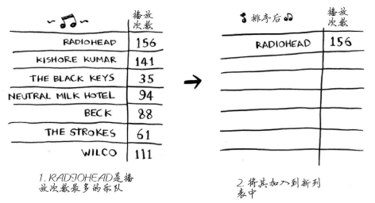
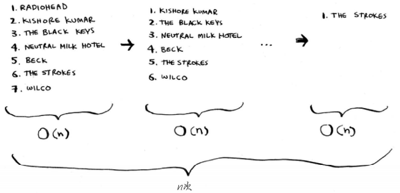

## 1.选择排序

- 遍历n次，每次遍历最大值，添加到新数组
- 时间复杂度：O(n^2)






```js
export function selectSort(arr) {
    for (let i = 0; i < arr.length - 1; i++) {
        for (let j = i + 1; j < arr.length; j++) {
            if (arr[i] > arr[j]) {
                let tmp = arr[i];
                arr[i] = arr[j];
                arr[j] = tmp;
            }
        }
    }
    return arr
}
```


## 2.插入排序

平均：N*N/4 次比较，N*N/4次交换

最好：N-1次比较，0次交换

最坏：N*N/2次比较， N*N/2次交换

时间复杂度：**O(N2)** 　　稳定性：**稳定**


```js
export function insertSort(arr) {
    for (let i = 1; i < arr.length; i++) {
        let tmp = arr[i];
        for (let j = i - 1; j >= 0; j--) {
            if (arr[j] > tmp) {
                arr[j + 1] = arr[j]
                arr[j] = tmp
            }else{
                break
            }
        }
    }
    return arr
}
```


## 3.冒泡

时间复杂度：**O(N2)** 　　稳定性：**稳定**


```js
function bubbleSort(arr) {
    for (let i = 0; i < arr.length; i++) {
        for (let j = 0; j < arr.length - i - 1; j++) {
            if (arr[j] > arr[j + 1]) {
                const temp = arr[j];
                arr[j] = arr[j + 1];
                arr[j + 1] = temp;
            }
        }
    }
}
```

优化思路：

前面没交换过得，说明是排好序的，上次开始排序的位置作为下次开始的位置。

```js
function bubbleSort1(arr) {
    let i = arr.length - 1;

    while (i > 0) {
        let pos = 0;
        for (let j = 0; j < i; j++) {
            if (arr[j] > arr[j + 1]) {
                pos = j;
                const temp = arr[j];
                arr[j] = arr[j + 1];
                arr[j + 1] = temp;
            }
        }
        i = pos;
    }
    console.log(arr);
}
```


# 高效排序


## 4.快速排序

涉及D&C，使用D&C（分而治之，divide and conquer）解决问题的过程包括两个步骤。
(1) 找出基线条件，这种条件必须尽可能简单。
(2) 不断将问题分解（或者说缩小规模），直到符合基线条件。

快排：

- 时间复杂度，最糟糕情况（有序数组）是O(n^2)，平均O(nlogn)。
- 逻辑：递归执行，取数组第一个元素最为基准值，遍历数组，比基准值小或者打的放在基准值两边，进行分组。即，[left]+base+[right]，递归对分组进行分组排序合并。

层数为O(log n)（用技术术语说，调用栈的高度为O(log n)），而每层需要的时间为O(n)，因为要遍历分组。因此整个算法需要的时间为O(n) * O(log n) = O(n log n)。这就是最佳情况。

有序数组层数是n，时间为O(n) * O(n) = O(n^2)。最糟糕。

```js
export function quickSort(arr) {
    // 递归退出条件
    if (arr.length < 2) {
        return arr
    }

    let base = [arr[0]]
    let left = []
    let right = []

    for (let i = 1; i < arr.length; i++) {
        if (arr[0] > arr[i]) {
            left.push(arr[i])
        } else if (arr[0] < arr[i]) {
            right.push(arr[i])
        } else {
            base.push(arr[i])
        }
    }
    return quickSort(left).concat(base, quickSort(right))
}
```


