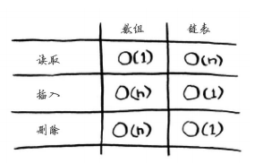

#### 数组

在内存中都是相连的。需要随机地读取元素时，数组的效率很高，因为可迅速找到数组的任何元素。

#### 链表

链表中的元素可存储在内存的任何地方。链表的每个元素都存储了下一个元素的地址，从而使一系列随机的内存地址串在一起。链表的优势在插入元素方面。

在需要读取链表的最后一个元素时，你不能直接读取，因为你不知道它所处的地址，必须先访问元素#1，从中获取元素#2的地址，再访问元素#2并从中获取元素#3的地址，以此类推，直到访问最后一个元素。需要同时读取所有元素时，链表的效率很高：你读取第一个元素，根据其中的地址再读取第二个元素，以此类推。但如果你需要跳跃，链表的效率真的很低。

数组和链表哪个用得更多呢？显然要看情况。但数组用得很多，因为它支持随机访问。有两种访问方式：随机访问和顺序访问。顺序访问意味着从第一个元素开始逐个地读取元素。链表只能顺序访问：要读取链表的第十个元素，得先读取前九个元素，并沿链接找到第十个元素。随机访问意味着可直接跳到第十个元素。

