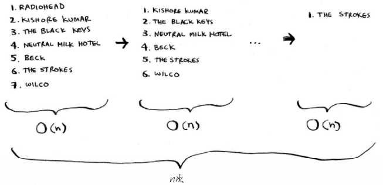

##### 复杂度：大 O 表示法指出了最糟情况下的运行时间

下面按从快到慢的顺序列出了你经常会遇到的5种大O运行时间。
 O(log n)，也叫对数时间，这样的算法包括二分查找。
 O(n)，也叫线性时间，这样的算法包括简单查找。
 O(n * log n)，这样的算法包括快速排序——一种速度较快的排序算法。
 O(n^2)，这样的算法包括选择排序——一种速度较慢的排序算法。
 O(n!)，这样的算法包括接下来将介绍的旅行商问题的解决方案——一种非常慢的算法。


## 二分查找

- 有序列表才能二分查找
- 时间复杂度 log2N，比如8个元素，最多只需要查找3次就能找到，2^3 = 8


## 选择排序

- 遍历n次，每次遍历最大值，添加到新数组
- 时间复杂度：O(n^2)





## 递归

 递归指的是调用自己的函数。
 每个递归函数都有两个条件：基线条件和递归条件。
 调用栈可能很长，这将占用大量的内存。

存储详尽的信息可能占用大量的内存。每个函数调用都要占用一定的内存，如果栈很高，就意味着计算机存储了大量函数调用的信息。在这种情况
下，你有两种选择。
 重新编写代码，转而使用循环。
 使用尾递归。另外，并非所有的语言都支持尾递归。


## 快速排序

涉及D&C，使用D&C（分而治之，divide and conquer）解决问题的过程包括两个步骤。
(1) 找出基线条件，这种条件必须尽可能简单。
(2) 不断将问题分解（或者说缩小规模），直到符合基线条件。


快排：

- 时间复杂度，最糟糕情况（有序数组）是O(n^2)，平均O(nlogn)。
- 逻辑：递归执行，取数组第一个元素最为基准值，遍历数组，比基准值小或者打的放在基准值两边，进行分组。即，[left]+base+[right]，递归对分组进行分组排序合并。

层数为O(log n)（用技术术语说，调用栈的高度为O(log n)），而每层需要的时间为O(n)。因此整个算法需要的时间为O(n) * O(log n) = O(n log n)。这就是最佳情况。


快排自实现：

```js
            function quicksort(arr) {
                // 只有0个或1个元素，直接返回，不需要排序
                if (arr.length < 2) {
                    return arr
                }

                let base = [arr[0]];
                let left = [];
                let right = [];
                for (let i = 1; i < arr.length; i++) {
                    if (arr[i] > arr[0]) {
                        right.push(arr[i])
                    } else if (arr[i] < arr[0]) {
                        left.push(arr[i])
                    } else {
                        base.push(arr[i])
                    }
                }

                return quicksort(left).concat(base).concat(quicksort(right))
            }
```


