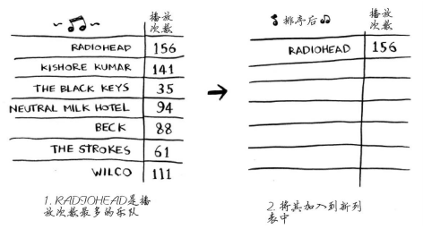

##### 复杂度：大 O 表示法指出了最糟情况下的运行时间

下面按从快到慢的顺序列出了你经常会遇到的5种大O运行时间。
 O(log n)，也叫对数时间，这样的算法包括二分查找。
 O(n)，也叫线性时间，这样的算法包括简单查找。
 O(n * log n)，这样的算法包括快速排序——一种速度较快的排序算法。
 O(n^2)，这样的算法包括选择排序——一种速度较慢的排序算法。
 O(n!)，这样的算法包括接下来将介绍的旅行商问题的解决方案——一种非常慢的算法。

## 二分查找

- 有序列表才能二分查找
- 时间复杂度 log2N，比如8个元素，最多只需要查找3次就能找到，2^3 = 8

## 选择排序

- 遍历n次，每次遍历最大值，添加到新数组
- 时间复杂度：O(n^2)

## 递归

 递归指的是调用自己的函数。
 每个递归函数都有两个条件：基线条件和递归条件。
 调用栈可能很长，这将占用大量的内存。

存储详尽的信息可能占用大量的内存。每个函数调用都要占用一定的内存，如果栈很高，就意味着计算机存储了大量函数调用的信息。在这种情况
下，你有两种选择。
 重新编写代码，转而使用循环。
 使用尾递归。另外，并非所有的语言都支持尾递归。

