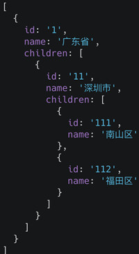

#### 已知如下数组，编写一个程序将数组扁平化去并除其中重复部分数据，最终得到一个升序且不重复的数组

> ```js
> var arr = [ [1, 2, 2], [3, 4, 5, 5], [6, 7, 8, 9, [11, 12, [12, 13, [14] ] ] ], 10];
> ```

解法1：

```js
`Array.from(new Set(arr.flat(Infinity))).sort((a,b)=>{ return a-b})`
```

解法2：

```js
`arr.toString().split(",").sort((a,b)=>{ return a-b})`
    
```

解法3：

```js
// flatten函数
Array.prototype.flat= function() {
    return [].concat(...this.map(item => (Array.isArray(item) ? item.flat() : [item])));
}
// 去重
Array.prototype.unique = function() {
    return [...new Set(this)]
}

const sort = (a, b) => a - b;

console.log(arr.flat().unique().sort(sort)); 
```

解法4：

```js
var arr = [ [1, 2, 2], [3, 4, 5, 5], [6, 7, 8, 9, [11, 12, [12, 13, [14] ] ] ], 10];
// flatten
function flatten(arr) {
	// 有数组元素，concat开一层
    while (arr.some(item => Array.isArray(item))) {
        arr = [].concat(...arr);
    }
    return arr;
}
// 去重+排序
Array.from(new Set(flatten(arr))).sort((a, b) => {
 return a - b
})
```


#### 合并数组

```js
// 请把两个数组 
['A1', 'A2', 'B1', 'B2', 'C1', 'C2', 'D1', 'D2'] 
//和 
['A', 'B', 'C', 'D']
// 合并为 
['A1', 'A2', 'A', 'B1', 'B2', 'B', 'C1', 'C2', 'C', 'D1', 'D2', 'D']
```


#### 某公司 1 到 12 月份的销售额存在一个对象里面

> 如下：{1:222, 2:123, 5:888}，请把数据处理为如下结构：[222, 123, null, null, 888, null, null, null, null, null, null, null]。

```js
let obj = {1:222, 2:123, 5:888};
const result = Array.from({ length: 12 }).map((v, i) => obj[i + 1] || null);
```


#### 要求设计 LazyMan 类，实现以下功能。

> ```js
> LazyMan('Tony');
> // Hi I am Tony
> 
> LazyMan('Tony').sleep(10).eat('lunch');
> // Hi I am Tony
> // 等待了10秒...
> // I am eating lunch
> 
> LazyMan('Tony').eat('lunch').sleep(10).eat('dinner');
> // Hi I am Tony
> // I am eating lunch
> // 等待了10秒...
> // I am eating diner
> 
> LazyMan('Tony').eat('lunch').eat('dinner').sleepFirst(5).sleep(10).eat('junk food');
> // Hi I am Tony
> // 等待了5秒...
> // I am eating lunch
> // I am eating dinner
> // 等待了10秒...
> // I am eating junk food
> ```

```javascript
class LazyManClass {
    constructor(name) {
        this.taskList = [];
        this.name = name;
        console.log(`Hi I am ${this.name}`);
        setTimeout(() => {
            this.next();
        }, 0);
    }
    eat (name) {
        var that = this;
        var fn = (function (n) {
            return function () {
                console.log(`I am eating ${n}`)
                that.next();
            }
        })(name);
        this.taskList.push(fn);
        return this;
    }
    sleepFirst (time) {
        var that = this;
        var fn = (function (t) {
            return function () {
                setTimeout(() => {
                    console.log(`等待了${t}秒...`)
                    that.next();
                }, t * 1000);  
            }
        })(time);
        this.taskList.unshift(fn);
        return this;
    }
    sleep (time) {
        var that = this
        var fn = (function (t) {
            return function () {
                setTimeout(() => {
                    console.log(`等待了${t}秒...`)
                    that.next();
                }, t * 1000); 
            }
        })(time);
        this.taskList.push(fn);
        return this;
    }
    next () {
        var fn = this.taskList.shift();
        fn && fn();
    }
}
function LazyMan(name) {
    return new LazyManClass(name);
}
LazyMan('Tony').eat('lunch').eat('dinner').sleepFirst(5).sleep(4).eat('junk food');
```


#### 给定两个数组，写一个方法来计算它们的交集。

> 例如：给定 nums1 = [1, 2, 2, 1]，nums2 = [2, 2]，返回 [2, 2]。


#### 数组编程题

> 随机生成一个长度为 10 的整数类型的数组，例如 `[2, 10, 3, 4, 5, 11, 10, 11, 20]`，将其排列成一个新数组，要求新数组形式如下，例如 `[[2, 3, 4, 5], [10, 11], [20]]`。
>


#### 请实现一个 add 函数，满足以下功能。

> ```js
> add(1); 			// 1
> add(1)(2);  	// 3
> add(1)(2)(3)；// 6
> add(1)(2, 3); // 6
> add(1, 2)(3); // 6
> add(1, 2, 3); // 6
> ```


##### 已知数据格式，实现一个函数 fn 找出链条中所有的父级 id

> ```js
> const value = '112'
> const fn = (value) => {
> ...
> }
> fn(value) // 输出 [1， 11， 112]
> ```




#### 给定两个大小为 m 和 n 的有序数组 nums1 和 nums2。请找出这两个有序数组的中位数。要求算法的时间复杂度为 O(log(m+n))。

示例 1：

```js
nums1 = [1, 3]
nums2 = [2]
```

中位数是 2.0

示例 2：

```js
nums1 = [1, 2]
nums2 = [3, 4]
```

中位数是(2 + 3) / 2 = 2.5


#### 编程算法题

> 用 JavaScript 写一个函数，输入 int 型，返回整数逆序后的字符串。如：输入整型 1234，返回字符串“4321”。要求必须使用递归函数调用，不能用全局变量，输入函数必须只有一个参数传入，必须返回字符串。


#### 不用加减乘除运算符，求整数的7倍


#### 编程题，写个程序把 entry 转换成如下对象

```js
var entry = {
  a: {
    b: {
      c: {
        dd: 'abcdd'
      }
    },
    d: {
      xx: 'adxx'
    },
    e: 'ae'
  }
}

// 要求转换成如下对象
var output = {
  'a.b.c.dd': 'abcdd',
  'a.d.xx': 'adxx',
  'a.e': 'ae'
}
```

实现：

```js
        function flatten(obj, prefix = '', res = {}) {
            for (let k in obj) {
                let key = prefix ? `${prefix}.${k}` : k
                typeof obj[k] === 'object' ? 
                    flatten(obj[k], key, res) : (res[key] = obj[k])
            }
            return res
        }
```


#### 编程题，写个程序把 entry 转换成如下对象（跟昨日题目相反）

```js
var entry = {
  'a.b.c.dd': 'abcdd',
  'a.d.xx': 'adxx',
  'a.e': 'ae'
}

// 要求转换成如下对象
var output = {
  a: {
    b: {
      c: {
        dd: 'abcdd'
      }
    },
    d: {
      xx: 'adxx'
    },
    e: 'ae'
  }
}
```

实现

```js
        function treeify(obj) {
            let res = {}
            for (let k in obj) {
                let keys = k.split('.')
                let cur = res
                keys.map((key, i) => {
                    if (i === keys.length - 1) {
                        cur[key] = obj[k]
                    } else {
                        cur[key] = cur[key] || {}
                        cur = cur[key]
                    }
                })
            }
            return res
        }
```


#### 编程题，根据以下要求，写一个数组去重函数（蘑菇街）

> 1. 如传入的数组元素为`[123, "meili", "123", "mogu", 123]`，则输出：`[123, "meili", "123", "mogu"]`
> 2. 如传入的数组元素为`[123, [1, 2, 3], [1, "2", 3], [1, 2, 3], "meili"]`，则输出：`[123, [1, 2, 3], [1, "2", 3], "meili"]`
> 3. 如传入的数组元素为`[123, {a: 1}, {a: {b: 1}}, {a: "1"}, {a: {b: 1}}, "meili"]`，则输出：`[123, {a: 1}, {a: {b: 1}}, {a: "1"}, "meili"]`

实现

```js
            function dup(arr) {
                let _arr = arr.map(el => JSON.stringify(el))

                let set = new Set(_arr)
                _arr = Array.from(set)

                return _arr.map(a => JSON.parse(a))
            }
```

遗留问题：

1.考虑undefined存在情况，不做转换

2.对象键的顺序不同，转换后的字符串不同，可以对象的key进行排序


#### 编程题，找出字符串中连续出现最多的字符和个数

```js
'abcaakjbb' => {'a':2,'b':2}
'abbkejsbcccwqaa' => {'c':3}
```

自实现

```js
            function charCount(str) {
                let keys = new Set()
                let max = 0
                let c = ''

                let strArr = str.split('')
                // 当前字符的个数
                let count = 0

                strArr.map(v => {
                    if (v !== c) {
                        count = 0
                        c = v
                    }

                    count++
                    if (count >= max) {
                        if (count > max) {
                            max = count
                            keys.clear()
                        }
                        keys.add(v)
                    }
                })

                let res = {}
                keys.forEach(el => {
                    res[el] = max
                })

                return res
            }
```

其他方案

正则匹配出相邻相同字符的字符串片段，然后再统计

```js
str.match(/(.)\1*/g)
```


#### 统计 1 ~ n 整数中出现 1 的次数


