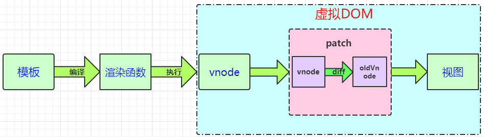

### vue模板转视图的过程

### 什么是Virtual DOM

Virtual DOM 其实就是一棵以 JavaScript 对象( VNode 节点)作为基础的树，用对象属性来描述节点，实际上它只是一层对真实 DOM 的抽象。最终可以通过一系列操作使这棵树映射到真实环境上。

> 自己说

Virtual DOM其实就是用树状结构的js对象来描述真实的DOM结构。vnode对应真实的dom节点，用对象属性来描述节点信息。

### Virtual DOM的作用

**虚拟DOM的最终目标是将虚拟节点渲染到视图上**。但是如果直接使用虚拟节点覆盖旧节点的话，会有很多不必要的DOM操作。例如，一个ul标签下很多个li标签，其中只有一个li有变化，这种情况下如果使用新的ul去替代旧的ul,因为这些不必要的DOM操作而造成了性能上的浪费。

为了避免不必要的DOM操作，虚拟DOM在虚拟节点映射到视图的过程中，将虚拟节点与上一次渲染视图所使用的旧虚拟节点（oldVnode）做对比，找出真正需要更新的节点来进行DOM操作，从而避免操作其他无需改动的DOM。

其实虚拟DOM在Vue.js主要做了两件事：

- 提供与真实DOM节点所对应的虚拟节点vnode
- 将虚拟节点vnode和旧虚拟节点oldVnode进行对比，然后更新视图

### 为何需要Virtual DOM

- 具备跨平台的优势

  虚拟DOM提供了一个对视图的描述。我们可以将它转成浏览器环境的视图（DOM）、安卓环境的视图（安卓相应组件）等。

- 操作 DOM 慢，js运行效率高。我们可以将DOM对比操作放在JS层，提高效率。

  因为DOM操作的执行速度远不如Javascript的运算速度快，因此，把大量的DOM操作搬运到Javascript中，运用patching算法来计算出真正需要更新的节点，最大限度地减少DOM操作，从而显著提高性能。

  虚拟节点vnode和旧虚拟节点oldVnode进行对比（diff算法），得出需要更新的视图，做局部的DOM更新。

- 提升渲染性能

  Virtual DOM的优势不在于单次的操作，而是在大量、频繁的数据更新下，能够对视图进行合理、高效的更新。

### Virtual DOM 真的比操作原生 DOM 快吗？

