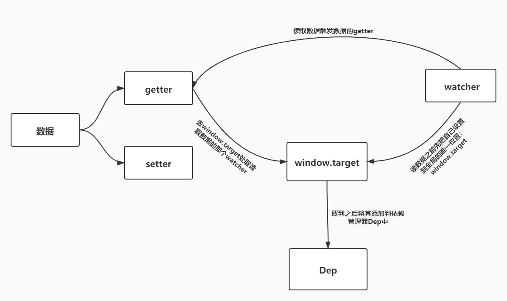

#### 简单模型公式

**UI = render(state)**

状态state是输入，页面UI是输出

数据驱动视图： 状态输入一旦发生变化，页面输出也随之变化。（什么样的数据，渲染什么样的视图）

##### Vue的角色

Vue扮演render的角色，当发现state变化之后，把变化更新到视图中


#### 变化侦测

> vue怎么知道state变化了呢？

通过Object.defineProperty的getter、setter对数据对象的每个key进行拦截（key是object则继续递归处理）

Observer类

处理成响应式之后会带有`__ob__`标记


问题：

具体怎么收集依赖和视图？


#### 依赖收集

> 视图里谁用到了这个数据就更新谁呗

我们给没个数据都建立一个依赖数组，谁依赖了，就把谁放进数组。当数据变化时，把数组里的每个依赖都通知一遍。

##### 何时收集依赖？何时通知依赖更新？

在getter中收集依赖，在setter中通知依赖更新

##### 依赖收集到哪里

依赖管理类Dep类

```javascript
// 源码位置：src/core/observer/dep.js
export default class Dep {
  constructor () {
    this.subs = []
  }

  addSub (sub) {
    this.subs.push(sub)
  }
  // 删除一个依赖
  removeSub (sub) {
    remove(this.subs, sub)
  }
  // 添加一个依赖
  depend () {
    if (window.target) {
      this.addSub(window.target)
    }
  }
  // 通知所有依赖更新
  notify () {
    const subs = this.subs.slice()
    for (let i = 0, l = subs.length; i < l; i++) {
      subs[i].update()
    }
  }
}

/**
 * Remove an item from an array
 */
export function remove (arr, item) {
  if (arr.length) {
    const index = arr.indexOf(item)
    if (index > -1) {
      return arr.splice(index, 1)
    }
  }
}
```


##### 依赖到底是谁

> Watcher类

在之后数据变化时，我们不直接去通知依赖更新，而是通知依赖对应的`Watch`实例，由`Watcher`实例去通知真正的视图。




问题：

以组件为单位推送，父组件有依赖，子组件都更新了？


#### 数组型数据


#### 虚拟DOM

> 是什么？为什么？

我们可以用`JS`模拟出一个`DOM`节点，称之为虚拟`DOM`节点。当数据发生变化时，我们对比变化前后的虚拟`DOM`节点，通过`DOM-Diff`算法计算出需要更新的地方，然后去更新需要更新的视图。


##### VNode

注释节点？

`isComment`为`true`

克隆节点？

`isCloned`为`true`


#### DOM-Diff

在`Vue`中，把 `DOM-Diff`过程叫做`patch`过程。


问题：

patch逻辑？


#### 模板编译


