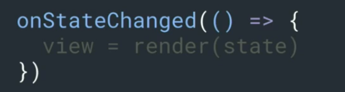
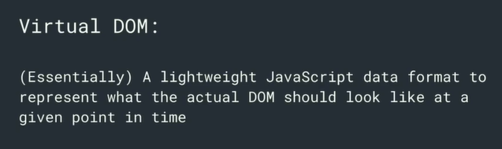
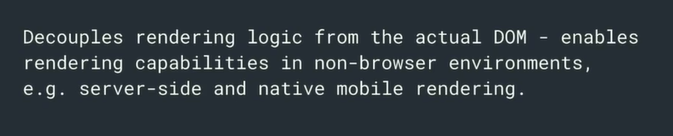
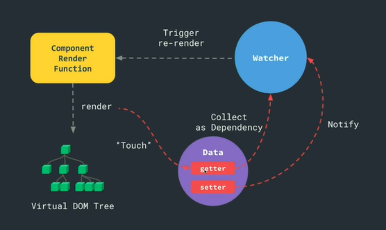
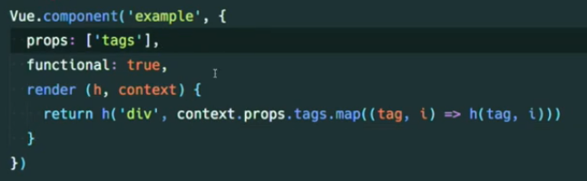

 响应式，如何修改数据同步更新视图？

react => 通过调用函数setState，修改state，然后更新视图render(state)




vue把数据对象变成响应式（通过getter 和setter劫持)，不需要通过调用函数修改数据


Dependency Tracking

dependency就是数据

```js
window.Dep = class Dep{
    constructor(){
        this.subscribers = new Set()
    }
    depend(){
        if(activeUpdate){
            this.subscribers.add(activeUpdate)
            // register the current active update as a subscriber
        }
    },
    notify(){
        // run all subscriber functions
        this.subscribers.forEach(sub => sub())
    }
}
// js单线程，同时只有一个在执行
let activeUpdate

const dep = new Dep()

// - autorun function that takes an updater function
// - inside the updater function, you can explicitly depend on an 
// 	 instance of Dep
function autorun (update) {
    function wrapperUpdate () {
        activeUpdate = wrapperUpdate
        update()
        activeUpdate = null
    }
    wrapperUpdate()
}
autorun(() => {
    dep.depend()
    console.log('updated')
})

dep.notify()
```


app.use

Vue.mixin

子组件都会混入？


slot什么关系，怎么通信


Template

- (compiled into) render function
- (returns) virtual dom
- (generates) actual dom


Render Function - a function that returns Virtual DOM

- (returns) new virtual dom
- (diffed against old virtual dom) dom updates
- (applied to) actual dom


Virtual DOM






Template -> [Compiler] -> Render Function





只有一个根元素？


functional: true ??




time slice

进行js计算的时候，把js计算切成一块块 一帧帧的去做。