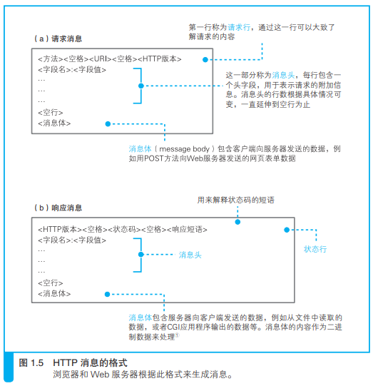

## 什么是协议

计算机与网络设备要相互通信，双方就必须基于相同的方法。比如，
如何探测到通信目标、由哪一边先发起通信、使用哪种语言进行通
信、怎样结束通信等规则都需要事先确定。不同的硬件、操作系统之
间的通信，所有的这一切都需要一种规则。而我们就把这种规则称为
协议（protocol）。

## TCP/IP 协议族

TCP/IP 是互联网相关的各类协议族的总称。

协议中存在各式各样的内容。从电缆的规格到 IP 地址的选定方法、寻找异地用户的方法、双方建立通信的顺序，以及 Web 页面显示需要处理的步骤，等等。像这样把与互联网相关联的协议集合起来总称为 TCP/IP。

## TCP/IP 的分层管理

应用层、传输层、网络层和数据链路层

#### 为什么分层

相互解耦，各个层次灵活升级改动。

#### 应用层

应用层决定了   向用户提供应用服务时  通信的活动。（如网页、邮箱等应用服务对应不同的协议）

http、ftp、dns等

#### 传输层

传输层对上层应用层，提供处于**网络连接中**的两台计算机之间的数据传输。

tcp、udp

#### 网络层（又名网络互连层）

网络层用来处理在网络上流动的数据包。数据包是网络传输的最小数据单位。该层规定了通过怎样的路径（所谓的传输路线）到达对方计算机，并把数据包传送给对方。

#### 链路层（又名数据链路层，网络接口层）

用来处理连接网络的硬件部分。包括控制操作系统、硬件的设备驱动、NIC（Network Interface Card，网络适配器，即网卡），及光纤等物理可见部分（还包括连接器等一切传输媒介）。硬件上的范畴均在链路层的作用范围之内。

#### 流程

我们用 HTTP 举例来说明，首先作为发送端的客户端在应用层（HTTP 协议）发出一个想看某个 Web 页面的 HTTP 请求。
接着，为了传输方便，在传输层（TCP 协议）把从应用层处收到的数据（HTTP 请求报文）进行分割，并在各个报文上打上标记序号及端口号后转发给网络层。
在网络层（IP 协议），增加作为通信目的地的 MAC 地址后转发给链路层。这样一来，发往网络的通信请求就准备齐全了。
接收端的服务器在链路层接收到数据，按序往上层发送，一直到应用层。当传输到应用层，才能算真正接收到由客户端发送过来的 HTTP请求。

## IP协议（网际协议）

IP 协议的作用是把各种数据包传送给对方。而要保证确实传送到对方那里，则需要满足各类条件。其中两个重要的条件是 IP 地址和 MAC地址（Media Access Control Address）。

IP 地址指明了节点被分配到的地址，MAC 地址是指网卡所属的固定地址。IP 地址可以和 MAC 地址进行配对。

IP 间的通信依赖 MAC 地址。

在网络上，通信的双方在同一局域网（LAN）内的情况是很少的，通常是经过多台计算机和网络设备中转
才能连接到对方。而在进行中转时，会利用下一站中转设备的 MAC地址来搜索下一个中转目标。这时，会采用 ARP 协议（AddressResolution Protocol）。ARP 是一种用以解析地址的协议，根据通信方的 IP 地址就可以反查出对应的 MAC 地址。

## 确保可靠性的 TCP 协议

按层次分，TCP 位于传输层，提供可靠的字节流服务。

## http

- HTTP 协议用于客户端和服务器端之间的通信

- 通过请求和响应的交换达成通信

  HTTP 协议规定，请求从客户端发出，最后服务器端响应该请求并返回。换句话说，肯定是先从客户端开始建立通信的，服务器端在没有接收到请求之前不会发送响应。

- HTTP 是不保存状态的协议

- HTTP 协议使用 URI 定位互联网上的资源

- 告知服务器意图的 HTTP 方法

  - get获取资源
  - post传输实体主体
  - delete删除
  - OPTIONS询问支持方法
  - CONNECT：要求在与代理服务器通信时建立隧道，实现用隧道协议进行 TCP 通信。主要使用 SSL（Secure Sockets Layer，安全套接层）和 TLS（Transport Layer Security，传输层安全）协议把通信内容加 密后经网络隧道传输。

- 使用方法下达命令

- 持久连接节省通信量

  

  

  为解决上述 TCP 连接的问题，HTTP/1.1 和一部分的 HTTP/1.0 想出了持久连接（HTTP Persistent Connections，也称为 HTTP keep-alive 或HTTP connection reuse）的方法。持久连接的特点是，只要任意一端没有明确提出断开连接，则保持 TCP 连接状态。

  持久连接旨在建立 1 次 TCP 连接后进行多次请求和响应的交互。减少了 TCP 连接的重复建立和断开所造成的额外开销，减轻了服务器端的负载。

- 管线化

  持久连接使得多数请求以管线化（pipelining）方式发送成为可能。从前发送请求后需等待并收到响应，才能发送下一个请求。管线化技术出现后，不用等待响应亦可直接发送下一个请求。

  

- 使用 Cookie 的状态管理

## http报文

#### 编码提升传输速率

- 报文主体和实体主体的差异

- 压缩传输的内容编码

  常用的内容编码有以下几种。
  gzip（GNU zip）
  compress（UNIX 系统的标准压缩）
  deflate（zlib）
  identity（不进行编码）

- 分割发送的分块传输编码

#### 发送多种数据的多部分对象集合

Content-type

#### 内容协商返回最合适的内容

同一个 Web 网站有可能存在着多份相同内容的页面。比如英语版和
中文版的 Web 页面，它们内容上虽相同，但使用的语言却不同。

内容协商机制是指客户端和服务器端就响应的资源内容进行交涉，然
后提供给客户端最为适合的资源。内容协商会以响应资源的语言、字
符集、编码方式等作为判断的基准。

Accept
Accept-Charset

Accept-Encoding
Accept-Language
Content-Language

#### 代理

使用代理服务器的理由有：利用缓存技术（稍后讲解）减少网络带宽的流量，组织内部针对特定网站的访问控制，以获取访问日志为主要目的，等等。

缓存代理
代理转发响应时，缓存代理（Caching Proxy）会预先将资源的副本（缓存）保存在代理服务器上。
当代理再次接收到对相同资源的请求时，就可以不从源服务器那里获取资源，而是将之前缓存的资源作为响应返回。

透明代理
转发请求或响应时，不对报文做任何加工的代理类型被称为透明代理（Transparent Proxy）。反之，对报文内容进行加工的代理被称为非透明代理。

#### 网关

利用网关可以由 HTTP 请求转化为其他协议通信

#### 隧道

隧道可按要求建立起一条与其他服务器的通信线路，届时使用 SSL等加密手段进行通信。隧道的目的是确保客户端能与服务器进行安全的通信。
隧道本身不会去解析 HTTP 请求。也就是说，请求保持原样中转给之后的服务器。隧道会在通信双方断开连接时结束。

#### 缓存

缓存是指代理服务器或客户端本地磁盘内保存的资源副本。利用缓存可减少对源服务器的访问，因此也就节省了通信流量和通信时间。

缓存服务器是代理服务器的一种。

##### 缓存服务器缓存的有效期限

即使存在缓存，也会因为客户端的要求、缓存的有效期等因素，向源服务器确认资源的有效性。

##### 客户端的缓存

同样确认有效期

## HTTP版本

##### HTTP/0.9

协议规定，服务器只能回应HTML格式的字符串，不能回应别的格式：

Hello World

服务器发送完毕，就关闭TCP连接。

##### HTTP/1.0

- **任何格式的内容都可以发送**。这使得互联网不仅可以传输文字，还能传输图像、视频、二进制文件。这为互联网的大发展奠定了基础。
- 其次，除了GET命令，还引入了**POST**命令和**HEAD**命令，丰富了浏览器与服务器的互动手段。
- 再次，HTTP请求和回应的格式也变了。除了数据部分，每次通信都必须包括头信息（HTTP header），用来描述一些元数据。
- 其他的新增功能还包括状态码（status code）、多字符集支持、多部分发送（multi-part type）、权限（authorization）、缓存（cache）、内容编码（content encoding）等。

缺点：HTTP/1.0 版的主要缺点是，每个TCP连接只能发送一个请求。发送数据完毕，连接就关闭

##### HTTP/1.1

- 持久连接，不用声明Connection: keep-alive
- 管道机制
- 分块传输编码，Transfer-Encoding: chunked

缺点：虽然1.1版允许复用TCP连接，但是同一个TCP连接里面，所有的数据通信是按次序进行的。服务器只有处理完一个回应，才会进行下一个回应。要是前面的回应特别慢，后面就会有许多请求排队等着。这称为["队头堵塞"](https://zh.wikipedia.org/wiki/队头阻塞)（Head-of-line blocking）。

##### HTTP/2

- 二进制协议

- 多工

  HTTP/2 复用TCP连接，在一个连接里，客户端和浏览器都可以同时发送多个请求或回应，而且不用按照顺序一一对应，这样就避免了"队头堵塞"。

- 数据流

- 头信息压缩

- 服务器推送

