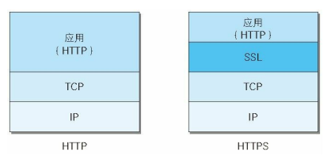
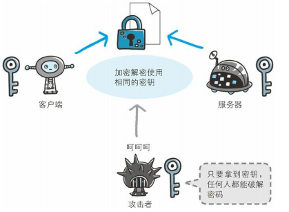
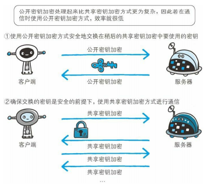
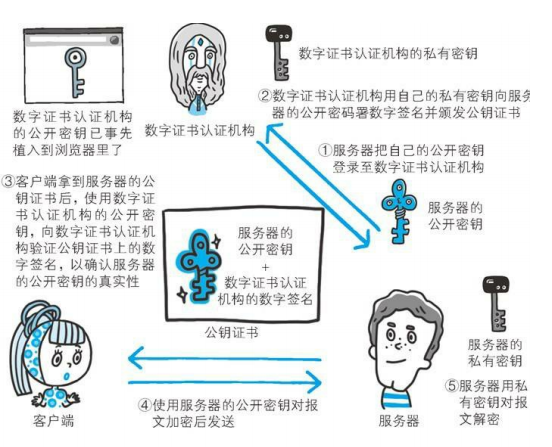
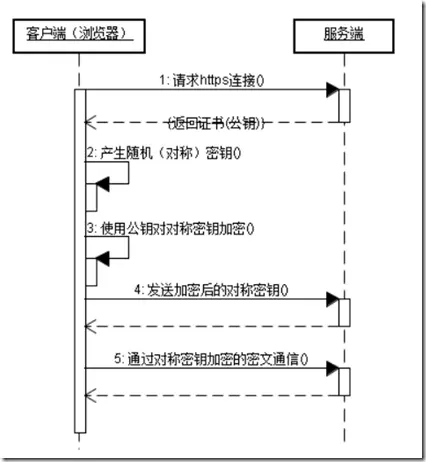
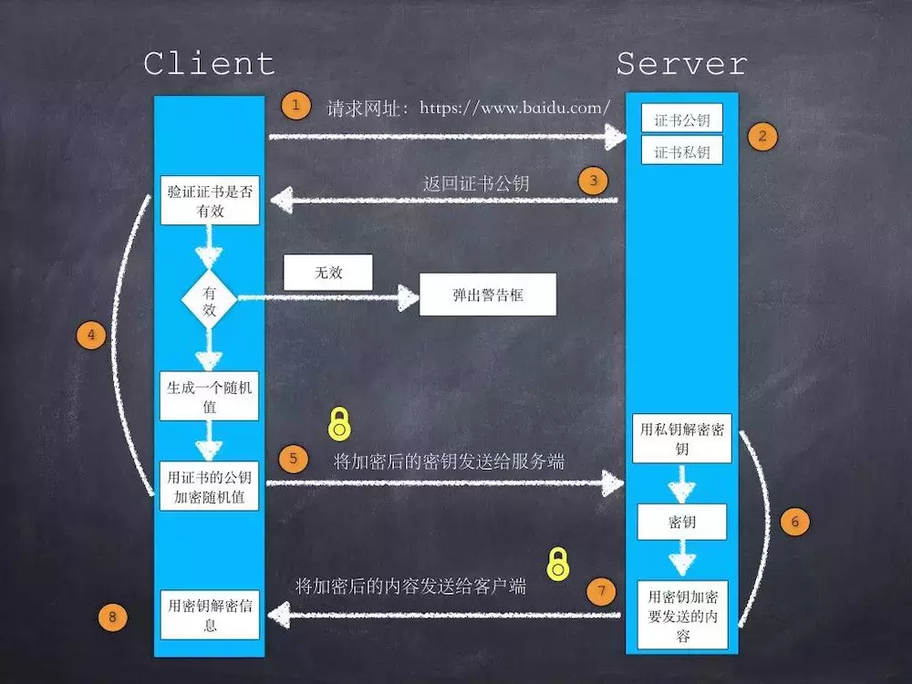

## http缺点

- 通信使用明文（**不加密**），内容可能会被窃听 
- 不验证通信方的身份，因此有可能遭遇**伪装** 
- 无法证明报文的完整性，所以有可能已遭**篡改**

## 加密

- 通信加密

  SSL（Secure Socket Layer，安全套接层）、TLS（Transport Layer Security，安全层传输协议）

- 内容的加密

## 验证通信方的身份

虽然使用 HTTP 协议无法确定通信方，但如果使用 SSL则可以。 SSL不仅提供加密处理，而且还使用了一种被称为证书的手段， 可用于确定方。

证书由值得信任的第三方机构颁发，用以证明服务器和客户端是 实际存在的。

另外，伪造证书从技术角度来说是异常困难的一件 事。所以只要能够确认通信方（服务器或客户端）持有的证书， 即可判断通信方的真实意图。

通过使用证书，以证明通信方就是意料中的服务器。这对使用者 个人来讲，也减少了个人信息泄露的危险性。 另外，客户端持有证书即可完成个人身份的确认，也可用于对 Web 网站的认证环节。

## 无法证明报文完整性，可能已遭篡改（中间人攻击）

SSL提供认证和加密处理及摘要功能。

## HTTP+ 加密 + 认证 + 完整性保护 =HTTPS

HTTPS 并非是应用层的一种新协议。只是 HTTP 通信接口部分用SSL（Secure Socket Layer）和 TLS（Transport Layer Security）协议代替而已。

通常，HTTP 直接和 TCP 通信。当使用 SSL时，则演变成先和 SSL通信，再由 SSL和 TCP 通信了。

### 加密

- 共享密钥加密（对称密钥加密）

  

  以共享密钥方式加密时必须将密钥也发给对方。可究竟怎样才能安全地转交？密钥被窃取，加密就失去意义。

- 使用两把密钥的公开密钥加密

  公开密钥加密使用一对非对称的密钥。

  使用公开密钥加密方式，发送密文的一方使用对方的公开密钥进行加密处理，对方收到被加密的信息后，再使用自己的私有密钥进行解密。利用这种方式，不需要发送用来解密的私有密钥，也不必担心密钥被攻击者窃听而盗走。

- HTTPS 采用混合加密机制

  若密钥能够实现安全交换，那么有可能会考虑仅使用公开密钥加密来通信。但是公开密钥加密与共享密钥加密相比，其处理速度要慢。

  

  

#### 证明公开密钥正确性的证书

如何证明收到的公开密钥就是原本预想的那台服务器发行的公开密钥。

服务器的运营人员向数字证书认证机构提出公开密钥的申请。数字证书认证
机构在判明提出申请者的身份之后，会对已申请的公开密钥做数字签名，然后分配这个已签名的公开密钥，并将该公开密钥放入公钥证书后绑定在一起。

接到证书的客户端可使用数字证书认证机构的公开密钥，对那张证书上的数字签名进行验证，一旦验证通过，客户端便可明确两件事：一，认证服务器的公开密钥的是真实有效的数字证书认证机构。二，服务器的公开密钥是值得信赖的。

此处认证机关的公开密钥必须安全地转交给客户端。使用通信方式时，如何安全转交是一件很困难的事，因此，多数浏览器开发商发布版本时，会事先在内部植入常用认证机关的公开密钥。

#### 用以确认客户端的客户端证书

以客户端证书进行客户端认证，证明服务器正在通信的对方始终是预料之内的客户端，其作用跟服务器证书如出一辙。

想获取证书时，用户得自行安装客户端证书。

HTTPS协议通信：HTTPS是HTTP报文直接将报文信息传输给SSL套接字进行加密，SSL加密后将加密后的报文发送给TCP套接字，然后TCP套接字再将加密后的报文发送给目的主机，目的主机将通过TCP套接字获取加密后的报文给SSL套接字，SSL解密后交给对应进程。

https 443端口

