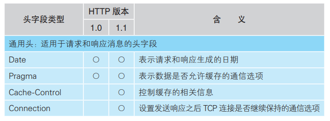
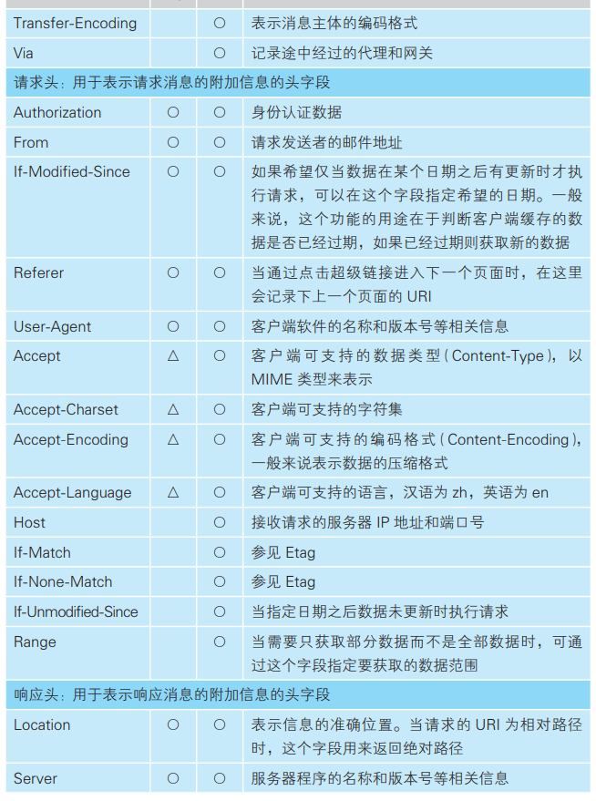
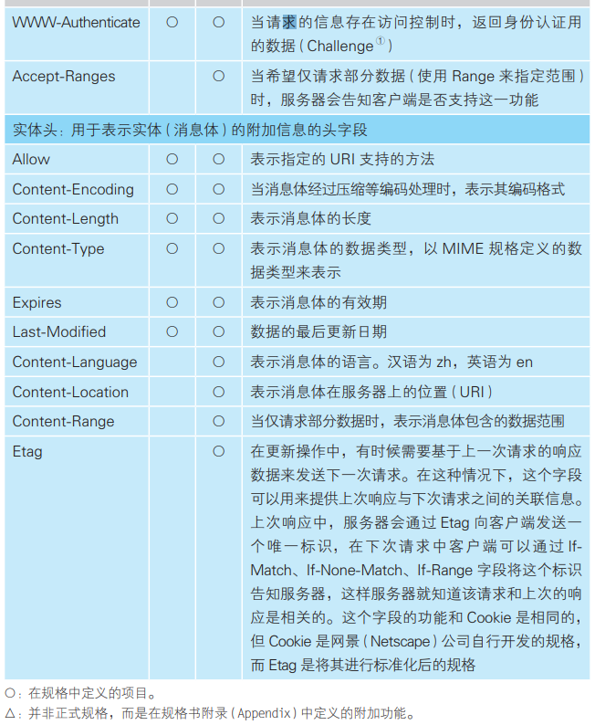
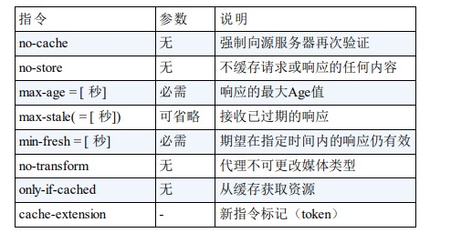
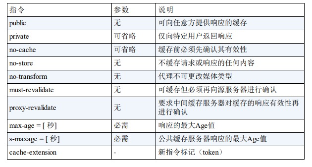
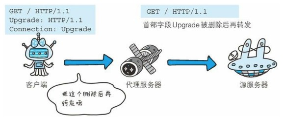
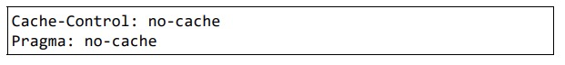
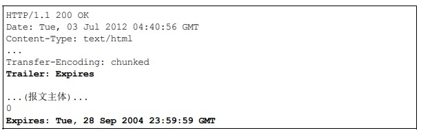
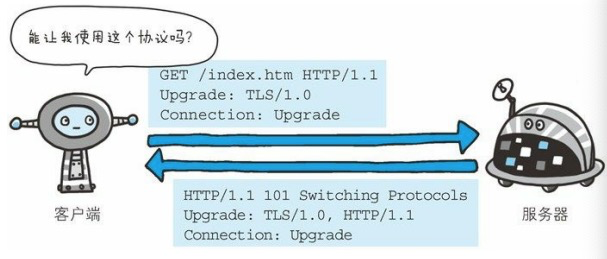
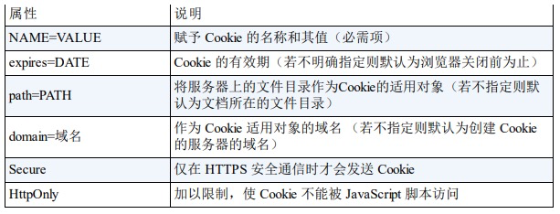

## 通用首部字段

#### Cache-Control

缓存请求响应

缓存响应指令

#### Connection

- 控制不再转发给代理的首部字段

  

- 管理持久连接

#### Date

创建 HTTP 报文的日期和时间

#### Pragma

Pragma 是 HTTP/1.1 之前版本的历史遗留字段，仅作为与 HTTP/1.0 的向后兼容而定义。

Pragma: no-cache

该首部字段属于通用首部字段，但只用在客户端发送的请求中。

所有的中间服务器如果都能以 HTTP/1.1 为基准，那直接采用 CacheControl: no-cache 指定缓存的处理方式是最为理想的。

#### Trailer

首部字段 Trailer 会事先说明在报文主体后记录了哪些首部字段。该 首部字段可应用在 HTTP/1.1 版本分块传输编码时。

#### Transfer-Encoding

首部字段 Transfer-Encoding 规定了传输报文主体时采用的编码方式。

Transfer-Encoding: chunked

#### Upgrade

首部字段 Upgrade 用于检测 HTTP 协议及其他协议是否可使用更高的 版本进行通信，其参数值可以用来指定一个完全不同的通信协议。

首部字段 Upgrade 指定的值为 TLS/1.0。请注意此处两 个字段首部字段的对应关系，Connection 的值被指定为 Upgrade。 Upgrade 首部字段产生作用的 Upgrade 对象仅限于客户端和邻接服务 器之间。因此，使用首部字段 Upgrade 时，还需要额外指定 Connection:Upgrade。

#### Via

使用首部字段 Via 是为了追踪客户端与服务器之间的请求和响应报文 的传输路径。

首部字段 Via 不仅用于追踪报文的转发，还可避免请求回环的发生。 所以必须在经过代理时附加该首部字段内容。

## 请求首部字段

#### Accept

Accept 首部字段可通知服务器，用户代理能够处理的媒体类型及媒体 类型的相对优先级。可使用 type/subtype 这种形式，一次指定多种媒 体类型。

Accept: text/html,application/xhtml+xml,application/xml;q=0.9,*/*;q=0.8

#### Accept-Charset

Accept-Charset 首部字段可用来通知服务器用户代理支持的字符集及 字符集的相对优先顺序。

Accept-Charset: iso-8859-5, unicode-1-1;q=0.8

#### Accept-Encoding

Accept-Encoding 首部字段用来告知服务器用户代理支持的内容编码及 内容编码的优先级顺序。

Accept-Encoding: gzip, deflate

#### Accept-Language

首部字段 Accept-Language 用来告知服务器用户代理能够处理的自然 语言集（指中文或英文等），以及自然语言集的相对优先级。

Accept-Language: zh-cn,zh;q=0.7,en-us,en;q=0.3

#### From

首部字段 From 用来告知服务器使用用户代理的用户的电子邮件地 址。

#### Host

首部字段 Host 会告知服务器，请求的资源所处的互联网主机名和端 口号。

#### If-Match

形如 If-xxx 这种样式的请求首部字段，都可称为条件请求。服务器接 收到附带条件的请求后，只有判断指定条件为真时，才会执行请求。

只有当 If-Match 的字段值跟 ETag（实体标记） 值匹配一致时，服务器才会 接受请求

#### If-Modified-Since

#### If-None-Match

只有在 If-None-Match 的字段值与 ETag 值不一致时，可处理 该请求。与 If-Match 首部字段的作用相反

#### If-Range

首部字段 If-Range 属于附带条件之一。它告知服务器若指定的 IfRange 字段值（ETag 值或者时间）和请求资源的 ETag 值或时间相一 致时，则作为范围请求处理。反之，则返回全体资源。

#### If-Unmodified-Since

指定的请求资源只有在字段值内指定 的日期时间之后，未发生更新的情况下，才能处理请求。

#### Max-Forwards

通过 TRACE 方法或 OPTIONS 方法，发送包含首部字段 MaxForwards 的请求时，该字段以十进制整数形式指定可经过的服务器最 大数目。服务器在往下一个服务器转发请求之前，Max-Forwards 的 值减 1 后重新赋值。当服务器接收到 Max-Forwards 值为 0 的请求 时，则不再进行转发，而是直接返回响应。

#### Range

#### Referer

首部字段 Referer 会告知服务器请求的原始资源的 URI。

#### User-Agent

浏览器的种类

## 响应首部字段

#### Accept-Ranges

当不能处理范围请求时，Accept-Ranges: none

可指定的字段值有两种，可处理范围请求时指定其为 bytes，反之则 指定其为 none。

#### Age

首部字段 Age 能告知客户端，源服务器在多久前创建了响应。字段值 的单位为秒。

#### ETag

另外，当资源更新时，ETag 值也需要更新。生成 ETag 值时，并没有 统一的算法规则，而仅仅是由服务器来分配。

#### Location

使用首部字段 Location 可以将响应接收方引导至某个与请求 URI 位置 不同的资源。 

基本上，该字段会配合 3xx ：Redirection 的响应，提供重定向的 URI。

#### Retry-After

#### Server

首部字段 Server 告知客户端当前服务器上安装的 HTTP 服务器应用程 序的信息。

Server: Apache/2.2.6 (Unix) PHP/5.2.5

#### Vary

## 实体首部字段

#### Allow

Allow: GET, HEAD

#### Content-Encoding

Content-Encoding: gzip

## 为 Cookie 服务的首部字段

#### Set-Cookie

Set-Cookie: status=enable; expires=Tue, 05 Jul 2011 07:26:31 GMT; path=/; domain=.hackr.jp;

#### max-age和expires区别

expires是http1.0的，绝对时间，但由于客户端和服务端可能存在时间差，导致不准确；

max-age是相对时间

