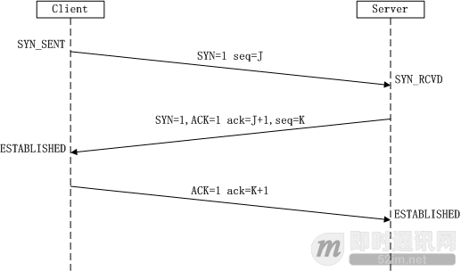
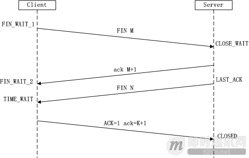

### 五层模型

<http://www.52im.net/thread-1095-1-1.html>

- 应用层
- 传输层
- 网络层
- 链接层
- 实体层 

#### 实体层

电脑要组网，第一件事要干什么？当然是先把电脑连起来，可以用光缆、电缆、双绞线、无线电波等方式。

这就叫做"实体层"，它就是把电脑连接起来的物理手段。它主要规定了网络的一些电气特性，作用是负责传送0和1的电信号。

#### 链接层

 单纯的0和1没有任何意义，必须规定解读方式：多少个电信号算一组？每个信号位有何意义？

这就是"链接层"的功能，它在"实体层"的上方，确定了0和1的分组方式。  

##### 以太网协议

以太网规定，一组电信号构成一个数据包，叫做"帧"（Frame）。每一帧分成两个部分：标头（Head）和数据（Data）。

  "标头"包含数据包的一些说明项，比如发送者、接受者、数据类型等等；"数据"则是数据包的具体内容。

"标头"的长度，固定为18字节。"数据"的长度，最短为46字节，最长为1500字节。因此，整个"帧"最短为64字节，最长为1518字节。如果数据很长，就必须分割成多个帧进行发送。  

##### MAC地址

 上面提到，以太网数据包的"标头"，包含了发送者和接受者的信息。那么，发送者和接受者是如何标识呢？

以太网规定，连入网络的所有设备，都必须具有"网卡"接口。数据包必须是从一块网卡，传送到另一块网卡。网卡的地址，就是数据包的发送地址和接收地址，这叫做MAC地址。  

##### 广播

> 一块网卡怎么会知道另一块网卡的MAC地址？

有一种ARP协议，可以解决这个问题。这个留到后面介绍，这里只需要知道，以太网数据包必须知道接收方的MAC地址，然后才能发送。

> 就算有了MAC地址，系统怎样才能把数据包准确送到接收方？

以太网采用了一种很"原始"的方式，它不是把数据包准确送到接收方，而是向本网络内所有计算机发送，让每台计算机自己判断，是否为接收方。

1号计算机向2号计算机发送一个数据包，同一个子网络的3号、4号、5号计算机都会收到这个包。它们读取这个包的"标头"，找到接收方的MAC地址，然后与自身的MAC地址相比较，如果两者相同，就接受这个包，做进一步处理，否则就丢弃这个包。这种发送方式就叫做"广播"（broadcasting）。

#### 网络层

> 网络层的由来

  以太网协议，依靠MAC地址发送数据。理论上，单单依靠MAC地址，上海的网卡就可以找到洛杉矶的网卡了，技术上是可以实现的。

但是，这样做有一个重大的缺点。以太网采用广播方式发送数据包，所有成员人手一"包"，不仅**效率低**，而且局限在发送者所在的**子网络**。也就是说，如果两台计算机不在同一个子网络，广播是传不过去的。这种设计是合理的，否则互联网上每一台计算机都会收到所有包，那会引起灾难。

互联网是无数子网络共同组成的一个巨型网络，很像想象上海和洛杉矶的电脑会在同一个子网络，这几乎是不可能的。  

  因此，必须找到一种方法，能够区分哪些MAC地址属于同一个子网络，哪些不是。如果是同一个子网络，就采用广播方式发送，否则就采用"路由"方式发送。（"路由"的意思，就是指如何向不同的子网络分发数据包，这是一个很大的主题，本文不涉及。）遗憾的是，MAC地址本身无法做到这一点。它只与厂商有关，与所处网络无关。

这就导致了"网络层"的诞生。它的作用是引进一套新的地址，使得我们能够区分不同的计算机是否属于同一个子网络。这套地址就叫做"网络地址"，简称"网址"。  

于是，"网络层"出现以后，每台计算机有了两种地址，一种是MAC地址，另一种是网络地址。两种地址之间没有任何联系，MAC地址是绑定在网卡上的，网络地址则是管理员分配的，它们只是随机组合在一起。

网络地址帮助我们确定计算机所在的子网络，MAC地址则将数据包送到该子网络中的目标网卡。因此，从逻辑上可以推断，必定是先处理网络地址，然后再处理MAC地址。

上图中，1号电脑要向4号电脑发送一个数据包。它先判断4号电脑是否在同一个子网络，结果发现不是（后文介绍判断方法），于是就把这个数据包发到网关A。网关A通过路由协议，发现4号电脑位于子网络B，又把数据包发给网关B，网关B再转发到4号电脑。

| **场景**       | **数据包地址**              |
| -------------- | --------------------------- |
| 同一个子网络   | 对方的MAC地址，对方的IP地址 |
| 非同一个子网络 | 网关的MAC地址，对方的IP地址 |

> IP协议

规定网络地址的协议，叫做IP协议。它所定义的地址，就被称为IP地址。

互联网上的每一台计算机，都会分配到一个IP地址。这个地址分成两个部分，前一部分代表网络，后一部分代表主机。

比如，IP地址172.16.254.1，这是一个32位的地址，假定它的网络部分是前24位（172.16.254），那么主机部分就是后8位（最后的那个1）。处于同一个子网络的电脑，它们IP地址的网络部分必定是相同的，也就是说172.16.254.2应该与172.16.254.1处在同一个子网络。

> 子网掩码

用以判断网络部分，判断是否在同一子网

> IP数据包

  根据IP协议发送的数据，就叫做IP数据包。不难想象，其中必定包括IP地址信息。但是前面说过，以太网数据包只包含MAC地址，并没有IP地址的栏位。那么是否需要修改数据定义，再添加一个栏位呢？

回答是不需要，我们可以把IP数据包直接放进以太网数据包的"数据"部分，因此完全不用修改以太网的规格。这就是互联网分层结构的好处：上层的变动完全不涉及下层的结构。
具体来说，IP数据包也分为"标头"和"数据"两个部分。

IP数据包的"标头"部分的长度为20到60字节，整个数据包的总长度最大为65,535字节。因此，理论上，一个IP数据包的"数据"部分，最长为65,515字节。前面说过，以太网数据包的"数据"部分，最长只有1500字节。因此，如果IP数据包超过了1500字节，它就需要分割成几个以太网数据包，分开发送了。

> ARP协议

我们需要一种机制，能够从IP地址得到MAC地址。

这里又可以分成两种情况：

- **1）第一种情况：**如果两台主机不在同一个子网络，那么事实上没有办法得到对方的MAC地址，只能把数据包传送到两个子网络连接处的"网关"（gateway），让网关去处理；
- **2）第二种情况：**如果两台主机在同一个子网络，那么我们可以用ARP协议，得到对方的MAC地址。ARP协议也是发出一个数据包（包含在以太网数据包中），其中包含它所要查询主机的IP地址，在对方的MAC地址这一栏，填的是FF:FF:FF:FF:FF:FF，表示这是一个"广播"地址。它所在子网络的每一台主机，都会收到这个数据包，从中取出IP地址，与自身的IP地址进行比较。如果两者相同，都做出回复，向对方报告自己的MAC地址，否则就丢弃这个包。

#### 传输层

> 传输层的由来

  有了MAC地址和IP地址，我们已经可以在互联网上任意两台主机上建立通信。

接下来的问题是，同一台主机上有许多程序都需要用到网络，比如，你一边浏览网页，一边与朋友在线聊天。当一个数据包从互联网上发来的时候，你怎么知道，它是表示网页的内容，还是表示在线聊天的内容？

也就是说，我们还需要一个参数，表示这个数据包到底供哪个程序（进程）使用。这个参数就叫做"端口"（port），它其实是每一个使用网卡的程序的编号。每个数据包都发到主机的特定端口，所以不同的程序就能取到自己所需要的数据。

"端口"是0到65535之间的一个整数，正好16个二进制位。0到1023的端口被系统占用，用户只能选用大于1023的端口。不管是浏览网页还是在线聊天，应用程序会随机选用一个端口，然后与服务器的相应端口联系。

"传输层"的功能，就是建立"端口到端口"的通信。相比之下，"网络层"的功能是建立"主机到主机"的通信。只要确定主机和端口，我们就能实现程序之间的交流。因此，Unix系统就把主机+端口，叫做"套接字"（socket）。有了它，就可以进行网络应用程序开发了。  

> UDP协议

现在，我们必须在数据包中加入端口信息，这就需要新的协议。最简单的实现叫做UDP协议，它的格式几乎就是在数据前面，加上端口号。

"标头"部分主要定义了发出端口和接收端口，"数据"部分就是具体的内容。然后，把整个UDP数据包放入IP数据包的"数据"部分，而前面说过，IP数据包又是放在以太网数据包之中的，所以整个以太网数据包现在变成了下面这样：

UDP数据包非常简单，"标头"部分一共只有8个字节，总长度不超过65,535字节，正好放进一个IP数据包。

> TCP协议

为了提高网络可靠性，TCP协议就诞生了。每发出一个数据包都要求确认。如果有一个数据包遗失，就收不到确认，发出方就知道有必要重发这个数据包了。

TCP数据包和UDP数据包一样，都是内嵌在IP数据包的"数据"部分。TCP数据包没有长度限制，理论上可以无限长，但是为了保证网络的效率，通常TCP数据包的长度不会超过IP数据包的长度，以确保单个TCP数据包不必再分割。

### 应用层

> 由来

"应用层"的作用，就是规定应用程序的数据格式（邮件、网页等）。

### 动态IP地址

所谓"动态IP地址"，指计算机开机后，会自动分配到一个IP地址，不用人为设定。它使用的协议叫做DHCP协议。

### 路由协议

网关怎么转发

怎么体现ip地址的定位功能

## TCP 协议

以太网协议解决了局域网的点对点通信，但是，以太网协议不能解决多个局域网如何互通，这由 IP 协议解决。

IP 协议定义了一套自己的地址规则，称为 IP 地址。它实现了路由功能，允许某个局域网的 A 主机，向另一个局域网的 B 主机发送消息。

局域网之间要靠路由器连接，

路由的原理很简单。市场上所有的路由器，背后都有很多网口，要接入多根网线。路由器内部有一张路由表，规定了 A 段 IP 地址走出口一，B 段地址走出口二，......通过这套"指路牌"，实现了数据包的转发。

### TCP 数据包的大小

以太网数据包（packet）的大小是固定的，最初是1518字节，后来增加到1522字节。其中， 1500 字节是负载（payload），22字节是头信息（head）。IP 数据包在以太网数据包的负载里面，它也有自己的头信息，最少需要20字节，所以 IP 数据包的负载最多为1480字节。

TCP 数据包在 IP 数据包的负载里面。它的头信息最少也需要20字节，因此 TCP 数据包的最大负载是 1480 - 20 = 1460 字节。由于 IP 和 TCP 协议往往有额外的头信息，所以 TCP 负载实际为1400字节左右。因此，一条1500字节的信息需要两个 TCP 数据包。HTTP/2 协议的一大改进， 就是压缩 HTTP 协议的头信息，使得一个 HTTP 请求可以放在一个 TCP 数据包里面，而不是分成多个，这样就提高了速度。

### TCP 数据包的编号（SEQ）

一个包1400字节，那么一次性发送大量数据，就必须分成多个包。比如，一个 10MB 的文件，需要发送7100多个包。发送的时候，TCP 协议为每个包编号（sequence number，简称 SEQ），以便接收的一方按照顺序还原。万一发生丢包，也可以知道丢失的是哪一个包。

第一个包的编号是一个随机数。为了便于理解，这里就把它称为1号包。假定这个包的负载长度是100字节，那么可以推算出下一个包的编号应该是101。这就是说，每个数据包都可以得到两个编号：自身的编号，以及下一个包的编号。接收方由此知道，应该按照什么顺序将它们还原成原始文件。

### TCP 数据包的组装

收到 TCP 数据包以后，组装还原是操作系统完成的。

应用程序收到组装好的原始数据，以浏览器为例，就会根据 HTTP 协议的 Content-Length 字段正确读出一段段的数据。这也意味着，一次 TCP 通信可以包括多个 HTTP 通信。

### 慢启动和 ACK

服务器发送数据包，当然越快越好，最好一次性全发出去。但是，发得太快，就有可能丢包。带宽小、路由器过热、缓存溢出等许多因素都会导致丢包。线路不好的话，发得越快，丢得越多。

TCP 协议为了做到效率与可靠性的统一，设计了一个慢启动（slow start）机制。开始的时候，发送得较慢，然后根据丢包的情况，调整速率：如果不丢包，就加快发送速度；如果丢包，就降低发送速度。

**ACK 携带两个信息：**

1）期待要收到下一个数据包的编号；

2）接收方的接收窗口的剩余容量。

发送方有了这两个信息，再加上自己已经发出的数据包的最新编号，就会推测出接收方大概的接收速度，从而降低或增加发送速率。这被称为"发送窗口"，这个窗口的大小是可变的。

<u>*每个 ACK 都带有下一个数据包的编号，以及接收窗口的剩余容量，双方都会发送 ACK*</u>

上图一共4次通信。第一次通信，A 主机发给B 主机的数据包编号是1，长度是100字节，因此第二次通信 B 主机的 ACK 编号是 1 + 100 = 101，第三次通信 A 主机的数据包编号也是 101。同理，第二次通信 B 主机发给 A 主机的数据包编号是1，长度是200字节，因此第三次通信 A 主机的 ACK 是201，第四次通信 B 主机的数据包编号也是201。

### 数据包的遗失处理

前面说过，每一个数据包都带有下一个数据包的编号。如果下一个数据包没有收到，那么 ACK 的编号就不会发生变化。

举例来说，现在收到了4号包，但是没有收到5号包。ACK 就会记录，期待收到5号包。过了一段时间，5号包收到了，那么下一轮 ACK 会更新编号。如果5号包还是没收到，但是收到了6号包或7号包，那么 ACK 里面的编号不会变化，总是显示5号包。这会导致大量重复内容的 ACK。

如果发送方发现收到三个连续的重复 ACK，或者超时了还没有收到任何 ACK，就会确认丢包，即5号包遗失了，从而再次发送这个包。通过这种机制，TCP 保证了不会有数据包丢失。

Host B 没有收到100号数据包，会连续发出相同的 ACK，触发 Host A 重发100号数据包

### TCP链接方式

我们可以先明确一下 TCP 建立连接并且初始化的目标是什么呢？

- 1）初始化资源；
- 2）告诉对方我的序列号。

所以三次握手的次序是这样子的：

- 1）client端首先发送一个SYN包告诉Server端我的初始序列号是X；
- 2）Server端收到SYN包后回复给client一个ACK确认包，告诉client说我收到了；
- 3）接着Server端也需要告诉client端自己的初始序列号，于是Server也发送一个SYN包告诉client我的初始序列号是Y；
- 4）Client收到后，回复Server一个ACK确认包说我知道了。

其中的 2 、3 步骤可以简化为一步，也就是说将 ACK 确认包和 SYN 序列化包一同发送给 Client 端。到此我们就比较简单的解释了 TCP 建立连接的“三次握手”。

标志位：共6个，即URG、ACK、PSH、RST、SYN、FIN等，具体含义如下：
       （A）URG：紧急指针（urgent pointer）有效。
       （B）ACK：确认序号有效。
       （C）PSH：接收方应该尽快将这个报文交给应用层。
       （D）RST：重置连接。
       （E）SYN：发起一个新连接。
       （F）FIN：释放一个连接。

  **需要注意的是：**

（A）不要将确认序号Ack与标志位中的ACK搞混了。
（B）确认方Ack=发起方Seq+1，两端配对。  

  **（1）第一次握手：**
Client将标志位SYN置为1，随机产生一个值seq=J，并将该数据包发送给Server，Client进入SYN_SENT状态，等待Server确认。

**（2）第二次握手：**
Server收到数据包后由标志位SYN=1知道Client请求建立连接，Server将标志位SYN和ACK都置为1，ack=J+1，随机产生一个值seq=K，并将该数据包发送给Client以确认连接请求，Server进入SYN_RCVD状态。

**（3）第三次握手：**
Client收到确认后，检查ack是否为J+1，ACK是否为1，如果正确则将标志位ACK置为1，ack=K+1，并将该数据包发送给Server，Server检查ack是否为K+1，ACK是否为1，如果正确则连接建立成功，Client和Server进入ESTABLISHED状态，完成三次握手，随后Client与Server之间可以开始传输数据了。  

##### SYN攻击：

在三次握手过程中，Server发送SYN-ACK之后，收到Client的ACK之前的TCP连接称为半连接（half-open connect），此时Server处于SYN_RCVD状态，当收到ACK后，Server转入ESTABLISHED状态。SYN攻击就是Client在短时间内伪造大量不存在的IP地址，并向Server不断地发送SYN包，Server回复确认包，并等待Client的确认，由于源地址是不存在的，因此，Server需要不断重发直至超时，这些伪造的SYN包将产时间占用未连接队列，导致正常的SYN请求因为队列满而被丢弃，从而引起网络堵塞甚至系统瘫痪。SYN攻击时一种典型的DDOS攻击，检测SYN攻击的方式非常简单，即当Server上有大量半连接状态且源IP地址是随机的，则可以断定遭到SYN攻击了，使用如下命令可以让之现行：

\#netstat -nap | grep SYN_RECV

#### 4次挥手过程详解

<http://www.52im.net/thread-258-1-1.html>

由于TCP连接时全双工的，因此，每个方向都必须要单独进行关闭，这一原则是当一方完成数据发送任务后，发送一个FIN来终止这一方向的连接，收到一个FIN只是意味着这一方向上没有数据流动了，即不会再收到数据了，但是在这个TCP连接上仍然能够发送数据，直到这一方向也发送了FIN。首先进行关闭的一方将执行主动关闭，而另一方则执行被动关闭，上图描述的即是如此。

- 第一次挥手：
  Client发送一个FIN，用来关闭Client到Server的数据传送，Client进入FIN_WAIT_1状态。

- 第二次挥手：
  Server收到FIN后，发送一个ACK给Client，确认序号为收到序号+1（与SYN相同，一个FIN占用一个序号），Server进入CLOSE_WAIT状态。

- 第三次挥手：
  Server发送一个FIN，用来关闭Server到Client的数据传送，Server进入LAST_ACK状态。

- 第四次挥手：
  Client收到FIN后，Client进入TIME_WAIT状态，接着发送一个ACK给Server，确认序号为收到序号+1，Server进入CLOSED状态，完成四次挥手。

  

关于三次握手与四次挥手通常都会有典型的面试题，在此提出供有需求的XDJM们参考：

- (1) 三次握手是什么或者流程？四次握手呢？答案前面分析就是。
- (2) 为什么建立连接是三次握手，而关闭连接却是四次挥手呢？

这是因为服务端在LISTEN状态下，收到建立连接请求的SYN报文后，把ACK和SYN放在一个报文里发送给客户端。而关闭连接时，当收到对方的FIN报文时，仅仅表示对方不再发送数据了但是还能接收数据，己方也未必全部数据都发送给对方了，所以己方可以立即close，也可以发送一些数据给对方后，再发送FIN报文给对方来表示同意现在关闭连接，因此，己方**ACK和FIN一般都会分开发送**。

### UDP

UDP 压根不会建立什么连接。

