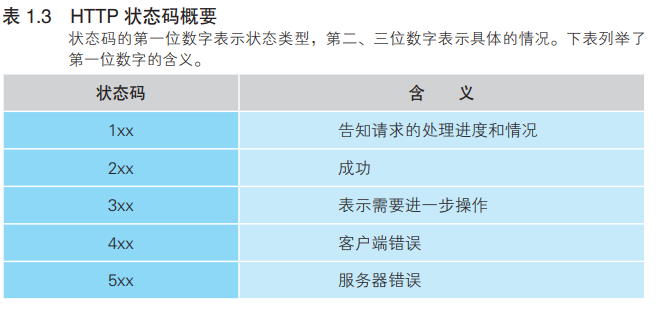

#### 2XX 成功

##### 204 no content

返回的响应报文中不含实体的主体部分。

一般在只需要从客户端往服务器发送信息，而对客户端不需要发送新信息内容的情况下使用。

##### 206 Partial Content

响应报文中包含由 Content-Range 指定范围的实体内容。

#### 3XX 重定向

##### 301 Moved Permanently

##### 302 Found

临时性重定向。

##### 303 See Other

303 状态码和 302 Found 状态码有着相同的功能，但 303 状态码明确表示客户端应当采用 GET 方法获取资源。

> 当 301、302、303 响应状态码返回时，几乎所有的浏览器都会把POST 改成 GET，并删除请求报文内的主体，之后请求会自动再次发送。
> 301、302 标准是禁止将 POST 方法改变成 GET 方法的，但实际使用时大家都会这么做。

##### 304 Not Modified

该状态码表示客户端发送附带条件的请求时，服务器端允许请求访问资源，但未满足条件的情况。304 状态码返回时，不包含任何响应的主体部分。304 虽然被划分在 3XX 类别中，但是和重定向没有关系。

If-Match，If-ModifiedSince，If-None-Match，If-Range，If-Unmodified-Since 

##### 307 Temporary Redirect

同302，但307 会遵照浏览器标准，不会从 POST 变成 GET。

#### 4XX 客户端错误

##### 400 Bad Request

请求报文中存在语法错误。当错误发生时，需修改请求的内容后再次发送请求。

##### 401 Unauthorized

表示发送的请求需要有通过 HTTP 认证（BASIC 认证、DIGEST 认证）的认证信息。

##### 403 Forbidden

访问被服务器拒绝

##### 404 Not Found

无法找到请求的资源

#### 5XX 服务器错误

##### 500 Internal Server Error

##### 503 Service Unavailable

该状态码表明服务器暂时处于超负载或正在进行停机维护，现在无法处理请求。

