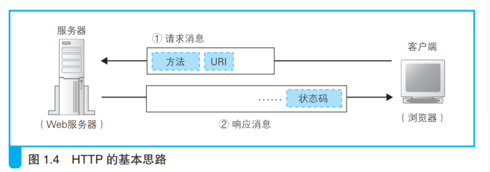

### HTTP协议是什么？

HTTP 协议定义了客户端和服务器之间交互的消息内容和步骤，其基本思路非常简单。

首先，客户端会向服务器发送请求消息。

请求消息中包含的内容是“对什么”（URI）和“进行怎样的操作”（方法）两个部分。

### 概述HTTP特点

1.HTTP 协议定义了客户端和服务器之间交互的消息内容和步骤。流程是请求响应。

2.应用层协议，基于TCP/IP，是可靠的传输协议

3.无状态

4.方便拓展。通过表示附加信息的头字段。