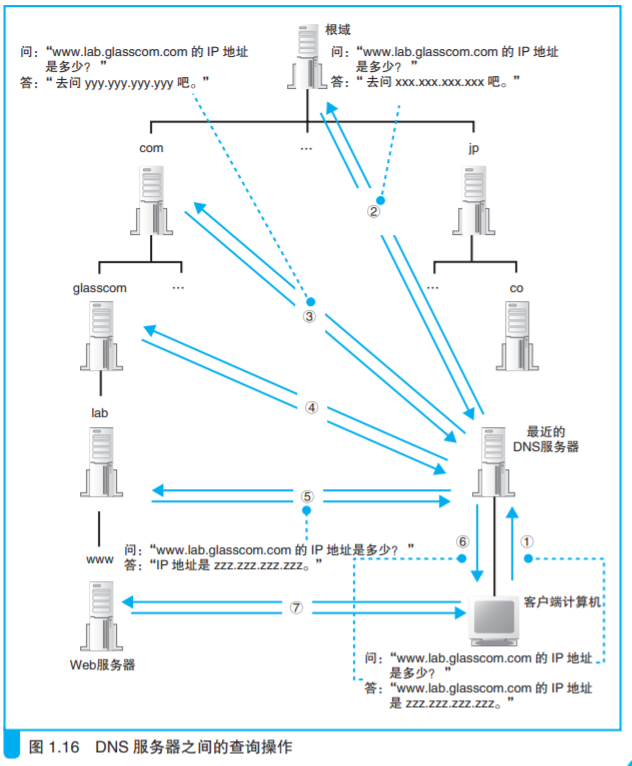

## 域名解析

### 解析器

Socket 库其中一个程序组件（gethostbyname）。

### 域名的层次结构

将负责管理下级域的 DNS 服务器的 IP 地址注 册到它们的上级 DNS 服务器中，然后上级 DNS 服务器的 IP 地址再注册到 更上一级的 DNS 服务器中，以此类推。

也就是说，负责管理 lab.glasscom.com 这个域的 DNS 服务器的 IP 地址需要注册到 glasscom.com 域的 DNS 服务器中，而 glasscom.com 域的 DNS 服务器的 IP 地址又需要注册到 com 域的 DNS 服务器中。这样，我们就可以通过上级 DNS 服务器查询出下级 DNS 服务器的 IP 地址，也就可以向下级 DNS 服务器发送查询请求了。

### 查询过程

### 缓存加快 DNS 服务器的响应