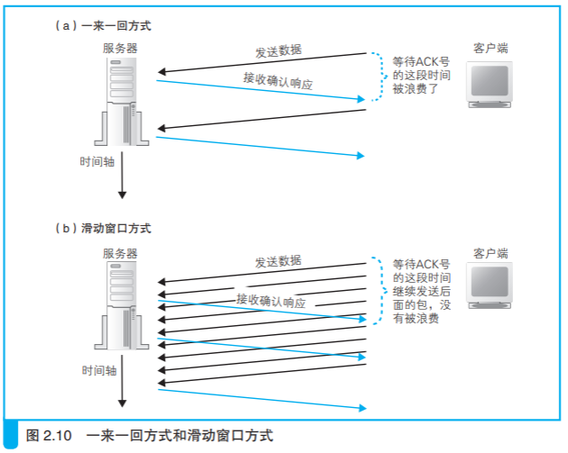

## TCP vs UDP

浏览器、邮件等一般应用程序收发数据时用 TCP；

DNS 查询等收发较短的控制数据时用 UDP。

## IP 协议

在互联网上传送数 据时，数据会被切分成一个一个的网络包 ，而将网络包发送给通信对象的操作就是由 IP 来负责的。

IP 下面的网卡驱动程序负责控制网卡硬件，而最下面的网卡则负责完 成实际的收发操作，也就是对网线中的信号执行发送和接收的操作。

## 套接字

在协议栈内部有一块用于存放控制信息的内存空间，这里记录了用于 控制通信操作的控制信息，例如通信对象的 IP 地址、端口号、通信操作的 进行状态等。本来套接字就只是一个概念而已，并不存在实体，如果一定 要赋予它一个实体，我们可以说这些控制信息就是套接字的实体，或者说 存放控制信息的内存空间就是套接字的实体。

- ### 协议栈是根据套接字中记录的控制信息来工作的

协议栈在执行操作时需要参阅这些控制信息 。例如，在发送数据时， 需要看一看套接字中的通信对象 IP 地址和端口号，以便向指定的 IP 地址 和端口发送数据。在发送数据之后，协议栈需要等待对方返回收到数据的响应信息，但数据也可能在中途丢失，永远也等不到对方的响应。在这样 的情况下，我们不能一直等下去，需要在等待一定时间之后重新发送丢失的数据，这就需要协议栈能够知道执行发送数据操作后过了多长时间。为 此，套接字中必须要记录是否已经收到响应，以及发送数据后经过了多长时间，才能根据这些信息按照需要执行重发操作。

- ### 创建套接字

- ### 连接服务器

两个套接字连接是什么意思？

连接实际上是通信双方交换控制信息，在套接字中记录这些必要信息并准备数据收发的一连串操作。

> 套接字刚刚创建完成时，当应用程序委托发送数据的时候，协议栈 会如何操作呢？

套接字刚刚创建完成的时候，里面并没有存放任何数据，也不知道通 信的对象是谁。在这个状态下，即便应用程序要求发送数据，协议栈也不 知道数据应该发送给谁。浏览器可以根据网址来查询服务器的 IP 地址，而 且根据规则也知道应该使用 80 号端口，但只有浏览器知道这些必要的信息 是不够的，因为在调用 socket 创建套接字时，这些信息并没有传递给协议栈。

**因此，我们需要把服务器的 IP 地址和端口号等信息告知协议栈，这是连接操作的目的之一。**

那么，服务器这边又是怎样的情况呢？我们需要让客户端向服 务器告知必要的信息。

**可见，客户端向服务器传达开始通信的请求， 也是连接操作的目的之一。**

此外，当执行数据收发操作时，我们还需要一块用来临时存放要收发的数据的内存空间，这块内存空间称为**缓冲区**，它也是在连接操作的过程中分配的。

- ### 控制信息

通信操作中使用的控制信息分为两类。

（1）头部中记录的信息

（2）套接字（协议栈中的内存空间）中记录的信息

TCP头包含：发送方端口号、接收方端口号、序号、ACK 号、窗口等。

## 连接操作的实际过程

Socket.connect（< 描述符 >, < 服务器 IP 地址和端口号 >, …）

这些信息会传递给协议栈中的 TCP 模块。

创建TCP连接（三次握手）

## 收发数据

数据收发操作是从应用程序调用 write 将要发送的数据交给协议栈 开始的。应用程序在 调用 write 时会指定发送数据的长度，在协议栈看来，要发送的数据就是 一定长度的二进制字节序列而已。

- ### 发送时机

协议栈并不是一收到数据就马上发送出去，而是会将数据存放在内部的发送缓冲区中，并等待应用程序的下一段数据。这样做是有道理的。应用程序交给协议栈发送的数据长度是由应用程序本身来决定的，不同的应用程序在实现上有所不同，有些程序会一次性传递所有的数据，有 些程序则会逐字节或者逐行传递数据。总之，一次将多少数据交给协议栈是由应用程序自行决定的，协议栈并不能控制这一行为。在这样的情况下， 如果一收到数据就马上发送出去，就可能会发送大量的小包，导致网络效率下降，因此需要在数据积累到一定量时再发送出去。至于要积累多少数据才能发送，不同种类和版本的操作系统会有所不同，不能一概而论，但都是根据下面几个要素来判断的。

第一个判断要素是每个网络包能容纳的数据长度，协议栈会根据一个 叫作 MTU的参数来进行判断。MTU 表示一个网络包的最大长度，在以太网中一般是 1500 字节。MTU 是包含头部的总长度，因此需要从 MTU 减去头部的长度，然后得到的长度就是一个网络包中所能容纳的最大 数据长度，这一长度叫作 MSS。当从应用程序收到的数据长度超过或者接 近 MSS 时再发送出去，就可以避免发送大量小包的问题了。

另一个判断要素是时间。当应用程序发送数据的频率不高的时候，如果每次都等到长度接近 MSS 时再发送，可能会因为等待时间太长而造成发送延迟，这种情况下，即便缓冲区中的数据长度没有达到 MSS，也应该果断发送出去。为此，协议栈的内部有一个计时器，当经过一定时间之后， 就会把网络包发送出去。

- ### 对较大的数据进行拆分

发送缓冲区中的数据超过 MSS 的长度，这时我们当然不需要继续等待后面的数据了。发送缓冲区中的数据会被以 MSS 长度为单位进行拆分，拆分出来的每块数据会被放进单独的网络包中。

根据发送缓冲区中的数据拆分的情况，当判断需要发送这些数据时，就 在每一块数据前面加上 TCP 头部，并根据套接字中记录的控制信息标记发送 方和接收方的端口号，然后交给 IP 模块来执行发送数据的操作。

- ### 使用 ACK 号确认网络包已收到

TCP 具备确认对方是否成功收到网络包，以及当对方没收到时进 行重发的功能，因此在发送网络包之后，接下来还需要进行确认操作。

双方互相ack确认

- ### 根据网络包平均往返时间调整 ACK 号等待时间

当网络传输繁忙时就会发生拥塞，ACK 号的返回会变慢，这时我们就必须将等待时间设置得稍微长一点，否则可能会发生已经重传了包之后， 前面的 ACK 号才姗姗来迟的情况。这样的重传是多余的，看上去只是多 发一个包而已，但它造成的后果却没那么简单。因为 ACK 号的返回变慢大多是由于网络拥塞引起的，因此如果此时再出现很多多余的重传，对于本来就很拥塞的网络来说无疑是雪上加霜。那么等待时间是不是越长越好呢？也不是。如果等待时间过长，那么包的重传就会出现很大的延迟，也会导致网络速度变慢。

等待时间设置为一个固定值并不是一个好办法。因此，TCP 采用了动态调整等待时间的方法，这个等待时间是根据 ACK 号返回所需的时间来判断的。具体来说，TCP 会在发送数据的过程中持续测量 ACK 号的返回时间，如果 ACK 号返回变慢，则相应延长等待时间；相对地，如果 ACK 号马上就能返回，则相应缩短等待时间 。

- ### 使用窗口有效管理 ACK 号

的能够接收的最大数据量称为窗口大小，一般和接收方的缓冲区大小一致。

- ### ACK 与窗口的合并

要提高收发数据的效率，还需要考虑另一个问题，那就是返回 ACK 号和更新窗口的时机。如果假定这两个参数是相互独立的，分别用两个单 独的包来发送，结果会如何呢？ 首先，什么时候需要更新窗口大小呢？当收到的数据刚刚开始填入缓冲区时，其实没必要每次都向发送方更新窗口大小，因为只要发送方在每 次发送数据时减掉已发送的数据长度就可以自行计算出当前窗口的剩余长 度。因此，更新窗口大小的时机应该是接收方从缓冲区中取出数据传递给 应用程序的时候。这个操作是接收方应用程序发出请求时才会进行的，而 发送方不知道什么时候会进行这样的操作，因此当接收方将数据传递给应 用程序，导致接收缓冲区剩余容量增加时，就需要告知发送方，这就是更 新窗口大小的时机。

那么 ACK 号又是什么情况呢？当接收方收到数据时，如果确认内容 没有问题，就应该向发送方返回 ACK 号，因此我们可以认为收到数据之后马上就应该进行这一操作。

如果将前面两个因素结合起来看，首先，发送方的数据到达接收方， 在接收操作完成之后就需要向发送方返回 ACK 号，而再经过一段时间， 当数据传递给应用程序之后才需要更新窗口大小。但如果根据这样的设计来实现，每收到一个包，就需要向发送方分别发送 ACK 号和窗口更新这两个单独的包。这样一来，接收方发给发送方的包就太多了，导致网络效 率下降。

因此，接收方在发送 ACK 号和窗口更新时，并不会马上把包发送出 去，而是会等待一段时间，在这个过程中很有可能会出现其他的通知操作， 这样就可以把两种通知合并在一个包里面发送了。

**提高效率：合并多个ACK确认包，合并ACK确认包和更新窗口大小包。**

- ### 接收 HTTP 响应消息

浏览器在委托协议栈发送请求消息之后，会调用 read 程序来获取响应消息。

## 从服务器断开并删除套接字

- ### 数据发送完毕后断开连接

调用 Socket 库的 close 程序。

- ### 删除套接字

套接字并不会立即被删除，而是 会等待一段时间之后再被删除。

#### 等待这段时间是为了防止误操作

如果最后客户端返回的 ACK 号丢失了，结果会如何呢？这时，服务器没有接收到 ACK 号，可能会重发一次 FIN。如果这时客户端的套接字已经删除了，会发生什么事呢？套接字被删除，那么套接字中保存的控制信息也就跟着消失了，套接字对应的端口号就会被释放出来。这时，如果别的应用程序要创建套接字，新套接字碰巧又被分配了同一个端口号，而服 务器重发的 FIN 正好到达，会怎么样呢？本来这个 FIN 是要发给刚刚删除的那个套接字的，但新套接字具有相同的端口号，于是这个 FIN 就会错误地跑到新套接字里面，新套接字就开始执行断开操作了。之所以不马上删 除套接字，就是为了防止这样的误操作。

## 数据收发小结

## 包的基本知识

IP 模块负责添加如下两个头部。

（1） MAC 头部：以太网用的头部，包含 MAC 地址

（2） IP 头部：IP 用的头部，包含 IP 地址

封装好的包会被交给网络硬件，它们统称为网卡。传递给网卡的网络 包是由一连串 0 和 1 组成的数字信息，网卡会将这些数字信息转换为电信 号或光信号，并通过网线（或光纤）发送出去，然后这些信号就会到达集线 器、路由器等转发设备，再由转发设备一步一步地送达接收方。

IP 模块会将 TCP 头部和 数据块看作一整块二进制数据。

IP 地址实际上并不是分配给计算机的，而是分配给 网卡的，因此当计算机上存在多块网卡时，每一块网卡都会有自己的 IP 地 址。

IP 模块在生成 IP 头部之后，会在它前面再加上 MAC 头部。MAC 头 部是以太网使用的头部，它包含了接收方和发送方的 MAC 地址等信息。

### 通过 ARP 查询目标路由器的 MAC 地址

在以太网中，有一种叫作 广播的方法，可以把包发给连接在同一以太网中的所有设备。通过IP地址获取MAC地址，然后添加MAC头。

#### ARP 缓存

> IP 模块负责添加MAC头

让 IP 负责整个打包工作是有利的。 如果在交给网卡之前，IP 模块能够完成整个打包工作，那么网卡只要将打好 的包发送出去就可以了。对于除 IP 以外的其他类型的包也是一样，如果在 交给网卡之前完成打包，那么对于网卡来说，发送的操作和发送 IP 包是完全 相同的。这样一来，同一块网卡就可以支持各种类型的包。

### 以太网特性

- 将包发送到 MAC 头部的接收方 MAC 地址代表的目的地
- 用发送方 MAC 地址识别发送方
- 用以太类型识别包的内容

### MAC地址

网卡的 ROM 中保存着全世界唯一的 MAC 地址，这是在生产网 卡时写入的。