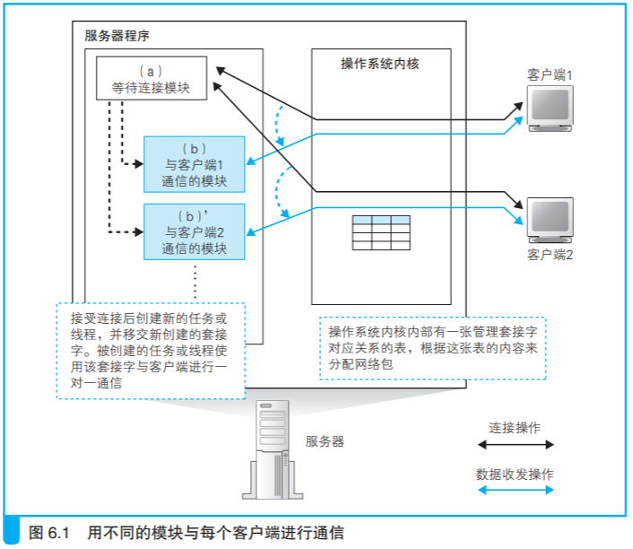

### 服务器程序的结构

服务器需要同时和多个客户端通信，但一个程序来处理多个客户端的 请求是很难的，因为服务器必须把握每一个客户端的操作状态。因此一般的做法是，每有一个客户端连接进来，就启动一个新的服务器程序，确保 服务器程序和客户端是一对一的状态。

具体来说，服务器程序的结构。我们将程序分成 两个模块，即等待连接模块和负责与客户端通信的模块。

### 服务器端的套接字和端口号

连接这个操作是在有一方等待连接的情况下，另一方才能发起连接。发起连接的一方是客户端，等待连接的一方是服务器。

**客户端的数据收发需要 经过下面 4 个阶段。** 

（1）创建套接字（创建套接字阶段） 

（2）用管道连接服务器端的套接字（连接阶段） 

（3）收发数据（收发阶段） 

（4）断开管道并删除套接字（断开阶段） 

**相对地，服务器是将阶段（2）改成了等待连接，具体如下。** 

（1）创建套接字（创建套接字阶段） 

（2-1）将套接字设置为等待连接状态（等待连接阶段） 

（2-2）接受连接（接受连接阶段） 

（3）收发数据（收发阶段） 

（4）断开管道并删除套接字（断开阶段）

协议栈会调用 accept 来接受连接。如果包没有到达，就会转为等待包 到达的状态，并在包到达的时候继续执行接受连接操作。

在这个状态下，一旦客户端的包到达，就会返回响应包 并开始接受连接操作。接下来，协议栈会给等待连接的套接字复制一个副本，然后将连接对象等控制信息写入新的套接字中。

在复制出一个 新的套接字之后，原来那个处于等待连接状态的套接字还会以等待连接的状态继续存在，当再次调用 accept，客户端连接包到 达时，它又可以再次执行接受连接操作。

#### 识别套接字

端口号是用来识别套 接字的，因此我们以前说不同的套接字应该对应不同的端口号，但如果这 样做，这里就会出现问题。因为在接受连接的时候，新创建的套接字副本 就必须和原来的等待连接的套接字具有不同的端口号才行。这样一来，比 如客户端本来想要连接 80 端口上的套接字，结果从另一个端口号返回了 包，这样一来客户端就无法判断这个包到底是要连接的那个对象返回的， 还是其他程序返回的。因此，新创建的套接字副本必须和原来的等待连接 的套接字具有相同的端口号。

但是这样一来又会引发另一个问题。端口号是用来识别套接字的，如 果一个端口号对应多个套接字，就无法通过端口号来定位到某一个套接字 了。当客户端的包到达时，如果协议栈只看 TCP 头部中的接收方端口号， 是无法判断这个包到底应该交给哪个套接字的。

这个问题可以用下面的方法来解决，即要确定某个套接字时，不仅使 用服务器端套接字对应的端口号，还同时使用客户端的端口号再加上 IP 地 址，总共使用下面 4 种信息来进行判断。

• 客户端 IP 地址 

• 客户端端口号

• 服务器 IP 地址 

• 服务器端口号

服务器上可能存在多个端口号相同的套接字，但客户端的套接字都是 对应不同端口号的，因此我们可以通过客户端的端口号来确定服务器上的 某个套接字。不过，使用不同端口号的规则仅限一台客户端的内部，当有 多个客户端进行连接时，它们之间的端口号是可以重复的。因此，我们还 必须加上客户端的 IP 地址才能进行判断。

> 服务器 IP 地址 有什么用？

**既然通过客户端 IP 地址、客户端端口号、服务器 IP 地 址、服务器端口号这 4 种信息可以确定某个套接字，那么要指代某个套接 字时用这 4 种信息就好了，为什么还要使用描述符呢？**

原因是，在套接字刚刚创建好， 还没有建立连接的状态下，这 4 种信息是不全的。此外，为了指代一个套 接字，使用一种信息（描述符）比使用 4 种信息要简单。出于上面两个原 因，应用程序和协议栈之间是使用描述符来指代套接字的。