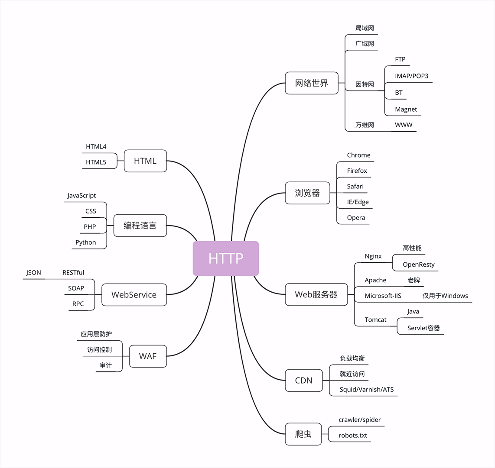

- ### 浏览器

浏览器本质上是一个 HTTP 协议中的**请求方**，使用 HTTP 协议获取网络上的各种资源。在 HTTP 协议里，浏览器的角色被称为“User Agent”即“用户代理”，意思是作为访问者的“代理”来发起 HTTP 请求。

- ### 爬虫

前面说到过浏览器，它是一种用户代理，代替我们访问互联网。

但 HTTP 协议并没有规定用户代理后面必须是“真正的人类”，它也完全可以是“机器人”，这些“机器人”的正式名称就叫做“**爬虫**”（Crawler），实际上是一种可以自动访问 Web 资源的应用程序。

- ### HTML

HTML是 HTTP 协议传输的主要内容之一，它描述了超文本页面，用各种“标签”定义文字、图片等资源和排版布局，最终由浏览器“渲染”出可视化页面。

- ### WAF

**WAF**是近几年比较“火”的一个词，意思是“网络应用防火墙”。与硬件“防火墙”类似，它是应用层面的“防火墙”，专门检测 HTTP 流量，是防护 Web 应用的安全技术。

WAF 通常位于 Web 服务器之前，可以阻止如 SQL 注入、跨站脚本等攻击，目前应用较多的一个开源项目是 ModSecurity，它能够完全集成进 Apache 或 Nginx。

