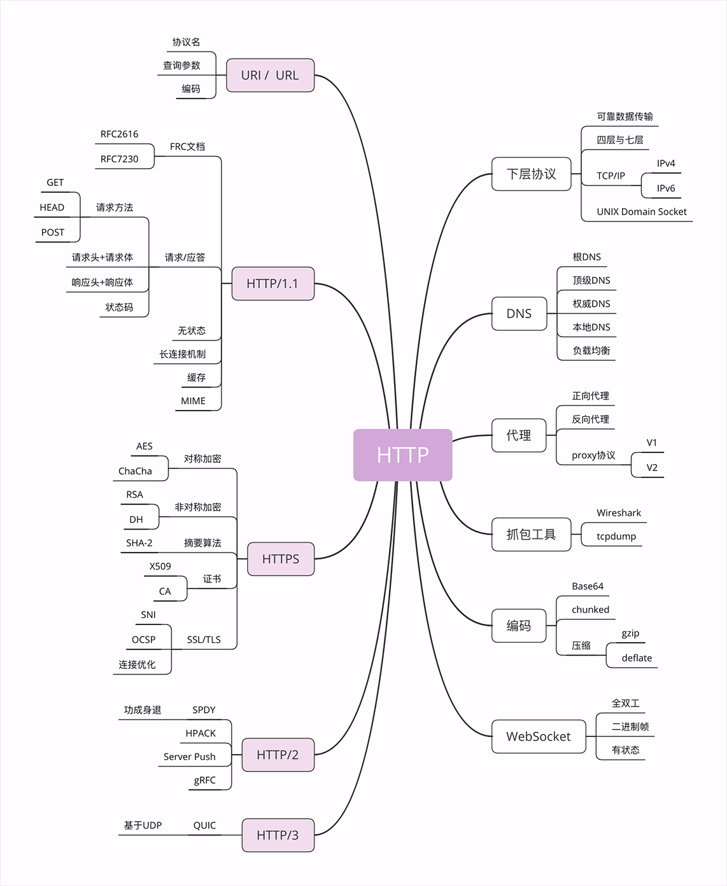

- ### TCP/IP

TCP/IP 协议实际上是一系列网络通信协议的统称，其中最核心的两个协议是**TCP**和**IP**，其他的还有 UDP、ICMP、ARP 等等，共同构成了一个复杂但有层次的协议栈。

这个协议栈有四层，最上层是“应用层”，最下层是“链接层”，TCP 和 IP 则在中间：**TCP 属于“传输层”，IP 属于“网际层”**。

**IP 协议**是“**I**nternet **P**rotocol”的缩写，主要目的是解决寻址和路由问题，以及如何在两点间传送数据包。IP 协议使用“**IP 地址**”的概念来定位互联网上的每一台计算机。

**TCP 协议**是“**T**ransmission **C**ontrol **P**rotocol”的缩写，意思是“传输控制协议”，它位于 IP 协议之上，基于 IP 协议提供可靠的、字节流形式的通信，是 HTTP 协议得以实现的基础。

HTTP 也就可以更准确地称为“**HTTP over TCP/IP**”。

- ### DNS

- ### URI/URL

- ### HTTPS

HTTP over SSL/TLS

SSL/TLS它是一个负责加密通信的安全协议，建立在 TCP/IP 之上，所以也是个可靠的传输协议，可以被用作 HTTP 的下层。

- ### 代理

代理（Proxy）是 HTTP 协议中请求方和应答方中间的一个环节，作为“中转站”，既可以转发客户端的请求，也可以转发服务器的应答。

代理有很多的种类，常见的有：

1. 匿名代理：完全“隐匿”了被代理的机器，外界看到的只是代理服务器；
2. 透明代理：顾名思义，它在传输过程中是“透明开放”的，外界既知道代理，也知道客户端；
3. 正向代理：靠近客户端，代表客户端向服务器发送请求；
4. 反向代理：靠近服务器端，代表服务器响应客户端的请求；

