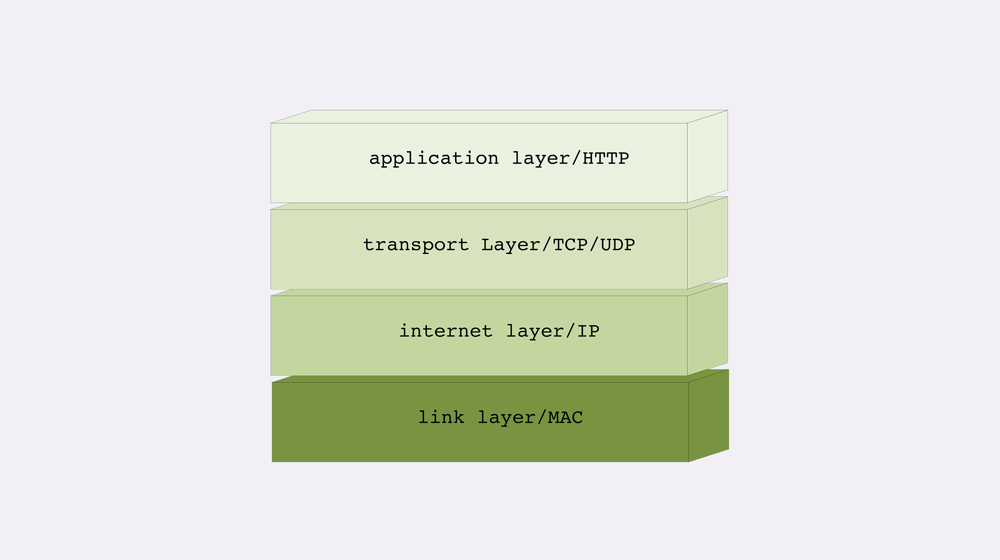
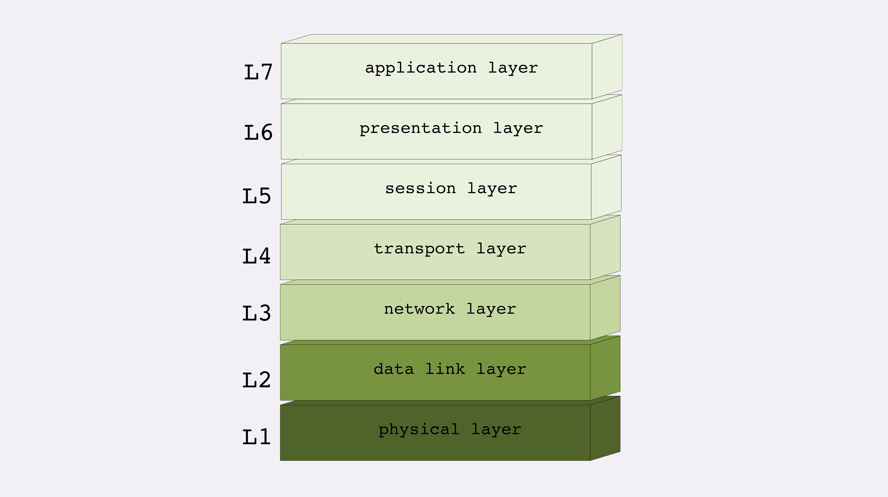
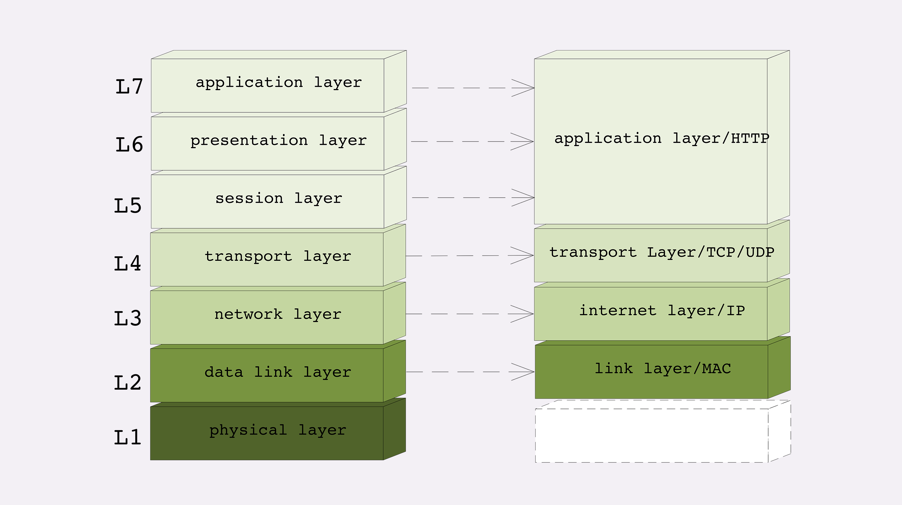
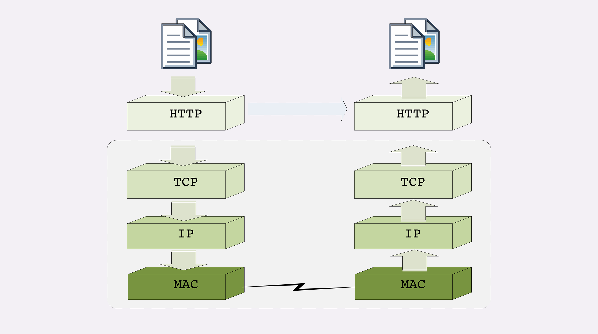

把复杂的网络通信划分出多个层次，再给每一个层次分配不同的职责，层次内只专心做自己的事情就好，用“分而治之”的思想把一个“大麻烦”拆分成了数个“小麻烦”，从而解决了网络通信的难题。

## TCP/IP 网络分层模型

它是目前事实上的网络通信标准。

层次顺序是“**从下往上**”数的。

第一层叫“**链接层**”（link layer），负责在以太网、WiFi 这样的底层网络上发送原始数据包，工作在网卡这个层次，使用 MAC 地址来标记网络上的设备，所以有时候也叫 MAC 层。

第二层叫“**网际层**”或者“**网络互连层**”（internet layer），IP 协议就处在这一层。因为 IP 协议定义了“IP 地址”的概念，所以就可以在“链接层”的基础上，用 IP 地址取代 MAC 地址，把许许多多的局域网、广域网连接成一个虚拟的巨大网络，在这个网络里找设备时只要把 IP 地址再“翻译”成 MAC 地址就可以了。

第三层叫“**传输层**”（transport layer），这个层次协议的职责是保证数据在 IP 地址标记的两点之间“可靠”地传输，是 TCP 协议工作的层次，另外还有它的一个“小伙伴”UDP。

TCP 是一个有状态的协议，需要先与对方建立连接然后才能发送数据，而且保证数据不丢失不重复。而 UDP 则比较简单，它无状态，不用事先建立连接就可以任意发送数据，但不保证数据一定会发到对方。两个协议的另一个重要区别在于数据的形式。TCP 的数据是连续的“字节流”，有先后顺序，而 UDP 则是分散的小数据包，是顺序发，乱序收。

协议栈的第四层叫“**应用层**”（application layer），由于下面的三层把基础打得非常好，所以在这一层就“百花齐放”了，有各种面向具体应用的协议。例如 Telnet、SSH、FTP、SMTP 等等，当然还有我们的 HTTP。

MAC 层的传输单位是帧（frame），IP 层的传输单位是包（packet），TCP 层的传输单位是段（segment），HTTP 的传输单位则是消息或报文（message）。但这些名词并没有什么本质的区分，可以统称为数据包。

## OSI 网络分层模型

第二个网络分层模型：**OSI**，全称是“**开放式系统互联通信参考模型**”（Open System Interconnection Reference Model）。

不过国际标准组织心里也很清楚，TCP/IP 等协议已经在许多网络上实际运行，再推翻重来是不可能的。所以，OSI 分层模型在发布的时候就明确地表明是一个“参考”，不是强制标准。

1. 第一层：物理层，网络的物理形式，例如电缆、光纤、网卡、集线器等等；
2. 第二层：数据链路层，它基本相当于 TCP/IP 的链接层；
3. 第三层：网络层，相当于 TCP/IP 里的网际层；
4. 第四层：传输层，相当于 TCP/IP 里的传输层；
5. 第五层：会话层，维护网络中的连接状态，即保持会话和同步；
6. 第六层：表示层，把数据转换为合适、可理解的语法和语义；
7. 第七层：应用层，面向具体的应用传输数据。

但 OSI 模型也是有优点的。对比一下就可以看出，TCP/IP 是一个纯软件的栈，没有网络应有的最根基的电缆、网卡等物理设备的位置。而 OSI 则补足了这个缺失，在理论层面上描述网络更加完整。

## 两个分层模型的映射关系

1. 第一层：物理层，TCP/IP 里无对应；
2. 第二层：数据链路层，对应 TCP/IP 的链接层；
3. 第三层：网络层，对应 TCP/IP 的网际层；
4. 第四层：传输层，对应 TCP/IP 的传输层；
5. 第五、六、七层：统一对应到 TCP/IP 的应用层。

OSI 的分层模型在四层以上分的太细，而 TCP/IP 实际应用时的会话管理、编码转换、压缩等和具体应用经常联系的很紧密，很难分开。例如，HTTP 协议就同时包含了连接管理和数据格式定义。

