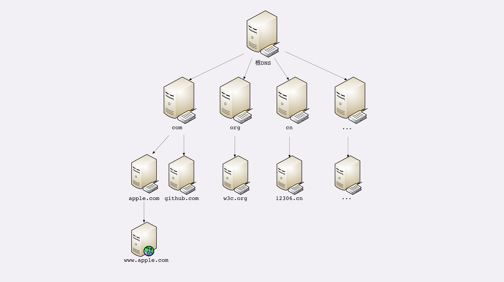

## 域名是什么

域名就是IP地址的映射。由有语义的词组成。

## 域名的形式

域名是一个有层次的结构，是一串用“.”分隔的多个单词，最右边的被称为“顶级域名”，然后是“二级域名”，层级关系向左依次降低。

## 域名的解析

域名转换为IP地址的过程。

DNS 的核心系统是一个三层的树状、分布式服务，基本对应域名的结构：

1. 根域名服务器（Root DNS Server）：管理顶级域名服务器，返回“com”“net”“cn”等顶级域名服务器的 IP 地址；
2. 顶级域名服务器（Top-level DNS Server）：管理各自域名下的权威域名服务器，比如 com 顶级域名服务器可以返回 apple.com 域名服务器的 IP 地址；
3. 权威域名服务器（Authoritative DNS Server）：管理自己域名下主机的 IP 地址，比如 apple.com 权威域名服务器可以返回 www.apple.com 的 IP 地址。

有了这个系统以后，任何一个域名都可以在这个树形结构里从顶至下进行查询，就好像是把域名从右到左顺序走了一遍，最终就获得了域名对应的 IP 地址。

例如，你要访问“www.apple.com”，就要进行下面的三次查询：

1. 访问根域名服务器，它会告诉你“com”顶级域名服务器的地址；
2. 访问“com”顶级域名服务器，它再告诉你“apple.com”域名服务器的地址；
3. 最后访问“apple.com”域名服务器，就得到了“www.apple.com”的地址。

## DNS缓存

