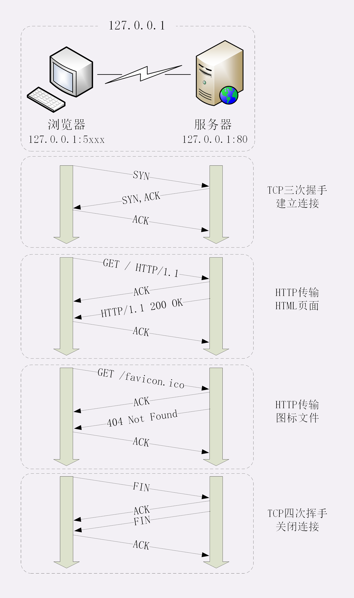

使用 IP 地址访问 Web 服务器。简要叙述一下这次最简单的浏览器 HTTP 请求过程：

1. 浏览器从地址栏的输入中获得服务器的 IP 地址和端口号；
2. 浏览器用 TCP 的三次握手与服务器建立连接；
3. 浏览器向服务器发送拼好的报文；
4. 服务器收到报文后处理请求，同样拼好报文再发给浏览器；
5. 浏览器解析报文，渲染输出页面。

### DNS多级缓存

在域名解析的过程中会有多级的缓存，浏览器首先看一下自己的缓存里有没有，如果没有就向操作系统的缓存要，还没有就检查本机域名解析文件 hosts