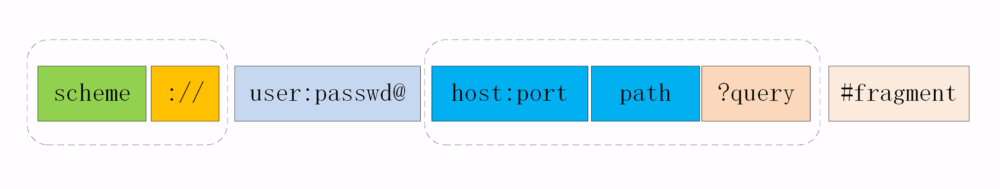

## URI

严格地说，URI 不完全等同于网址，它包含有 URL 和 URN 两个部分，在 HTTP 世界里用的网址实际上是 URL——**统一资源定位符**（**U**niform **R**esource **L**ocator）。但因为 URL 实在是太普及了，所以常常把这两者简单地视为相等。

### URI 的编码

在 URI 里只能使用 ASCII 码。URI 引入了编码机制，对于 ASCII 码以外的字符集和特殊字符做一个特殊的操作，把它们转换成与 URI 语义不冲突的形式。这在 RFC 规范里称为“escape”和“unescape”，俗称“转义”。

URI 转义的规则有点“简单粗暴”，直接把非 ASCII 码或特殊字符转换成十六进制字节值，然后前面再加上一个“%”。

### encodeURI vs encodeURIComponent

encodeURI()和encodeURIComponent()方法都可以对URI（通用资源标识符）进行编码，以便发送给浏览器。
 但它们编码的**范围**有所不用。

1. encodeURI()方法不会对下列字符编码：ASCII字母、数字、~!@#$&*()=:/,;?+'
2. encodeURIComponent()方法不会对下列字符编码：ASCII字母、数字、~!*()'