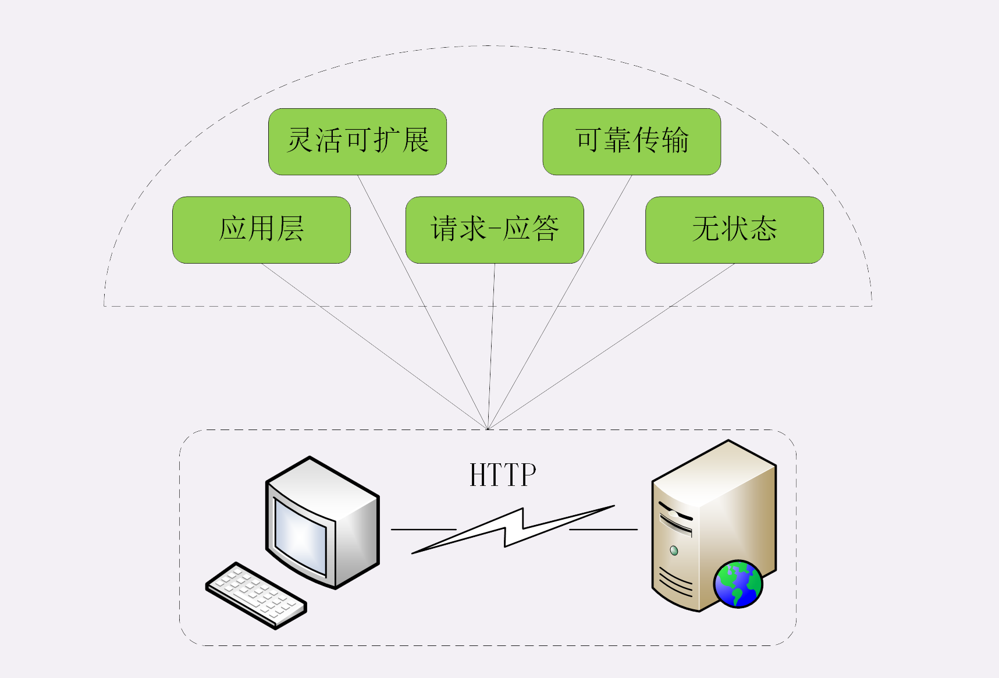

## HTTP特点

### 1.灵活可扩展

HTTP 协议最初诞生的时候就比较简单，本着开放的精神只规定了报文的基本格式，比如用空格分隔单词，用换行分隔字段，“header+body”等，报文里的各个组成部分都没有做严格的语法语义限制，可以由开发者任意定制。

所以，HTTP 协议就随着互联网的发展一同成长起来了。在这个过程中，HTTP 协议逐渐增加了请求方法、版本号、状态码、头字段等特性。而 body 也不再限于文本形式的 TXT 或 HTML，而是能够传输图片、音频视频等任意数据，这些都是源于它的“灵活可扩展”的特点。

而那些 RFC 文档，实际上也可以理解为是对已有扩展的“承认和标准化”，实现了“从实践中来，到实践中去”的良性循环。

### 2.可靠传输

这个特点显而易见，因为 HTTP 协议是基于 TCP/IP 的，而 TCP 本身是一个“可靠”的传输协议，所以 HTTP 自然也就继承了这个特性，能够在请求方和应答方之间“可靠”地传输数据。

### 3.应用层协议

HTTP 凭借着可携带任意头字段和实体数据的报文结构，以及连接控制、缓存代理等方便易用的特性，一出现就“技压群雄”，迅速成为了应用层里的“明星”协议。

### 4.请求 - 应答

这个请求 - 应答模式是 HTTP 协议最根本的通信模型，通俗来讲就是“一发一收”“有来有去”，就像是写代码时的函数调用，只要填好请求头里的字段，“调用”后就会收到答复。

请求 - 应答模式也明确了 HTTP 协议里通信双方的定位，永远是请求方先发起连接和请求，是主动的，而应答方只有在收到请求后才能答复，是被动的，如果没有请求时不会有任何动作。

当然，请求方和应答方的角色也不是绝对的，在浏览器 - 服务器的场景里，通常服务器都是应答方，但如果将它用作代理连接后端服务器，那么它就可能同时扮演请求方和应答方的角色。

HTTP 的请求 - 应答模式也恰好契合了传统的 C/S（Client/Server）系统架构，请求方作为客户端、应答方作为服务器。所以，随着互联网的发展就出现了 B/S（Browser/Server）架构，用轻量级的浏览器代替笨重的客户端应用，实现零维护的“瘦”客户端，而服务器则摈弃私有通信协议转而使用 HTTP 协议。

此外，请求 - 应答模式也完全符合 RPC（Remote Procedure Call）的工作模式，可以把 HTTP 请求处理封装成远程函数调用，导致了 WebService、RESTful 和 gPRC 等的出现。

### 5.无状态

“状态”其实就是客户端或者服务器里保存的一些数据或者标志，记录了通信过程中的一些变化信息。

你一定知道，TCP 协议是有状态的，一开始处于 CLOSED 状态，连接成功后是 ESTABLISHED 状态，断开连接后是 FIN-WAIT 状态，最后又是 CLOSED 状态。

这些“状态”就需要 TCP 在内部用一些数据结构去维护，可以简单地想象成是个标志量，标记当前所处的状态，例如 0 是 CLOSED，2 是 ESTABLISHED 等等。

再来看 HTTP，那么对比一下 TCP 就看出来了，在整个协议里没有规定任何的“状态”，客户端和服务器永远是处在一种“**无知**”的状态。建立连接前两者互不知情，每次收发的报文也都是互相独立的，没有任何的联系。收发报文也不会对客户端或服务器产生任何影响，连接后也不会要求保存任何信息。

但不要忘了 HTTP 是“灵活可扩展”的，虽然标准里没有规定“状态”，但完全能够在协议的框架里给它“打个补丁”，增加这个特性。