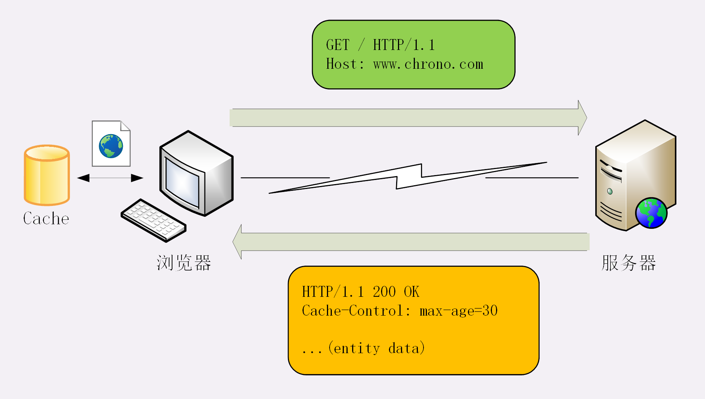
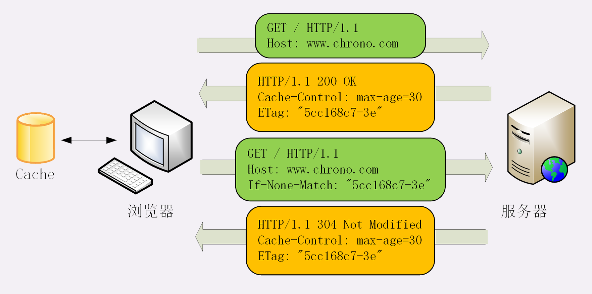

# HTTP的缓存控制

## 服务器的缓存控制

1. 浏览器发现缓存无数据，于是发送请求，向服务器获取资源；
2. 服务器响应请求，返回资源，同时标记资源的有效期；
3. 浏览器缓存资源，等待下次重用。

这里的 max-age 是“**生存时间**”（又叫“新鲜度”“缓存寿命”，类似 TTL，Time-To-Live），时间的计算起点是响应报文的创建时刻（即 Date 字段，也就是离开服务器的时刻），而不是客户端收到报文的时刻，也就是说包含了在链路传输过程中所有节点所停留的时间。

### cache-control其他值

- no_store：**不允许缓存**，用于某些变化非常频繁的数据，例如秒杀页面；
- no_cache：它的字面含义容易与 no_store 搞混，实际的意思并不是不允许缓存，而是**可以缓存**，但在使用之前必须要去服务器验证是否过期，是否有最新的版本；
- must-revalidate：又是一个和 no_cache 相似的词，它的意思是如果缓存不过期就可以继续使用，但过期了如果还想用就必须去服务器验证。

## 客户端的缓存控制

当你点“刷新”按钮的时候，浏览器会在请求头里加一个“**Cache-Control: max-age=0**”。

Ctrl+F5 的“强制刷新”又是什么样的呢？

它其实是发了一个“**Cache-Control: no-cache**”，含义和“max-age=0”基本一样，就看后台的服务器怎么理解，通常两者的效果是相同的。

**200 ok (from disk cache)**

直接利用之前的资源，不再进行网络通信。

## 条件请求

条件请求一共有 5 个头字段，我们最常用的是“**if-Modified-Since**”和“**If-None-Match**”这两个。需要第一次的响应报文预先提供“**Last-modified**”和“**ETag**”，然后第二次请求时就可以带上缓存里的原值，验证资源是否是最新的。

如果资源没有变，服务器就回应一个“**304 Not Modified**”，表示缓存依然有效，浏览器就可以更新一下有效期，然后放心大胆地使用缓存了。

“Last-modified”很好理解，就是文件的最后修改时间。

ETag 是“实体标签”（Entity Tag）的缩写，**是资源的一个唯一标识**，主要是用来解决修改时间无法准确区分文件变化的问题。

ETag 还有“强”“弱”之分。

强 ETag 要求资源在字节级别必须完全相符，弱 ETag 在值前有个“W/”标记，只要求资源在语义上没有变化，但内部可能会有部分发生了改变（例如 HTML 里的标签顺序调整，或者多了几个空格）。