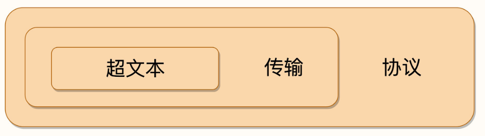
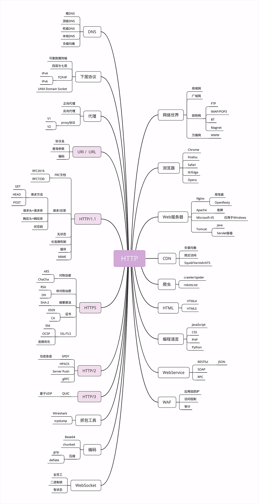

# HTTP是什么

HTTP 就是超文本传输协议，也就是**H**yper**T**ext **T**ransfer **P**rotocol。

### 超文本传输协议

超文本+传输+协议

- #### 协议

1. 协议必须要有两个或多个参与者，也就是“协”。
2. 协议是对参与者的一种行为约定和规范，也就是“议”。

**第一层含义**：HTTP 是一个用在计算机世界里的协议。它使用计算机能够理解的语言确立了一种计算机之间交流通信的规范，以及相关的各种控制和错误处理方式。

- #### 传输

所谓的“传输”（Transfer）其实很好理解，就是把一堆东西从 A 点搬到 B 点，或者从 B 点搬到 A 点，即“A<===>B”。

1. HTTP 协议是一个“**双向协议**”。（请求方+响应方）
2. 数据虽然是在 A 和 B 之间传输，但并没有限制只有 A 和 B 这两个角色，允许中间有“中转”或者“接力”。

**第二层含义**：HTTP 是一个在计算机世界里专门用来在两点之间传输数据的约定和规范。

- #### 超文本

所谓“**文本**”（Text），就表示 HTTP 传输的不是 TCP/UDP 这些底层协议里被切分的杂乱无章的二进制包（datagram），而是完整的、有意义的数据，可以被浏览器、服务器这样的上层应用程序处理。

所谓“**超文本**”，就是“超越了普通文本的文本”，它是文字、图片、音频和视频等的混合体，最关键的是含有“超链接”，能够从一个“超文本”跳跃到另一个“超文本”，形成复杂的非线性、网状的结构关系。

HTTP 是一个在计算机世界里专门在两点之间传输文字、图片、音频、视频等超文本数据的约定和规范

> 小结

在互联网世界里，HTTP 通常跑在 TCP/IP 协议栈之上，依靠 IP 协议实现寻址和路由、TCP 协议实现可靠数据传输、DNS 协议实现域名查找、SSL/TLS 协议实现安全通信。此外，还有一些协议依赖于 HTTP，例如 WebSocket、HTTPDNS 等。这些协议相互交织，构成了一个协议网，而 HTTP 则处于中心地位。

